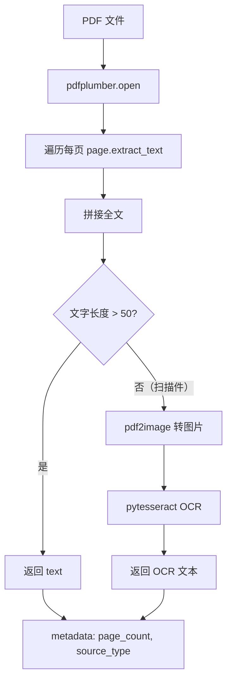
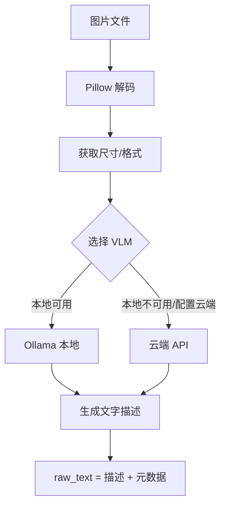
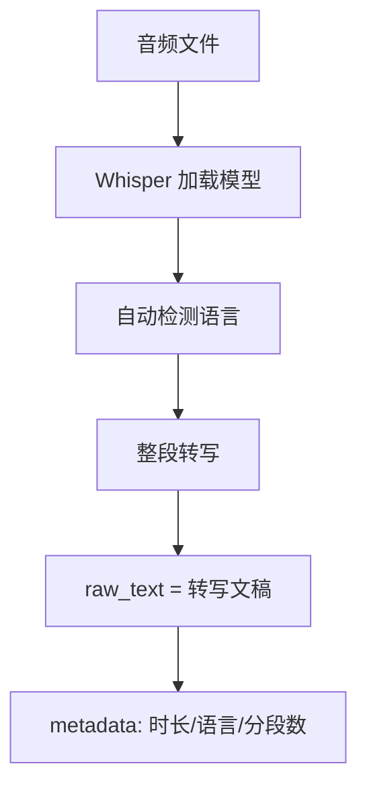
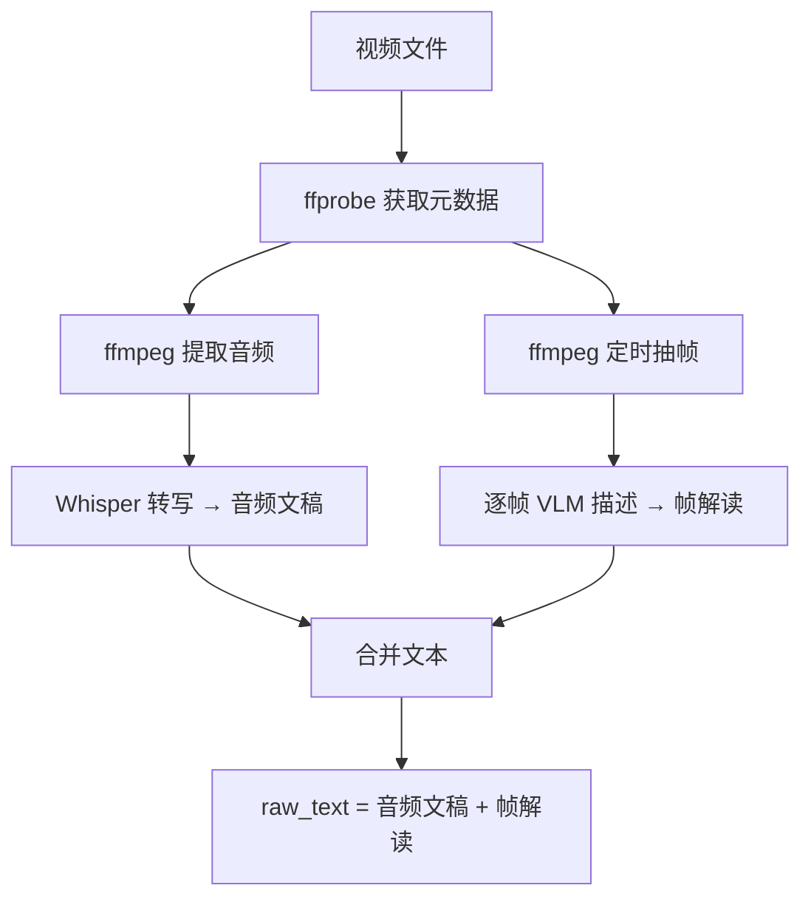

# FastAPI 文档解析服务设计方案

> 一个专注于「非文本 → 纯文本」转换的轻量解析引擎，通过 HTTP API 为 Tauri/Rust 后端提供文档解析能力。

---

## 目录

1. [定位与职责](#1-定位与职责)
2. [项目结构](#2-项目结构)
3. [API 接口定义](#3-api-接口定义)
4. [PDF 解析](#4-pdf-解析)
5. [图片解析](#5-图片解析)
6. [音频解析](#6-音频解析)
7. [视频解析](#7-视频解析)
8. [VLM 双模式客户端](#8-vlm-双模式客户端)
9. [配置与环境变量](#9-配置与环境变量)
10. [错误处理](#10-错误处理)
11. [测试](#11-测试)
12. [部署与运维](#12-部署与运维)

---

## 1. 定位与职责

### 1.1 职责边界

```
┌──────────────────────────────────────────────────────────┐
│                     FastAPI 解析服务                        │
│                                                           │
│  职责：非文本 → 纯文本                                      │
│                                                           │
│  PDF (pdfplumber) ──→ raw_text                            │
│  图片 (VLM)        ──→ raw_text                            │
│  音频 (Whisper)    ──→ raw_text                            │
│  视频 (ffmpeg+VLM) ──→ raw_text                            │
│                                                           │
│  输出：统一 ParseResult { raw_text, file_type, metadata }  │
└──────────────────────────┬───────────────────────────────┘
                           │ HTTP POST
                           ▼
┌──────────────────────────────────────────────────────────┐
│                 Tauri / Rust 后端                          │
│                                                           │
│  接收 raw_text → TextChunker 分片 → document_chunk 入库    │
│  → RAGRetriever 检索 → llm_gateway_service 回答           │
│  （以上全部是已有代码，零改动）                               │
└──────────────────────────────────────────────────────────┘
```

**核心原则：**
- 只做「非文本 → 文本」转换，不做任何业务逻辑
- 与 Rust 后端只通过 HTTP + `raw_text` 字段交互
- 无状态、水平可扩展

### 1.2 为什么用 Python？

| 解析场景 | Python 方案 | 成熟度 | Rust 替代可行性 |
|---------|------------|--------|----------------|
| PDF 文字提取 | pdfplumber | ⭐⭐⭐⭐⭐ 十年生态 | 可行，但测试周期长 |
| 扫描件 OCR | pytesseract | ⭐⭐⭐⭐⭐ | rusty-tesseract 刚起步 |
| 图片 VLM | Ollama/API | ⭐⭐⭐⭐ HTTP 调用 | ollama-rs 可用 |
| 语音转写 | openai-whisper | ⭐⭐⭐⭐⭐ pip install | whisper-rs 需 C++ 工具链 |
| 视频处理 | ffmpeg-python | ⭐⭐⭐⭐⭐ | ffmpeg-light 较新 |

**结论：** Python 成熟度远高于 Rust，FastAPI 作为旁路服务，做好了解析这一件事即可。Rust 专注做它更擅长的：**性能敏感的核心链路**（LLM 网关、RAG 检索、Tauri 命令）。

---

## 2. 项目结构

```
apps/doc-parser/                          # Python 解析服务
├── main.py                               # FastAPI 入口
├── config.py                             # 环境配置
├── requirements.txt                      # 依赖清单
├── Dockerfile                            # 容器化部署（可选）
│
├── models/                               # 数据模型
│   └── parse_result.py                   # 统一输出结构
│
├── parsers/                              # 解析器
│   ├── __init__.py
│   ├── base.py                           # 解析器抽象基类
│   ├── pdf_parser.py                     # PDF 解析
│   ├── image_parser.py                   # 图片解析
│   ├── audio_parser.py                   # 音频解析
│   └── video_parser.py                   # 视频解析
│
├── vlm/                                  # VLM 客户端
│   ├── __init__.py                       # 路由入口 + 自动故障切换
│   ├── base.py                           # VLM 抽象接口
│   ├── ollama_client.py                  # 本地 Ollama
│   └── cloud_client.py                   # 云端 API（经 Rust 中转）
│
├── utils/                                # 工具
│   ├── __init__.py
│   └── ocr.py                            # OCR 封装
│
└── tests/                                # 测试
    ├── __init__.py
    ├── test_pdf_parser.py
    ├── test_image_parser.py
    ├── test_audio_parser.py
    └── test_vlm_router.py
```

---

## 3. API 接口定义

### 3.1 `POST /parse`

解析任意文件，返回提取的纯文本。

**请求：**

```json
{
    "file_path": "/data/uploads/document.pdf",
    "options": {
        "vlm_prompt": "请详细描述这张图片中的文字和图表内容",
        "ocr_language": "chi_sim+eng",
        "frame_interval": 30
    }
}
```

| 字段 | 类型 | 必填 | 说明 |
|------|------|:----:|------|
| `file_path` | string | ✅ | 待解析文件的绝对路径（服务端可见） |
| `options.vlm_prompt` | string | 否 | VLM 描述提示词，默认自动生成 |
| `options.ocr_language` | string | 否 | OCR 语言，默认 `chi_sim+eng` |
| `options.frame_interval` | int | 否 | 视频抽帧间隔（秒），默认 30 |

**成功响应 `200`：**

```json
{
    "file_name": "document.pdf",
    "file_type": "pdf",
    "raw_text": "这是提取出来的完整文本内容……",
    "metadata": {
        "page_count": 5,
        "source_type": "text",
        "parse_duration_ms": 356
    }
}
```

**错误响应 `4xx/5xx`：**

```json
{
    "detail": "不支持的文件类型: .exe",
    "error_code": "UNSUPPORTED_FORMAT"
}
```

完整错误码见第 10 节。

### 3.2 `GET /health`

健康检查。

**响应：**

```json
{
    "status": "ok",
    "version": "1.0.0",
    "vlm_mode": "ollama",
    "whisper_loaded": true
}
```

### 3.3 `GET /formats`

查询支持的文件格式列表。

**响应：**

```json
{
    "pdf": ["pdf"],
    "image": ["jpg", "jpeg", "png", "gif", "bmp", "webp", "tiff"],
    "audio": ["mp3", "wav", "ogg", "flac", "m4a", "aac"],
    "video": ["mp4", "avi", "mov", "mkv", "wmv", "flv"]
}
```

### 3.4 `POST /parse/batch`（可选）

批量解析多个文件。

**请求：**

```json
{
    "files": [
        {
            "file_path": "/data/file1.pdf",
            "options": {}
        },
        {
            "file_path": "/data/photo.jpg",
            "options": {}
        }
    ]
}
```

**响应：**

```json
{
    "results": [
        {"file_name": "file1.pdf", "file_type": "pdf", "raw_text": "...", "metadata": {}},
        {"file_name": "photo.jpg", "file_type": "image", "raw_text": "...", "metadata": {}}
    ],
    "failed": []
}
```

### 3.5 与 Rust 后端的对接

Rust 端只需简单的 HTTP 调用：

```rust
/// 调 FastAPI 解析文件 → 拿到 raw_text → 进 RAG 链路
pub async fn parse_file(file_path: &str) -> Result<String, String> {
    let resp = reqwest::Client::new()
        .post("http://127.0.0.1:8321/parse")
        .json(&serde_json::json!({"file_path": file_path}))
        .send()
        .await
        .map_err(|e| format!("FastAPI 调用失败: {}", e))?;

    let result: ParseResult = resp.json().await.map_err(|e| format!("响应解析失败: {}", e))?;

    if result.raw_text.trim().is_empty() {
        return Err("解析结果为空".to_string());
    }

    Ok(result.raw_text)
    // 后续：TextChunker::chunk() → INSERT document_chunk → RAG 链路
}
```

---

## 4. PDF 解析

### 4.1 流程



### 4.2 代码

```python
# parsers/pdf_parser.py
import pdfplumber
from models.parse_result import ParseResult
from utils.ocr import ocr_image

class PdfParser:
    """PDF 解析器：先尝试文字提取，不够则 OCR 兜底"""

    MIN_TEXT_LENGTH = 50  # 少于 50 字符 → 当作扫描件

    async def parse(self, file_path: str, options: dict = None) -> ParseResult:
        import time
        start = time.time()

        options = options or {}
        ocr_lang = options.get("ocr_language", "chi_sim+eng")

        raw_text = ""
        page_count = 0

        with pdfplumber.open(file_path) as pdf:
            page_count = len(pdf.pages)
            pages = []

            for page in pdf.pages:
                text = page.extract_text() or ""
                pages.append(text)

            raw_text = "\n".join(pages)

        # 文字不足 → 扫描件 OCR 兜底
        if len(raw_text.strip()) < self.MIN_TEXT_LENGTH:
            raw_text = await self._ocr_fallback(file_path, lang=ocr_lang)
            source_type = "ocr"
        else:
            source_type = "text"

        return ParseResult(
            file_name=file_path.rsplit("/", 1)[-1],
            file_type="pdf",
            raw_text=raw_text,
            metadata={
                "page_count": page_count,
                "source_type": source_type,
                "parse_duration_ms": int((time.time() - start) * 1000),
            },
        )

    async def _ocr_fallback(self, file_path: str, lang: str) -> str:
        """OCR 兜底：每页转图片后识别"""
        from pdf2image import convert_from_path

        images = convert_from_path(file_path, dpi=300)
        texts = [ocr_image(img, lang=lang) for img in images]
        return "\n".join(texts)
```

### 4.3 OCR 工具函数

```python
# utils/ocr.py
import pytesseract
from PIL import Image

def ocr_image(image: Image.Image, lang: str = "chi_sim+eng") -> str:
    """对图片执行 OCR"""
    return pytesseract.image_to_string(image, lang=lang)

def ocr_image_path(image_path: str, lang: str = "chi_sim+eng") -> str:
    """对图片文件执行 OCR"""
    return pytesseract.image_to_string(Image.open(image_path), lang=lang)
```

---

## 5. 图片解析

### 5.1 流程



### 5.2 代码

```python
# parsers/image_parser.py
from PIL import Image
from models.parse_result import ParseResult
from vlm import describe_image

class ImageParser:
    """图片解析器：VLM 描述画面与文字内容"""

    DEFAULT_PROMPT = (
        "请详细描述这张图片的内容。"
        "如果包含文字，请完整提取；"
        "如果包含图表/表格，请描述结构和数据；"
        "如果包含人物/场景，请描述细节。"
    )

    async def parse(self, file_path: str, options: dict = None) -> ParseResult:
        import time
        start = time.time()

        options = options or {}
        prompt = options.get("vlm_prompt", self.DEFAULT_PROMPT)

        # Pillow 解码获取元数据
        with Image.open(file_path) as img:
            width, height = img.size
            img_format = img.format or "unknown"
            mode = img.mode

        # VLM 描述
        description = await describe_image(file_path, prompt=prompt)

        return ParseResult(
            file_name=file_path.rsplit("/", 1)[-1],
            file_type="image",
            raw_text=description,
            metadata={
                "width": width,
                "height": height,
                "format": img_format,
                "mode": mode,
                "parse_duration_ms": int((time.time() - start) * 1000),
            },
        )
```

---

## 6. 音频解析

### 6.1 流程



### 6.2 代码

```python
# parsers/audio_parser.py
import whisper
from models.parse_result import ParseResult

class AudioParser:
    """
    音频解析器：Whisper 语音转写。

    模型选择（通过配置控制）：
    - tiny:   最快，~1GB VRAM，适合实时
    - base:   平衡速度与准确度（默认）
    - small:  准确度较好，~2GB VRAM
    - medium: 更准确，~5GB VRAM
    - large:  最准确，~10GB VRAM
    """

    _model = None  # 进程级单例，只加载一次

    def _get_model(self, model_name: str = "base"):
        if self._model is None or self._model.model_name != model_name:
            self._model = whisper.load_model(model_name)
        return self._model

    async def parse(self, file_path: str, options: dict = None) -> ParseResult:
        import time
        start = time.time()

        options = options or {}
        model_name = options.get("whisper_model", "base")

        model = self._get_model(model_name)
        result = model.transcribe(
            file_path,
            language=None,       # 自动检测语言
            task="transcribe",   # transcribe=转写, translate=翻译成英文
            verbose=False,
        )

        return ParseResult(
            file_name=file_path.rsplit("/", 1)[-1],
            file_type="audio",
            raw_text=result["text"],
            metadata={
                "duration_sec": round(result.get("duration", 0)),
                "language": result.get("language", "unknown"),
                "segments_count": len(result.get("segments", [])),
                "whisper_model": model_name,
                "parse_duration_ms": int((time.time() - start) * 1000),
            },
        )
```

---

## 7. 视频解析

### 7.1 流程



### 7.2 代码

```python
# parsers/video_parser.py
import os
import tempfile
import ffmpeg
from models.parse_result import ParseResult
from parsers.audio_parser import AudioParser
from vlm import describe_image

class VideoParser:
    """
    视频解析器：分离音频转写 + 定时抽帧 VLM 解读 → 合并。
    
    核心参数：
    - frame_interval: 抽帧间隔（秒），默认 30
    - 视频过长时自动降级（>30分钟只解析前后各5分钟）
    """

    MAX_DURATION_FOR_FULL = 1800  # 30 秒以上只解析首尾
    DEFAULT_FRAME_INTERVAL = 30

    async def parse(self, file_path: str, options: dict = None) -> ParseResult:
        import time
        start = time.time()

        options = options or {}
        frame_interval = options.get("frame_interval", self.DEFAULT_FRAME_INTERVAL)

        # 1. 获取视频元数据
        probe = ffmpeg.probe(file_path)
        video_stream = next(
            (s for s in probe["streams"] if s["codec_type"] == "video"), None
        )
        audio_stream = next(
            (s for s in probe["streams"] if s["codec_type"] == "audio"), None
        )

        duration = float(probe["format"].get("duration", 0))
        width = int(video_stream.get("width", 0)) if video_stream else 0
        height = int(video_stream.get("height", 0)) if video_stream else 0
        has_audio = audio_stream is not None

        with tempfile.TemporaryDirectory() as tmpdir:
            # 2. 提取音频 → Whisper 转写
            audio_text = ""
            if has_audio:
                audio_path = os.path.join(tmpdir, "audio.wav")
                ffmpeg.input(file_path).output(
                    audio_path, acodec="pcm_s16le", ac=1, ar=16000
                ).run(quiet=True, overwrite_output=True)

                audio_parser = AudioParser()
                audio_result = await audio_parser.parse(audio_path)
                audio_text = audio_result.raw_text

            # 3. 定时抽帧 → VLM 解读
            #    超过 MAX_DURATION 的视频降级处理
            if duration > self.MAX_DURATION_FOR_FULL:
                # 只解析前5分钟和后5分钟
                timestamps = (
                    list(range(0, 300, frame_interval))
                    + list(range(int(duration) - 300, int(duration), frame_interval))
                )
            else:
                timestamps = list(range(0, int(duration), frame_interval))

            frame_descriptions = []
            for t in timestamps:
                frame_path = os.path.join(tmpdir, f"frame_{t:06d}.jpg")
                try:
                    ffmpeg.input(file_path, ss=t).output(
                        frame_path, vframes=1
                    ).run(quiet=True, overwrite_output=True, capture_stderr=True)

                    if os.path.exists(frame_path):
                        desc = await describe_image(frame_path)
                        frame_descriptions.append(f"[{t}s] {desc}")
                except Exception as e:
                    frame_descriptions.append(f"[{t}s] 帧提取失败: {e}")

            # 4. 合并文本
            if audio_text and frame_descriptions:
                combined = f"【音频文稿】\n{audio_text}\n\n【关键帧解读】\n" + "\n".join(
                    frame_descriptions
                )
            elif audio_text:
                combined = audio_text
            elif frame_descriptions:
                combined = "【关键帧解读】\n" + "\n".join(frame_descriptions)
            else:
                combined = ""

        return ParseResult(
            file_name=file_path.rsplit("/", 1)[-1],
            file_type="video",
            raw_text=combined,
            metadata={
                "duration_sec": round(duration),
                "resolution": f"{width}x{height}",
                "has_audio": has_audio,
                "frames_analyzed": len(frame_descriptions),
                "parse_duration_ms": int((time.time() - start) * 1000),
            },
        )
```

---

## 8. VLM 双模式客户端

### 8.1 抽象接口

```python
# vlm/base.py
from abc import ABC, abstractmethod

class VLMProvider(ABC):
    """VLM 提供者抽象：所有实现必须支持 describe(image_path) → text"""

    @abstractmethod
    async def describe(self, image_path: str, prompt: str = None) -> str:
        ...
```

### 8.2 本地 Ollama

```python
# vlm/ollama_client.py
import httpx
import base64
from vlm.base import VLMProvider
import config

class OllamaClient(VLMProvider):
    """
    Ollama 本地 VLM 客户端。
    
    支持模型：llava, llava:13b, llama3.2-vision, bakllava 等
    默认端口：11434
    """

    def __init__(self):
        self.base_url = config.OLLAMA_BASE_URL  # e.g. http://localhost:11434
        self.model = config.OLLAMA_VLM_MODEL    # e.g. llava

    async def describe(self, image_path: str, prompt: str = None) -> str:
        prompt = prompt or "请详细描述这张图片的内容。"

        with open(image_path, "rb") as f:
            b64 = base64.b64encode(f.read()).decode()

        payload = {
            "model": self.model,
            "prompt": prompt,
            "images": [b64],
            "stream": False,
            "options": {"temperature": 0.1},
        }

        async with httpx.AsyncClient(timeout=60) as client:
            resp = await client.post(f"{self.base_url}/api/generate", json=payload)
            resp.raise_for_status()
            return resp.json()["response"]
```

### 8.3 云端 API

```python
# vlm/cloud_client.py
import httpx
import base64
from vlm.base import VLMProvider
import config

class CloudVLMClient(VLMProvider):
    """
    云端 VLM 客户端。

    不直接存储 API Key，所有请求通过 Rust 后端的 llm_gateway_service 转发。
    Rust 侧负责：厂商路由、负载均衡、API Key 管理、熔断重试。
    Python 只做：图片 base64 → 构造多模态消息 → HTTP 转发 → 获取回复。
    """

    def __init__(self):
        # Rust 后端的 LLM 网关地址
        self.gateway_url = config.RUST_GATEWAY_URL

    async def describe(self, image_path: str, prompt: str = None) -> str:
        prompt = prompt or "请详细描述这张图片的内容。"

        with open(image_path, "rb") as f:
            b64 = base64.b64encode(f.read()).decode()

        # 构造 OpenAI 兼容的多模态消息
        messages = [
            {
                "role": "user",
                "content": [
                    {"type": "text", "text": prompt},
                    {
                        "type": "image_url",
                        "image_url": {"url": f"data:image/jpeg;base64,{b64}"},
                    },
                ],
            }
        ]

        async with httpx.AsyncClient(timeout=120) as client:
            resp = await client.post(
                f"{self.gateway_url}/api/llm/chat",
                json={
                    "messages": messages,
                    "model_type": "vision",  # Rust 侧据此选择视觉模型
                    "stream": False,
                    "temperature": 0.1,
                },
            )
            resp.raise_for_status()
            return resp.json()["content"]
```

### 8.4 路由 + 自动故障切换

```python
# vlm/__init__.py
"""
VLM 统一入口。
自动切换逻辑：
1. 以配置的 VLM_MODE 为准
2. 当前模式调用失败 → 自动切换到另一种模式
3. 都失败 → 返回降级描述
"""

from vlm.ollama_client import OllamaClient
from vlm.cloud_client import CloudVLMClient
import config

_client = None
_current_mode = None

def _get_client():
    global _client, _current_mode

    if _client is None or _current_mode != config.VLM_MODE:
        if config.VLM_MODE == "ollama":
            _client = OllamaClient()
        else:
            _client = CloudVLMClient()
        _current_mode = config.VLM_MODE

    return _client


async def describe_image(image_path: str, prompt: str = None) -> str:
    """统一的 VLM 调用入口（带自动故障切换）"""
    modes_to_try = [config.VLM_MODE, "cloud" if config.VLM_MODE == "ollama" else "ollama"]

    for mode in modes_to_try:
        try:
            # 临时切换模式
            if mode == "ollama":
                client = OllamaClient()
            else:
                client = CloudVLMClient()
            return await client.describe(image_path, prompt)
        except Exception as e:
            print(f"[VLM] {mode} 调用失败: {e}")
            continue

    # 都失败 → 降级
    return f"[图片描述生成失败: {image_path}]"
```

---

## 9. 配置与环境变量

```python
# config.py
import os
from dotenv import load_dotenv

load_dotenv()

# ─── 服务 ───────────────────────────────────────────
PARSER_HOST = os.getenv("PARSER_HOST", "127.0.0.1")
PARSER_PORT = int(os.getenv("PARSER_PORT", "8321"))

# ─── VLM 模式 ───────────────────────────────────────
# ollama: 本地 Ollama
# cloud:  云端 API（经 Rust llm_gateway_service 中转）
VLM_MODE = os.getenv("VLM_MODE", "ollama")

# Ollama 配置
OLLAMA_BASE_URL = os.getenv("OLLAMA_BASE_URL", "http://localhost:11434")
OLLAMA_VLM_MODEL = os.getenv("OLLAMA_VLM_MODEL", "llava")  # 或 llama3.2-vision

# Rust 后端 LLM 网关地址（云端 VLM 模式用）
RUST_GATEWAY_URL = os.getenv("RUST_GATEWAY_URL", "http://127.0.0.1:1420")

# ─── Whisper ────────────────────────────────────────
WHISPER_MODEL = os.getenv("WHISPER_MODEL", "base")  # tiny/base/small/medium/large

# ─── OCR ────────────────────────────────────────────
OCR_LANGUAGE = os.getenv("OCR_LANGUAGE", "chi_sim+eng")

# ─── 视频 ───────────────────────────────────────────
FRAME_INTERVAL_SEC = int(os.getenv("FRAME_INTERVAL_SEC", "30"))
```

**`.env` 示例：**

```ini
# 本地 Ollama 模式
VLM_MODE=ollama
OLLAMA_BASE_URL=http://localhost:11434
OLLAMA_VLM_MODEL=llava

# 或云端 API 模式（通过 Rust 网关）
# VLM_MODE=cloud
# RUST_GATEWAY_URL=http://127.0.0.1:1420

WHISPER_MODEL=base
OCR_LANGUAGE=chi_sim+eng
FRAME_INTERVAL_SEC=30
```

---

## 10. 错误处理

### 10.1 错误码

| HTTP 状态码 | error_code | 说明 |
|:-----------|------------|------|
| 400 | `UNSUPPORTED_FORMAT` | 不支持的文件类型 |
| 400 | `FILE_NOT_FOUND` | 文件不存在 |
| 400 | `FILE_TOO_LARGE` | 文件超过大小限制 |
| 422 | `VALIDATION_ERROR` | 请求参数验证失败 |
| 500 | `PARSE_FAILED` | 解析过程异常 |
| 502 | `VLM_UNAVAILABLE` | VLM 服务不可用（Ollama/云端均失败） |
| 503 | `WHISPER_NOT_LOADED` | Whisper 模型未加载 |

### 10.2 异常处理中间件

```python
# main.py — 全局异常处理
from fastapi import FastAPI, HTTPException
from fastapi.responses import JSONResponse

app = FastAPI(title="doc-parser", version="1.0.0")

@app.exception_handler(Exception)
async def global_exception_handler(request, exc):
    if isinstance(exc, HTTPException):
        return JSONResponse(
            status_code=exc.status_code,
            content={"detail": exc.detail, "error_code": getattr(exc, "error_code", "UNKNOWN")},
        )

    return JSONResponse(
        status_code=500,
        content={"detail": f"解析过程异常: {str(exc)}", "error_code": "PARSE_FAILED"},
    )
```

### 10.3 超时策略

| 场景 | 超时时间 | 说明 |
|------|:--------:|------|
| PDF 文字提取 | 60s | 大文件可能较慢 |
| OCR 扫描件 | 300s | 每页约 3-5s，50 页约 250s |
| Ollama VLM | 60s | 本地模型 |
| 云端 VLM | 120s | 含网络延迟 |
| Whisper 转写 | 按音频时长×3 | 10 分钟音频约 30s |
| 视频完整解析 | 按时长 | 10 分钟视频约 2-5min |

---

## 11. 测试

### 11.1 测试框架

```bash
pip install pytest httpx
```

### 11.2 单元测试

```python
# tests/test_pdf_parser.py
import pytest
from parsers.pdf_parser import PdfParser

# 使用 fixtures 目录下的测试 PDF
FIXTURES_DIR = "tests/fixtures"

@pytest.mark.asyncio
async def test_pdf_text_extraction():
    parser = PdfParser()
    result = await parser.parse(f"{FIXTURES_DIR}/sample_text.pdf")
    assert result.file_type == "pdf"
    assert len(result.raw_text) > 50
    assert result.metadata["source_type"] == "text"

@pytest.mark.asyncio
async def test_pdf_ocr_fallback():
    parser = PdfParser()
    result = await parser.parse(f"{FIXTURES_DIR}/scanned_document.pdf")
    # 扫描件应该走 OCR，返回的文字不应为空
    assert result.metadata["source_type"] == "ocr"
    assert len(result.raw_text.strip()) > 0

@pytest.mark.asyncio
async def test_image_parse():
    from parsers.image_parser import ImageParser
    parser = ImageParser()
    result = await parser.parse(f"{FIXTURES_DIR}/test_chart.png")
    assert result.file_type == "image"
    assert len(result.raw_text) > 0  # VLM 应返回描述
```

### 11.3 集成测试

```python
# tests/test_api.py
from fastapi.testclient import TestClient
from main import app

client = TestClient(app)

def test_health():
    resp = client.get("/health")
    assert resp.status_code == 200
    assert resp.json()["status"] == "ok"

def test_formats():
    resp = client.get("/formats")
    assert resp.status_code == 200
    assert "pdf" in resp.json()

def test_unsupported_format():
    resp = client.post("/parse", json={"file_path": "/tmp/test.exe"})
    assert resp.status_code == 400
    assert resp.json()["error_code"] == "UNSUPPORTED_FORMAT"

def test_file_not_found():
    resp = client.post("/parse", json={"file_path": "/nonexistent/file.pdf"})
    assert resp.status_code == 400
```

---

## 12. 部署与运维

### 12.1 本地启动

```bash
# 1. 安装依赖
cd apps/doc-parser
pip install -r requirements.txt

# 2. 启动服务
python -m uvicorn main:app --host 127.0.0.1 --port 8321 --reload

# 3. 测试
curl http://127.0.0.1:8321/health
```

### 12.2 requirements.txt

```txt
# Web 框架
fastapi>=0.115.0
uvicorn[standard]>=0.32.0

# PDF
pdfplumber>=0.11.0

# OCR（可选，扫描件 PDF 需要）
pytesseract>=0.3.10
pdf2image>=1.17.0

# 图片处理
Pillow>=11.0.0

# 语音转写
openai-whisper>=20240930

# 视频处理
ffmpeg-python>=0.2.0

# HTTP
httpx>=0.28.0

# 配置
python-dotenv>=1.0.0
pydantic>=2.9.0
```

### 12.3 Docker 部署

```dockerfile
# Dockerfile
FROM python:3.12-slim

WORKDIR /app

# 系统依赖（OCR + ffmpeg + Whisper）
RUN apt-get update && apt-get install -y \
    tesseract-ocr \
    tesseract-ocr-chi-sim \
    tesseract-ocr-eng \
    ffmpeg \
    && rm -rf /var/lib/apt/lists/*

# Python 依赖
COPY requirements.txt .
RUN pip install --no-cache-dir -r requirements.txt

# 应用代码
COPY . .

EXPOSE 8321

CMD ["uvicorn", "main:app", "--host", "0.0.0.0", "--port", "8321"]
```

### 12.4 与 Tauri 的集成

Tauri 启动时自动拉起 Python 进程：

```rust
// Tauri 初始化时启动 doc-parser
fn start_doc_parser() -> Option<std::process::Child> {
    // 支持多种启动方式：
    // 1. 本地 Python 环境
    // 2. Docker 容器（docker run -d -p 8321:8321 doc-parser）
    // 3. 已运行的外部服务（跳过启动，直接连接）

    let parser_dir = std::env::current_dir().ok()?.join("../doc-parser");

    if !parser_dir.join("main.py").exists() {
        tracing::warn!("[doc-parser] main.py 不存在，跳过启动");
        return None;
    }

    match std::process::Command::new("python")
        .args(["-m", "uvicorn", "main:app", "--host", "127.0.0.1", "--port", "8321"])
        .current_dir(&parser_dir)
        .spawn()
    {
        Ok(child) => {
            tracing::info!("[doc-parser] 已启动 (PID: {})", child.id());
            Some(child)
        }
        Err(e) => {
            tracing::error!("[doc-parser] 启动失败: {}", e);
            None
        }
    }
}
```

### 12.5 健康检查与自动恢复

```rust
// Rust 端定期检查 Python 服务健康状态
use std::time::Duration;
use tokio::time::sleep;

pub async fn health_check_loop() {
    loop {
        sleep(Duration::from_secs(30)).await;

        match reqwest::get("http://127.0.0.1:8321/health").await {
            Ok(resp) if resp.status().is_success() => {
                tracing::debug!("[doc-parser] 健康");
            }
            _ => {
                tracing::warn!("[doc-parser] 异常，尝试重启...");
                // restart logic here
            }
        }
    }
}
```

---

> **最后更新：** 2026-07-30
> **相关文档：** [多模态文档解析与文本化归一设计方案](./多模态文档解析与文本化归一设计方案.md)