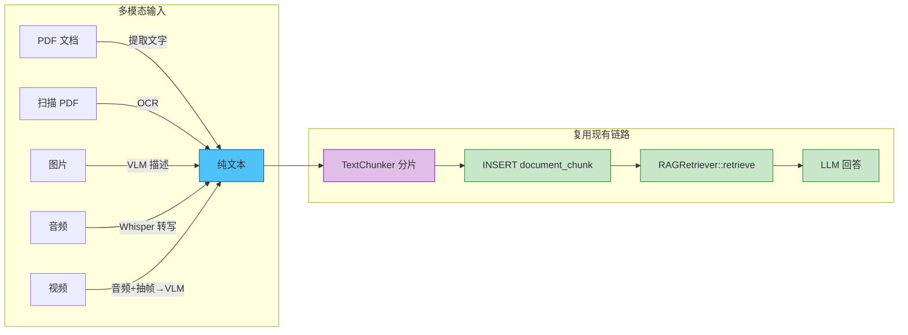
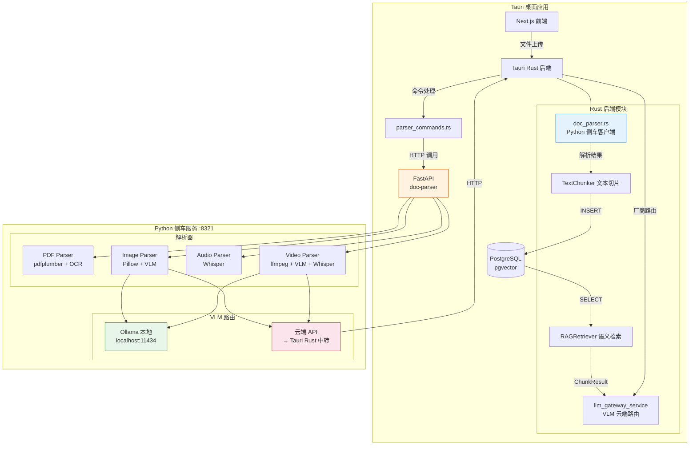
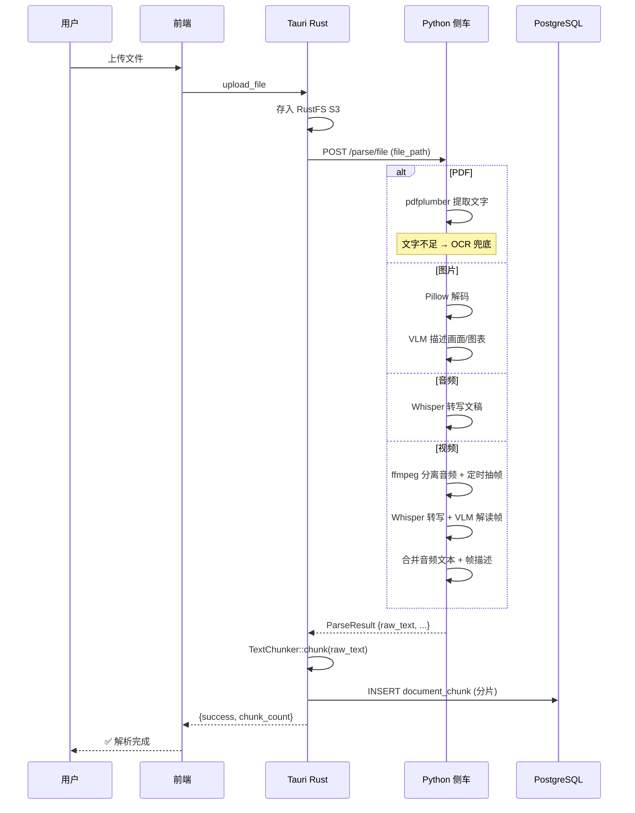
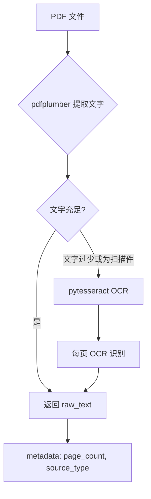
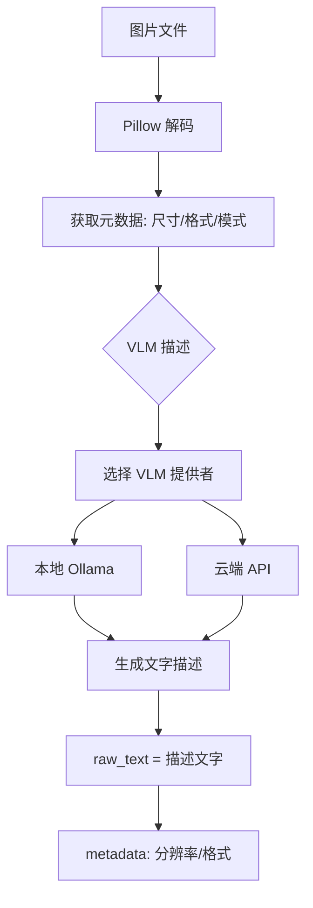
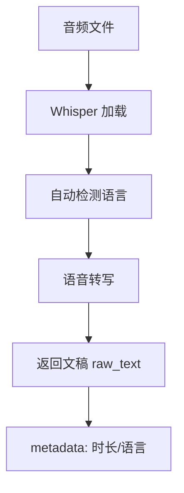
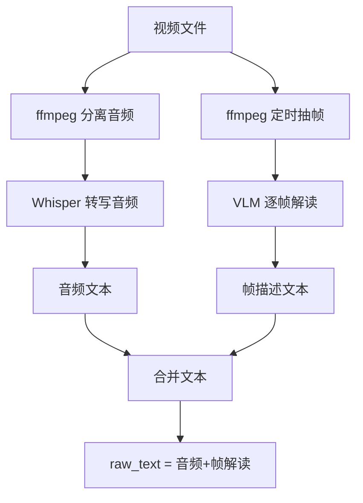
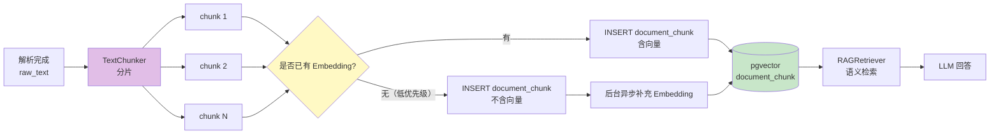

# 多模态文档解析与文本化归一设计方案

> 所有非文本模态（PDF/图片/音频/视频）统一转化为纯文本，完全复用现有 RAG 链路，不修改查询与生成逻辑。

---

## 目录

1. [背景与目标](#1-背景与目标)
2. [整体架构](#2-整体架构)
3. [Python 侧车服务](#3-python-侧车服务-doc-parser)
4. [各类文件解析流程](#4-各类文件解析流程)
5. [VLM 双模式](#5-vlm-双模式)
6. [Rust 侧集成](#6-rust-侧集成)
7. [与现有 RAG 链路的对接](#7-与现有-rag-链路的对接)
8. [实施路线图](#8-实施路线图)
9. [API 接口定义](#9-api-接口定义)
10. [附录](#10-附录)

---

## 1. 背景与目标

### 1.1 当前问题

知识库模块目前仅支持**纯文本内容**的 RAG 检索。用户上传的 PDF、图片、音频、视频等非文本文件，无法自动提取知识内容进入检索链路。

### 1.2 核心目标

**全部文本化归一**——将 PDF、图片、音频、视频全部转化为纯文本，之后完全复用现有 RAG 整条链路，查询与生成逻辑无需任何改动。



**核心原则：**
- 解析层只负责「非文本 → 文本」的转换，不参与检索和生成
- 查询与生成逻辑零改动（`RAGRetriever::retrieve` / `llm_gateway_service` 保持不变）
- 解析结果统一为 `raw_text` 纯文本，进入现有 `TextChunker` 切片流程

### 1.3 技术选型策略

**先 Python 侧车快速落地，再逐步迁移到 Rust 原生。**

| 阶段 | 方式 | 收益 |
|------|------|------|
| Phase 1-2 | Python 侧车服务 (FastAPI) | 快速验证、生态丰富、零编译问题 |
| Phase 3+ | 迁移到 Rust 原生 | 零部署依赖、统一进程、性能更高 |

---

## 2. 整体架构

### 2.1 双进程架构



### 2.2 统一文本输出格式

所有解析器输出统一结构：

```python
@dataclass
class ParseResult:
    file_name: str          # 原文件名
    file_type: str          # pdf / image / audio / video
    raw_text: str           # 核心：提取/生成的纯文本
    metadata: dict = None   # 可选元数据
    # metadata 示例：
    # PDF:  {"page_count": 5, "has_images": True}
    # 图片: {"width": 1920, "height": 1080, "format": "JPEG"}
    # 音频: {"duration_sec": 120.5, "language": "zh"}
    # 视频: {"duration_sec": 300, "fps": 24, "frames_analyzed": 10}
```

### 2.3 完整数据流



---

## 3. Python 侧车服务 (doc-parser)

### 3.1 项目结构

```
apps/
├── backend/
│   └── src-tauri/                  # 现有 Rust 后端
│       ├── Cargo.toml
│       └── src/
│           ├── service/
│           │   └── doc_parser.rs   # Python 侧车 HTTP 客户端
│           └── commands/
│               └── parser_commands.rs  # Tauri 命令
│
└── doc-parser/                          # NEW: Python 解析服务
    ├── main.py                          # FastAPI 入口
    ├── config.py                        # 配置（端口、VLM 模式、Ollama 地址等）
    ├── requirements.txt                 # Python 依赖清单
    ├── models/
    │   └── parse_result.py              # ParseResult 数据模型
    ├── parsers/
    │   ├── __init__.py
    │   ├── pdf_parser.py                # pdfplumber 文字 + OCR
    │   ├── image_parser.py              # Pillow + VLM
    │   ├── audio_parser.py              # Whisper
    │   └── video_parser.py              # ffmpeg + Whisper + VLM
    ├── vlm/
    │   ├── __init__.py
    │   ├── base.py                      # VLM 抽象接口
    │   ├── ollama_client.py             # 本地 Ollama
    │   └── cloud_client.py              # 云端 API 中转
    └── utils/
        ├── __init__.py
        ├── ocr.py                       # Tesseract OCR 封装
        └── ffmpeg_helper.py             # ffmpeg 命令行封装
```

### 3.2 FastAPI 服务入口

```python
# main.py
from fastapi import FastAPI, UploadFile, File, HTTPException
from models.parse_result import ParseResult
from parsers.pdf_parser import PdfParser
from parsers.image_parser import ImageParser
from parsers.audio_parser import AudioParser
from parsers.video_parser import VideoParser
import config

app = FastAPI(title="doc-parser", version="1.0.0")

# 注册解析器
pdf_parser = PdfParser()
image_parser = ImageParser()
audio_parser = AudioParser()
video_parser = VideoParser()

@app.post("/parse/file", response_model=ParseResult)
async def parse_file(file_path: str):
    """
    解析指定路径的文件，返回统一文本。
    """
    ext = file_path.rsplit(".", 1)[-1].lower() if "." in file_path else ""
    
    if ext in ("pdf",):
        return await pdf_parser.parse(file_path)
    elif ext in ("jpg", "jpeg", "png", "gif", "bmp", "webp", "tiff"):
        return await image_parser.parse(file_path)
    elif ext in ("mp3", "wav", "ogg", "flac", "m4a", "aac"):
        return await audio_parser.parse(file_path)
    elif ext in ("mp4", "avi", "mov", "mkv", "wmv", "flv"):
        return await video_parser.parse(file_path)
    else:
        raise HTTPException(status_code=400, detail=f"不支持的文件类型: {ext}")

@app.get("/health")
async def health():
    """健康检查接口"""
    return {"status": "ok", "vlm_mode": config.VLM_MODE}
```

### 3.3 依赖清单

```txt
# requirements.txt
# Web 框架
fastapi>=0.115.0
uvicorn>=0.32.0
python-multipart>=0.0.12

# PDF 解析
pdfplumber>=0.11.0

# OCR（扫描件 PDF 兜底）
pytesseract>=0.3.10
Pillow>=11.0.0

# 语音转写
openai-whisper>=20240930

# 音视频处理
ffmpeg-python>=0.2.0

# HTTP 客户端
httpx>=0.28.0

# 配置
python-dotenv>=1.0.0
pydantic>=2.9.0
```

### 3.4 进程生命周期管理

Tauri 启动时自动拉起 Python 侧车服务：

```rust
// lib.rs — 应用初始化
fn start_doc_parser() -> Option<std::process::Child> {
    let parser_dir = std::env::current_dir()
        .ok()?
        .parent()?
        .join("doc-parser");
    
    if !parser_dir.join("main.py").exists() {
        tracing::warn!("doc-parser 目录不存在，跳过启动");
        return None;
    }
    
    match std::process::Command::new("python")
        .args(["-m", "uvicorn", "main:app", "--host", "127.0.0.1", "--port", "8321"])
        .current_dir(&parser_dir)
        .stdout(std::process::Stdio::null())
        .stderr(std::process::Stdio::null())
        .spawn()
    {
        Ok(child) => {
            tracing::info!("doc-parser 已启动 (PID: {})", child.id());
            Some(child)
        }
        Err(e) => {
            tracing::error!("doc-parser 启动失败: {}", e);
            None
        }
    }
}
```

---

## 4. 各类文件解析流程

### 4.1 PDF 解析



```python
# parsers/pdf_parser.py
import pdfplumber
from models.parse_result import ParseResult

class PdfParser:
    MIN_TEXT_LENGTH = 50  # 少于 50 字符认为可能是扫描件
    
    async def parse(self, file_path: str) -> ParseResult:
        raw_text = ""
        page_count = 0
        
        with pdfplumber.open(file_path) as pdf:
            page_count = len(pdf.pages)
            pages_text = []
            has_images = False
            
            for page in pdf.pages:
                text = page.extract_text() or ""
                pages_text.append(text)
                
                # 检测页面是否包含图片
                if page.images:
                    has_images = True
            
            raw_text = "\n".join(pages_text)
        
        # 如果文字太少，可能是扫描件 → OCR 兜底
        if len(raw_text.strip()) < self.MIN_TEXT_LENGTH:
            raw_text = await self._ocr_fallback(file_path)
            source_type = "ocr"
        else:
            source_type = "text"
        
        return ParseResult(
            file_name=file_path.rsplit("/", 1)[-1],
            file_type="pdf",
            raw_text=raw_text,
            metadata={
                "page_count": page_count,
                "source_type": source_type,
                "has_images": has_images,
            }
        )
    
    async def _ocr_fallback(self, file_path: str) -> str:
        """OCR 兜底"""
        from pdf2image import convert_from_path
        import pytesseract
        
        images = convert_from_path(file_path)
        texts = []
        for img in images:
            text = pytesseract.image_to_string(img, lang="chi_sim+eng")
            texts.append(text)
        return "\n".join(texts)
```

### 4.2 图片解析



```python
# parsers/image_parser.py
from PIL import Image
from models.parse_result import ParseResult
from vlm.router import describe_image

class ImageParser:
    async def parse(self, file_path: str) -> ParseResult:
        # Pillow 解码获取元数据
        with Image.open(file_path) as img:
            width, height = img.size
            img_format = img.format or "unknown"
            mode = img.mode
        
        # VLM 描述
        description = await describe_image(file_path)
        
        return ParseResult(
            file_name=file_path.rsplit("/", 1)[-1],
            file_type="image",
            raw_text=description,
            metadata={
                "width": width,
                "height": height,
                "format": img_format,
                "mode": mode,
                "vlm_provider": config.VLM_MODE,
            }
        )
```

### 4.3 音频解析



```python
# parsers/audio_parser.py
import whisper
from models.parse_result import ParseResult

class AudioParser:
    _model = None  # 单例，避免重复加载
    
    def _get_model(self):
        if self._model is None:
            # 默认使用 base 模型（平衡速度与准确度）
            self._model = whisper.load_model("base")
        return self._model
    
    async def parse(self, file_path: str) -> ParseResult:
        model = self._get_model()
        result = model.transcribe(file_path, language=None)  # 自动检测语言
        
        return ParseResult(
            file_name=file_path.rsplit("/", 1)[-1],
            file_type="audio",
            raw_text=result["text"],
            metadata={
                "duration_sec": round(result.get("duration", 0)),
                "language": result.get("language", "unknown"),
                "segments_count": len(result.get("segments", [])),
            }
        )
```

### 4.4 视频解析



```python
# parsers/video_parser.py
import tempfile
import os
import ffmpeg
from models.parse_result import ParseResult
from parsers.audio_parser import AudioParser
from vlm.router import describe_image

class VideoParser:
    FRAME_INTERVAL_SEC = 30  # 每 30 秒抽取一帧
    
    async def parse(self, file_path: str) -> ParseResult:
        import json
        
        # 获取视频元数据
        probe = ffmpeg.probe(file_path)
        video_info = next(s for s in probe["streams"] if s["codec_type"] == "video")
        duration = float(probe["format"].get("duration", 0))
        fps = eval(video_info.get("avg_frame_rate", "0/1"))
        
        # 临时目录
        with tempfile.TemporaryDirectory() as tmpdir:
            # 1. 提取音频
            audio_path = os.path.join(tmpdir, "audio.wav")
            ffmpeg.input(file_path).output(
                audio_path, acodec="pcm_s16le", ac=1, ar=16000
            ).run(quiet=True, overwrite_output=True)
            
            # 2. Whisper 转写音频
            audio_parser = AudioParser()
            audio_result = await audio_parser.parse(audio_path)
            
            # 3. 定时抽帧 + VLM 解读
            frame_descriptions = []
            for t in range(0, int(duration), self.FRAME_INTERVAL_SEC):
                frame_path = os.path.join(tmpdir, f"frame_{t:04d}.jpg")
                ffmpeg.input(file_path, ss=t).output(
                    frame_path, vframes=1
                ).run(quiet=True, overwrite_output=True)
                
                if os.path.exists(frame_path):
                    desc = await describe_image(frame_path)
                    frame_descriptions.append(f"[第 {t}s 画面] {desc}")
            
            # 4. 合并
            combined_text = f"""【音频文稿】
{audio_result.raw_text}

【关键帧解读】
{chr(10).join(frame_descriptions)}"""
        
        return ParseResult(
            file_name=file_path.rsplit("/", 1)[-1],
            file_type="video",
            raw_text=combined_text,
            metadata={
                "duration_sec": round(duration),
                "fps": fps,
                "frames_analyzed": len(frame_descriptions),
                "frame_interval_sec": self.FRAME_INTERVAL_SEC,
            }
        )
```

---

## 5. VLM 双模式

### 5.1 抽象接口

```python
# vlm/base.py
from abc import ABC, abstractmethod

class VLMProvider(ABC):
    """VLM 提供者抽象接口"""
    
    @abstractmethod
    async def describe(self, image_path: str, prompt: str = None) -> str:
        """描述图片内容，返回文字"""
        pass
```

### 5.2 本地 Ollama 模式

```python
# vlm/ollama_client.py
import httpx
import base64
from vlm.base import VLMProvider
import config

class OllamaClient(VLMProvider):
    def __init__(self):
        self.base_url = config.OLLAMA_BASE_URL  # http://localhost:11434
        self.model = config.OLLAMA_VLM_MODEL    # llava / llama3.2-vision
    
    async def describe(self, image_path: str, prompt: str = None) -> str:
        prompt = prompt or "请详细描述这张图片的内容，包括文字、图表、人物、场景等。"
        
        with open(image_path, "rb") as f:
            image_base64 = base64.b64encode(f.read()).decode()
        
        payload = {
            "model": self.model,
            "prompt": prompt,
            "images": [image_base64],
            "stream": False,
            "options": {"temperature": 0.1},  # 低温度保证描述精准
        }
        
        async with httpx.AsyncClient() as client:
            resp = await client.post(
                f"{self.base_url}/api/generate",
                json=payload,
                timeout=60,
            )
            resp.raise_for_status()
            return resp.json()["response"]
```

### 5.3 云端 API 模式

```python
# vlm/cloud_client.py
import httpx
import json
from vlm.base import VLMProvider
import config

class CloudVLMClient(VLMProvider):
    """
    云端 VLM：通过 Tauri Rust 后端的 llm_gateway_service 中转。
    Python 不直接存 API Key，全部委托给 Rust。
    """
    
    def __init__(self):
        self.rust_gateway_url = config.RUST_GATEWAY_URL  # http://localhost:1420
    
    async def describe(self, image_path: str, prompt: str = None) -> str:
        prompt = prompt or "请详细描述这张图片的内容。"
        
        # 1. 图片 base64
        import base64
        with open(image_path, "rb") as f:
            image_base64 = base64.b64encode(f.read()).decode()
        
        # 2. 构造多模态消息（OpenAI 兼容格式）
        messages = [
            {
                "role": "user",
                "content": [
                    {"type": "text", "text": prompt},
                    {
                        "type": "image_url",
                        "image_url": {"url": f"data:image/jpeg;base64,{image_base64}"}
                    }
                ]
            }
        ]
        
        # 3. 调用 Rust 的 llm_gateway_service
        # 请求会经过 Rust 的厂商路由、负载均衡、熔断
        async with httpx.AsyncClient() as client:
            resp = await client.post(
                f"{self.rust_gateway_url}/api/llm/chat",
                json={
                    "messages": messages,
                    "model_type": "vision",  # 指定需要视觉模型
                    "stream": False,
                    "temperature": 0.1,
                },
                timeout=120,
            )
            resp.raise_for_status()
            return resp.json()["content"]
```

### 5.4 VLM 路由选择

```python
# vlm/__init__.py
from vlm.ollama_client import OllamaClient
from vlm.cloud_client import CloudVLMClient
import config

_client = None

def _get_client():
    global _client
    if _client is None:
        if config.VLM_MODE == "ollama":
            _client = OllamaClient()
        else:
            _client = CloudVLMClient()
    return _client

async def describe_image(image_path: str, prompt: str = None) -> str:
    """统一的 VLM 调用入口"""
    client = _get_client()
    try:
        return await client.describe(image_path, prompt)
    except Exception as e:
        # 当前模式失败时自动切换
        if config.VLM_MODE == "ollama":
            print(f"Ollama 调用失败 ({e})，切换到云端")
            config.VLM_MODE = "cloud"
            _client = CloudVLMClient()
            return await _client.describe(image_path, prompt)
        else:
            print(f"云端 VLM 调用失败 ({e})，切换到 Ollama")
            config.VLM_MODE = "ollama"
            _client = OllamaClient()
            return await _client.describe(image_path, prompt)
```

### 5.5 配置

```python
# config.py
import os

# 服务端口
PARSER_PORT = int(os.getenv("PARSER_PORT", "8321"))

# VLM 模式: "ollama" | "cloud"
VLM_MODE = os.getenv("VLM_MODE", "ollama")

# Ollama 配置
OLLAMA_BASE_URL = os.getenv("OLLAMA_BASE_URL", "http://localhost:11434")
OLLAMA_VLM_MODEL = os.getenv("OLLAMA_VLM_MODEL", "llava")

# Rust 后端网关地址（云端 VLM 中转）
RUST_GATEWAY_URL = os.getenv("RUST_GATEWAY_URL", "http://localhost:1420")
```

---

## 6. Rust 侧集成

### 6.1 Python 侧车 HTTP 客户端

```rust
// service/doc_parser.rs

use serde::{Deserialize, Serialize};

/// Python 解析服务的统一返回结构
#[derive(Debug, Clone, Serialize, Deserialize)]
pub struct ParseResult {
    pub file_name: String,
    pub file_type: String,
    pub raw_text: String,
    pub metadata: Option<serde_json::Value>,
}

/// Python 解析服务客户端
pub struct DocParserClient {
    base_url: String,
    client: reqwest::Client,
}

impl DocParserClient {
    pub fn new() -> Self {
        Self {
            base_url: "http://127.0.0.1:8321".to_string(),
            client: reqwest::Client::new(),
        }
    }

    /// 解析文件 → 返回纯文本
    pub async fn parse_file(&self, file_path: &str) -> Result<ParseResult, String> {
        let resp = self
            .client
            .post(format!("{}/parse/file", self.base_url))
            .query(&[("file_path", file_path)])
            .send()
            .await
            .map_err(|e| format!("调用 doc-parser 失败: {}", e))?;

        if !resp.status().is_success() {
            let err_text = resp.text().await.unwrap_or_default();
            return Err(format!("doc-parser 返回错误: {}", err_text));
        }

        resp.json::<ParseResult>()
            .await
            .map_err(|e| format!("解析 doc-parser 响应失败: {}", e))
    }

    /// 健康检查
    pub async fn health(&self) -> bool {
        self.client
            .get(format!("{}/health", self.base_url))
            .send()
            .await
            .map(|r| r.status().is_success())
            .unwrap_or(false)
    }
}
```

### 6.2 Tauri 命令层

```rust
// commands/parser_commands.rs

use crate::service::doc_parser::DocParserClient;
use crate::service::rag_service::{TextChunker, RAGRetriever};
use tauri::State;

#[tauri::command]
pub async fn parse_and_vectorize(
    file_path: String,
    tree_node_id: Option<i64>,
    title: String,
    okf_type: String,
    tags: Vec<String>,
) -> Result<serde_json::Value, String> {
    // 1. 调用 Python 侧车解析
    let parser = DocParserClient::new();
    let result = parser.parse_file(&file_path).await?;

    if result.raw_text.trim().is_empty() {
        return Err("解析结果为空，无法向量化".to_string());
    }

    // 2. 切片 + 入库（复用现有 RAG 链路）
    let chunks = RAGRetriever::chunk_and_vectorize(
        0,                       // asset_id — 这里需要实际的知识资产 ID
        &result.raw_text,
        &title,
        &okf_type,
        &tags,
        tree_node_id,
    )
    .await?;

    Ok(serde_json::json!({
        "success": true,
        "chunk_count": chunks.len(),
        "file_type": result.file_type,
        "file_name": result.file_name,
        "metadata": result.metadata,
    }))
}
```

### 6.3 Tauri 命令注册

```rust
// main.rs
fn main() {
    // 启动 Python 侧车
    let _parser_process = start_doc_parser();

    tauri::Builder::default()
        .invoke_handler(tauri::generate_handler![
            // ... 现有命令
            commands::parser_commands::parse_and_vectorize,
        ])
        .run(tauri::generate_context!())
        .expect("error while running tauri application");
}
```

---

## 7. 与现有 RAG 链路的对接

### 7.1 零改动原则

解析完成后的流程完全复用现有代码：

| 步骤 | 代码位置 | 改动？ |
|------|---------|:-----:|
| 文本切片 | `rag_service.rs` → `TextChunker::chunk()` | ❌ 不改 |
| 分片入库 | `rag_service.rs` → `RAGRetriever::chunk_and_vectorize()` | ❌ 不改 |
| 语义检索 | `rag_service.rs` → `RAGRetriever::retrieve()` | ❌ 不改 |
| LLM 回答 | `llm_gateway_service.rs` → 厂商路由 | ❌ 不改 |
| 前端展示 | `chat_routes.rs` → SSE 流式输出 | ❌ 不改 |

### 7.2 新增代码

```
src-tauri/src/
├── service/
│   └── doc_parser.rs          # NEW: Python 侧车客户端
└── commands/
    └── parser_commands.rs     # NEW: Tauri 命令
```

### 7.3 文档解析后入库流程



---

## 8. 实施路线图

### Phase 1：Python 侧车 + PDF/图片解析（P0）

| 任务 | 预估工时 |
|------|---------|
| 搭建 `doc-parser/` 项目骨架（FastAPI + 配置） | 1h |
| PDF 解析器（pdfplumber + OCR） | 1h |
| 图片解析器（Pillow + VLM 路由） | 2h |
| VLM 双模式（Ollama + 云端 API） | 2h |
| Rust 侧 `doc_parser.rs` 客户端 | 0.5h |
| Rust 侧 `parser_commands.rs` 命令 | 0.5h |
| Tauri 启动时自动拉起 Python 进程 | 0.5h |
| 端到端测试（上传 → 解析 → RAG） | 1h |
| **合计** | **~8.5h** |

### Phase 2：音频/视频解析（P1）

| 任务 | 预估工时 |
|------|---------|
| 音频 Whisper 转写 | 1h |
| 视频 ffmpeg 抽帧 + 音频分离 | 2h |
| 视频帧 VLM 解读 + 文本合并 | 1h |
| 集成测试 | 1h |
| **合计** | **~5h** |

### Phase 3：逐步迁移到 Rust 原生（P2）

| 模块 | 优先级 | Rust crate | 说明 |
|------|--------|------------|------|
| PDF 文字提取 | P0 | `pdf_oxide` | 已测试通过（0.8ms），测试已写 |
| 图片 VLM | P0 | `ollama-rs` + `llm_gateway_service` | 已有 |
| OCR | P1 | `rusty-tesseract` | 已有 |
| 语音 Whisper | P1 | `whisper-rs` | 已有（编译较复杂） |
| 视频处理 | P2 | `ffmpeg-light` | 最复杂，最后迁移 |

---

## 9. API 接口定义

### 9.1 `POST /parse/file`

**请求：**
```json
{
    "file_path": "/path/to/file.pdf"
}
```

**成功响应：**
```json
{
    "file_name": "document.pdf",
    "file_type": "pdf",
    "raw_text": "提取的完整文本内容……",
    "metadata": {
        "page_count": 5,
        "source_type": "text",
        "has_images": true
    }
}
```

**错误响应：**
```json
{
    "detail": "不支持的文件类型: exe"
}
```

### 9.2 `GET /health`

**响应：**
```json
{
    "status": "ok",
    "vlm_mode": "ollama"
}
```

### 9.3 `POST /parse/image`（独立图片解析，可选）

用于前端直接预览图片描述时调用：

```json
{
    "image_path": "/path/to/photo.jpg",
    "prompt": "请描述这张图片中的表格数据"
}
```

---

## 10. 附录

### 10.1 依赖清单汇总

#### Python 服务

| 包 | 用途 | 是否必需 |
|---|------|:--------:|
| fastapi | Web 框架 | ✅ |
| uvicorn | ASGI 服务器 | ✅ |
| pdfplumber | PDF 文字提取 | ✅ |
| pytesseract | OCR 扫描件 | PDF可选 |
| pdf2image | PDF→图片（OCR 用） | PDF可选 |
| Pillow | 图片解码 | ✅ |
| openai-whisper | 语音转写 | 音频/视频必需 |
| ffmpeg-python | 视频处理 | 视频必需 |
| httpx | HTTP 客户端 | VLM云端必需 |

#### Rust（已有，声明在 Cargo.toml）

| crate | 用途 | Phase |
|-------|------|:----:|
| `pdf_oxide` | PDF 文字提取 | Phase 3 |
| `image` | 图片处理基础 | Phase 3 |
| `rusty-tesseract` | OCR | Phase 3 |
| `whisper-rs` | 语音转写 | Phase 3 |
| `ffmpeg-light` | 音视频处理 | Phase 3 |
| `ollama-rs` | 本地 VLM | Phase 3 |

### 10.2 错误处理策略

| 错误场景 | 处理方式 |
|---------|---------|
| Python 服务未启动 | Rust 侧检测 health，失败则返回明确错误提示 |
| PDF 解析为空 | 检查是否为加密PDF/损坏文件，返回具体原因 |
| VLM 调用失败 | 自动切换模式（Ollama ↔ 云端），都失败则返回默认描述 |
| Whisper 加载失败 | 检查模型是否下载，未下载则提示首次需下载 |
| 文件不存在 | 返回 404 错误 |
| 大文件超时 | 设置 120s 超时，超时返回可重试信号 |

### 10.3 性能预期

| 模态 | 解析方式 | 预估耗时 | 并行度 |
|------|---------|---------|:------:|
| PDF 文字（10页） | pdfplumber | 0.5-2s | ✅ 可并行 |
| 扫描 PDF（10页） | OCR | 10-30s | ✅ 可并行 |
| 图片 VLM | Ollama | 3-10s | ❌ 串行 |
| 图片 VLM | 云端 API | 2-5s | ✅ 可并行 |
| 音频（10分钟） | Whisper base | 30-60s | ❌ 串行 |
| 视频（10分钟） | ffmpeg + Whisper + VLM | 2-5min | ⚠️ 部分并行 |

### 10.4 相关文档

- [知识库模块架构梳理与重新设计方案](./知识库模块/知识库模块架构梳理与重新设计方案.md) — 知识库整体架构
- [文档解析后向量化数据缓存方案](./文档解析后向量化数据缓存方案.md) — 向量存储缓存策略
- [智能问答系统（RAG多轮对话）设计方案](./知识库模块/智能问答系统（RAG多轮对话）设计方案.md) — RAG 查询与生成
- [多LLM厂商兼容设计方案](./知识库模块/多LLM厂商兼容设计方案.md) — LLM 厂商路由

---

> **最后更新：** 2026-07-30