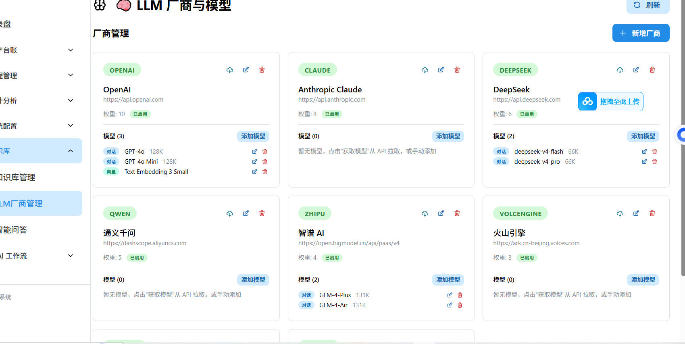

## 1. LLM 厂商管理模块

| 功能 | 标准描述 |
|------|---------|
| **1.1 内置厂商** | 预置多个主流 LLM 厂商（如 OpenAI、DeepSeek、智谱 GLM、Ollama 等），开箱即用 |
| **1.2 厂商 CRUD** | 支持添加、修改、删除 LLM 厂商配置，包括接口地址（Base URL）和认证 Token（API Key） |
| **1.3 模型拉取** | 通过 OpenAI 兼容接口自动拉取厂商的模型列表（`/v1/models`） |
| **1.4 模型分类** | 将模型按用途分类为 Chat（对话模型）和 Embedding（向量模型） |
| **1.5 本地部署** | 支持接入本地部署的 LLM（如 Ollama），通过 `is_local` 字段标识，接口地址指向本地服务（`http://localhost:11434`） |

## 2. 智能问答功能

| 功能 | 标准描述 |
|------|---------|
| **2.1 架构** | 直接调用 OpenAI 兼容接口，暂时不依赖 LangChain 等第三方框架，得想好方法再去引入，调用OpenAI兼容接口相对简单 |
| **2.2 交互模式** | 支持纯文本交互，暂不支持多模态输入 |
| **2.3 模型指定** | 支持手动指定使用的 LLM 厂商和模型 |
| **2.4 自动路由** | 未指定厂商或模型时，根据 LLM 厂商的权重配置，通过负载均衡 + 熔断机制自动选择可用的 OpenAI 兼容接口 |
| **2.5 前后端交互通讯方式** | 使用SSE |

def select_provider(candidates: List[Provider]) -> Provider:
    """
    从候选厂商列表中按权重随机选择一个
    
    参数:
        candidates: 候选厂商列表，每个元素有 weight 字段
    
    返回:
        被选中的厂商
    
    原理:
        将一条数字线按权重切段，然后扔飞镖
    """
    
    # 第一步：计算所有候选者的总权重
    total_weight = sum(p.weight for p in candidates)  # 例如 5+3+2 = 10
    
    # 第二步：生成一个 [1, total_weight] 之间的随机数（扔飞镖）
    threshold = random(1, total_weight)  # 例如随机到 7
    #  第三步：  调用某个厂商的openai接口，失败3次，不再调用。
    # 第四步：依次减去每个候选者的权重，减到 <= 0 时命中
    for candidate in candidates:
        threshold -= candidate.weight  # 第一轮 7-5=2, 第二轮 2-3=-1
        if threshold <= 0:
            return candidate 

