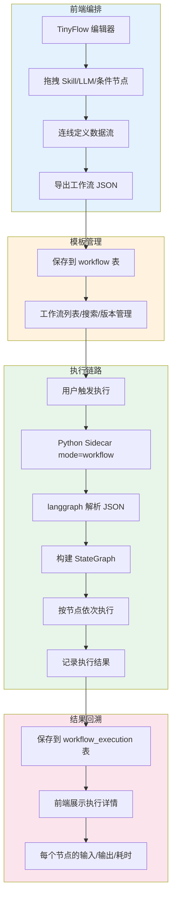
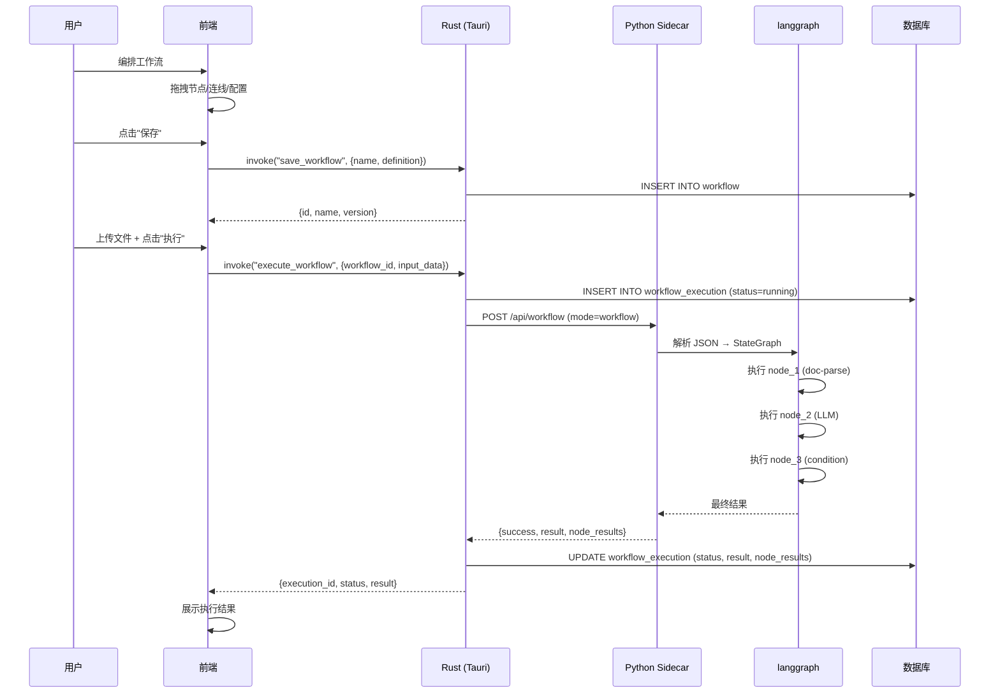
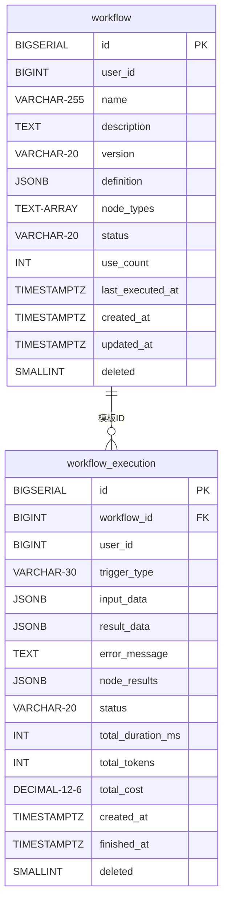

# AI 工作流编排器设计方案

> 可视化拖拽构建 AI 推理链条：TinyFlow UI → JSON → langgraph 执行
> 支撑数据表：workflow、workflow_execution
> 关联模块：skill_registry、LLMRouter、Python Sidecar

---

## 目录

1. [设计目标](#1-设计目标)
2. [整体架构](#2-整体架构)
3. [工作流 JSON 标准](#3-工作流-json-标准)
4. [数据库设计](#4-数据库设计)
5. [节点类型定义](#5-节点类型定义)
6. [后端执行引擎](#6-后端执行引擎)
7. [API 接口设计](#7-api-接口设计)
8. [前端集成](#8-前端集成)
9. [边界情况处理](#9-边界情况处理)
10. [实施路线图](#10-实施路线图)

---

## 1. 设计目标

### 1.1 核心能力

| 目标 | 说明 | 优先级 |
|------|------|--------|
| 🎨 **可视化编排** | 前端拖拽构建 AI 工作流，零代码配置 | P0 |
| 📤 **导出 JSON** | TinyFlow 导出标准化工作流定义 JSON | P0 |
| 🚀 **langgraph 执行** | JSON → StateGraph → 执行推理链条 | P0 |
| 💾 **模板存储** | 持久化工作流定义，支持版本管理 | P0 |
| 📊 **执行回溯** | 记录每次执行的每个节点结果 | P1 |
| 🔌 **Skill 集成** | 复用已有 Skill（doc-parse / rag-qa 等）作为节点 | P1 |
| 🔀 **条件分支** | 支持 if/else 条件判断节点 | P1 |
| 🔄 **变量传递** | 节点间的数据流映射 | P2 |

### 1.2 系统流程全景



---

## 2. 整体架构

### 2.1 分层架构

```mermaid
graph TB
    subgraph 前端层 Frontend
        A[TinyFlow UI 编辑器]
        B[工作流列表/管理]
        C[执行历史查看]
    end
    
    subgraph 应用层 API (Tauri Commands)
        D[save_workflow / get_workflow / list_workflows]
        E[execute_workflow]
        F[get_execution / list_executions]
    end
    
    subgraph 服务层 Service
        G[workflow_service.rs]
        H[workflow_execution_service.rs]
        I[模版管理/版本控制]
    end
    
    subgraph 执行引擎 Engine
        J[Python Sidecar]
        K[langgraph StateGraph]
        L[节点执行器]
    end
    
    subgraph 数据层 Data
        M[(workflow 表)]
        N[(workflow_execution 表)]
    end
    
    A --> D
    B --> D
    C --> F
    
    D --> G
    E --> J
    F --> H
    
    G --> M
    H --> N
    J --> K
    K --> L
    
    style 执行引擎 fill:#fff9c4,stroke:#f9a825
    style Python Sidecar fill:#f3e5f5,stroke:#7b1fa2
```

### 2.2 执行时序



---

## 3. 工作流 JSON 标准

### 3.1 顶层结构

```json
{
  "name": "合同智能分析",
  "description": "上传合同PDF → 提取要素 → 生成摘要 → 推审批",
  "version": "1.0.0",
  "nodes": [],
  "edges": [],
  "variables": {},
  "config": {
    "max_execution_time": 300,
    "retry_on_failure": true,
    "max_retries": 2
  }
}
```

### 3.2 节点类型定义

#### 触发节点（Trigger）

```json
{
  "id": "node_1",
  "type": "trigger",
  "label": "文件上传触发",
  "config": {
    "trigger_type": "file_upload",
    "accept": ".pdf,.docx,.mp4",
    "max_size_mb": 100
  }
}
```

支持类型：`file_upload` / `manual` / `scheduled` / `webhook`

#### Skill 节点（复用 skill_registry）

```json
{
  "id": "node_2",
  "type": "skill",
  "label": "文档解析",
  "skill_id": "doc-parse",
  "config": {}
}
```

`skill_id` 直接从 `skill_registry.rs` 加载，动态获取可用的 Skill 列表。

#### LLM 节点

```json
{
  "id": "node_3",
  "type": "llm",
  "label": "提取合同要素",
  "config": {
    "prompt": "从以下文本中提取：甲方、乙方、金额、签署日期",
    "model": null,
    "temperature": 0.1,
    "max_tokens": 2000,
    "output_schema": {
      "type": "object",
      "properties": {
        "party_a": { "type": "string" },
        "amount": { "type": "number" },
        "sign_date": { "type": "string" }
      }
    }
  }
}
```

`model: null` 表示使用用户默认模型（从 `user_llm_setting` 表加载）。

#### 条件分支节点

```json
{
  "id": "node_4",
  "type": "condition",
  "label": "金额判断",
  "config": {
    "field": "amount",
    "operator": ">",
    "value": 100000,
    "yes_label": "大额合同",
    "no_label": "普通合同"
  }
}
```

`operator` 支持：`>` / `<` / `>=` / `<=` / `==` / `!=` / `contains` / `is_empty`

edges 中的 `label` 字段指示条件走哪个分支：

```json
{
  "id": "edge_4",
  "source": "node_4",
  "target": "node_5",
  "label": "yes"
}
```

#### 工作流节点（调用子工作流或系统操作）

```json
{
  "id": "node_5",
  "type": "workflow",
  "wf_type": "push-approval",
  "label": "推送到审批",
  "config": {
    "approval_flow_id": "flow_contract",
    "title_template": "合同审批：{{party_a}} - {{amount}}元"
  }
}
```

#### 代码节点（沙箱执行）

```json
{
  "id": "node_6",
  "type": "code",
  "label": "数据转换",
  "config": {
    "language": "javascript",
    "code": "return { summary: input.text.slice(0, 100) };"
  }
}
```

### 3.3 变量传递

```json
{
  "variables": {
    "contract_amount": "$.node_3.output.amount",
    "party_a_name": "$.node_3.output.party_a",
    "parsed_text": "$.node_2.output.text"
  }
}
```

引用语法：`$.{node_id}.output.{field}` 表示引用某个节点的输出字段。

---

## 4. 数据库设计

### 4.1 统一设计规范（遵循项目现有规范）

| 规则 | 说明 |
|------|------|
| 🔑 主键 | `BIGSERIAL` 自增主键 |
| 🗑️ 软删除 | `deleted SMALLINT DEFAULT 0` |
| ⏰ 时间 | 统一 `TIMESTAMPTZ` |
| 📄 复杂数据 | 使用 `JSONB` 存储 |

### 4.2 workflow 工作流模板表

```sql
CREATE TABLE IF NOT EXISTS {schema}.workflow (
    id BIGSERIAL PRIMARY KEY,
    user_id BIGINT NOT NULL,                    -- 创建人
    name VARCHAR(255) NOT NULL,                 -- 工作流名称
    description TEXT,                           -- 描述
    version VARCHAR(20) DEFAULT '1.0.0',        -- 版本号
    
    -- 核心：TinyFlow 导出的完整 JSON
    definition JSONB NOT NULL,                  -- 完整工作流定义（nodes + edges + config）
    
    -- 节点类型索引（用于快速检索哪些工作流用了某个 Skill）
    node_types TEXT[] DEFAULT '{}',              -- ['skill:doc-parse', 'skill:rag-qa', 'llm', 'condition']
    
    -- 元数据
    status VARCHAR(20) DEFAULT 'draft',          -- draft / published / archived
    use_count INT DEFAULT 0,                    -- 执行次数
    last_executed_at TIMESTAMPTZ,
    
    created_at TIMESTAMPTZ NOT NULL DEFAULT NOW(),
    updated_at TIMESTAMPTZ NOT NULL DEFAULT NOW(),
    deleted SMALLINT NOT NULL DEFAULT 0
);

COMMENT ON TABLE {schema}.workflow IS 'AI 工作流模板定义';
COMMENT ON COLUMN {schema}.workflow.definition IS 'TinyFlow 导出的完整工作流 JSON（nodes + edges + variables + config）';
COMMENT ON COLUMN {schema}.workflow.node_types IS '节点类型数组，用于查询哪些工作流使用了某个 Skill';
COMMENT ON COLUMN {schema}.workflow.status IS '状态：draft=草稿 published=已发布 archived=已归档';

CREATE INDEX idx_wf_user ON {schema}.workflow(user_id, deleted);
CREATE INDEX idx_wf_status ON {schema}.workflow(status, deleted);
CREATE INDEX idx_wf_node_types ON {schema}.workflow USING GIN(node_types);
CREATE INDEX idx_wf_time ON {schema}.workflow(created_at DESC);
```

### 4.3 workflow_execution 执行记录表

```sql
CREATE TABLE IF NOT EXISTS {schema}.workflow_execution (
    id BIGSERIAL PRIMARY KEY,
    workflow_id BIGINT NOT NULL REFERENCES {schema}.workflow(id) ON DELETE CASCADE,
    user_id BIGINT NOT NULL,                    -- 执行人
    trigger_type VARCHAR(30) DEFAULT 'manual',   -- manual / scheduled / webhook
    
    -- 输入输出
    input_data JSONB,                           -- 执行输入（如文件路径、问题）
    result_data JSONB,                          -- 最终输出结果
    error_message TEXT,                         -- 失败原因（status=failed 时）
    
    -- 每个节点的执行详情
    node_results JSONB,                         -- [{node_id, status, input, output, duration_ms, error}]
    
    -- 执行状态
    status VARCHAR(20) DEFAULT 'running',        -- running / success / failed / cancelled
    
    -- 用量统计
    total_duration_ms INT,
    total_tokens INT,
    total_cost DECIMAL(12,6),
    
    created_at TIMESTAMPTZ NOT NULL DEFAULT NOW(),
    finished_at TIMESTAMPTZ,
    deleted SMALLINT NOT NULL DEFAULT 0
);

COMMENT ON TABLE {schema}.workflow_execution IS 'AI 工作流执行记录';
COMMENT ON COLUMN {schema}.workflow_execution.node_results IS '每个节点的执行详情，前端可逐步回溯展示';
COMMENT ON COLUMN {schema}.workflow_execution.status IS '执行状态：running=执行中 success=成功 failed=失败 cancelled=已取消';

CREATE INDEX idx_wfe_workflow ON {schema}.workflow_execution(workflow_id, deleted);
CREATE INDEX idx_wfe_user ON {schema}.workflow_execution(user_id, deleted);
CREATE INDEX idx_wfe_status ON {schema}.workflow_execution(status, created_at DESC);
CREATE INDEX idx_wfe_time ON {schema}.workflow_execution(created_at DESC);
```

### 4.4 表关系



---

## 5. 节点类型定义（Rust 侧）

```rust
/// 节点类型枚举（对应 JSON 中的 type 字段）
#[derive(Debug, Clone, Serialize, Deserialize)]
#[serde(tag = "type")]
pub enum WorkflowNode {
    /// 触发节点：文件上传 / 手动 / 定时
    Trigger {
        config: TriggerConfig,
    },
    
    /// Skill 节点：映射到 skill_registry.rs 中的注册 Skill
    Skill {
        skill_id: String,
        config: serde_json::Value,
    },
    
    /// LLM 节点：直接调用 LLMRouter
    LLM {
        config: LLMConfig,
    },
    
    /// 条件分支节点
    Condition {
        config: ConditionConfig,
    },
    
    /// 内置工作流操作节点
    Workflow {
        wf_type: String,
        config: serde_json::Value,
    },
    
    /// 代码节点（沙箱执行）
    Code {
        config: CodeConfig,
    },
}

#[derive(Debug, Clone, Serialize, Deserialize)]
pub struct TriggerConfig {
    pub trigger_type: String,     // file_upload / manual / scheduled / webhook
    pub accept: Option<String>,   // ".pdf,.docx"
    pub max_size_mb: Option<i32>,
}

#[derive(Debug, Clone, Serialize, Deserialize)]
pub struct LLMConfig {
    pub prompt: String,
    pub model: Option<String>,
    pub temperature: Option<f64>,
    pub max_tokens: Option<i32>,
    pub output_schema: Option<serde_json::Value>,
}

#[derive(Debug, Clone, Serialize, Deserialize)]
pub struct ConditionConfig {
    pub field: String,
    pub operator: String,         // > / < / >= / <= / == / != / contains
    pub value: serde_json::Value,
    pub yes_label: Option<String>,
    pub no_label: Option<String>,
}

#[derive(Debug, Clone, Serialize, Deserialize)]
pub struct CodeConfig {
    pub language: String,         // javascript / python
    pub code: String,
}

/// 工作流定义
#[derive(Debug, Clone, Serialize, Deserialize)]
pub struct WorkflowDefinition {
    pub name: String,
    pub description: Option<String>,
    pub version: Option<String>,
    pub nodes: Vec<WorkflowNode>,
    pub edges: Vec<Edge>,
    pub variables: Option<serde_json::Value>,
    pub config: Option<WorkflowConfig>,
}

#[derive(Debug, Clone, Serialize, Deserialize)]
pub struct Edge {
    pub id: String,
    pub source: String,
    pub target: String,
    pub label: Option<String>,   // 条件分支用：yes / no
}

#[derive(Debug, Clone, Serialize, Deserialize)]
pub struct WorkflowConfig {
    pub max_execution_time: Option<i32>,
    pub retry_on_failure: Option<bool>,
    pub max_retries: Option<i32>,
}
```

---

## 6. 后端执行引擎

### 6.1 Python Sidecar 扩展

在统一接口中新增 `mode=workflow`：

```
请求:
{
  "mode": "workflow",
  "action": "execute",
  "workflow": { ... },     // 完整工作流 JSON
  "input": { ... }         // 用户输入
}

响应:
{
  "success": true,
  "result": { ... },       // 最终输出
  "node_results": [        // 每个节点的执行详情
    {"node_id": "node_1", "status": "success", "output": "...", "duration_ms": 450},
    {"node_id": "node_2", "status": "success", "output": "...", "duration_ms": 1200}
  ],
  "total_duration_ms": 1650,
  "total_tokens": 1500,
  "error": null
}
```

### 6.2 Python 执行器伪代码

```python
# Python Sidecar - workflow_executor.py
from langgraph.graph import StateGraph, State

def execute_workflow(workflow_json: dict, input_data: dict) -> dict:
    """
    将工作流 JSON 转换为 langgraph StateGraph 并执行
    """
    try:
        nodes = workflow_json["nodes"]
        edges = workflow_json["edges"]
        
        # 构建 StateGraph
        graph = StateGraph(WorkflowState)
        
        # 注册所有节点
        for node in nodes:
            node_type = node["type"]
            if node_type == "skill":
                graph.add_node(node["id"], create_skill_node(node))
            elif node_type == "llm":
                graph.add_node(node["id"], create_llm_node(node))
            elif node_type == "condition":
                graph.add_conditional_edges(node["id"], create_condition_fn(node))
            elif node_type == "code":
                graph.add_node(node["id"], create_code_node(node))
            elif node_type == "workflow":
                graph.add_node(node["id"], create_workflow_node(node))
        
        # 添加边
        for edge in edges:
            graph.add_edge(edge["source"], edge["target"])
        
        # 编译并执行
        app = graph.compile()
        result = app.invoke(input_data)
        
        return {
            "success": True,
            "result": result.get("final_output"),
            "node_results": result.get("node_results", []),
            "total_duration_ms": result.get("total_duration_ms", 0),
            "total_tokens": result.get("total_tokens", 0),
        }
    except Exception as e:
        return {
            "success": False,
            "error": str(e),
            "node_results": [],
            "total_duration_ms": 0,
            "total_tokens": 0,
        }
```

### 6.3 Rust 侧调用

```rust
// workflow_service.rs
use crate::service::llm_gateway_service::LLMRouter;
use std::sync::Arc;

pub struct WorkflowService;

impl WorkflowService {
    /// 执行工作流（通过 Python Sidecar）
    pub async fn execute(
        workflow_definition: &WorkflowDefinition,
        input_data: serde_json::Value,
    ) -> Result<ExecutionResult, String> {
        // 调 Python Sidecar（HTTP 或 Sidecar CLI）
        let result = call_python_sidecar(PythonRequest {
            mode: "workflow".to_string(),
            action: "execute".to_string(),
            workflow: workflow_definition.clone(),
            input: input_data,
        }).await?;
        
        Ok(result)
    }
}
```

---

## 7. API 接口设计

### 7.1 Tauri Command 列表

| Command | 方法 | 说明 |
|---------|------|------|
| `save_workflow` | POST | 创建/更新工作流模板 |
| `get_workflow` | GET | 获取单个工作流定义 |
| `list_workflows` | GET | 获取工作流列表（支持按节点类型过滤） |
| `delete_workflow` | DELETE | 删除工作流（软删除） |
| `execute_workflow` | POST | 执行工作流（异步，返回 execution_id） |
| `get_execution` | GET | 获取执行详情（含每个节点结果） |
| `list_executions` | GET | 获取执行历史列表 |
| `cancel_execution` | POST | 取消正在执行的工作流 |

### 7.2 请求/响应示例

```json
// save_workflow 请求
{
  "id": null,
  "name": "合同智能分析",
  "description": "上传PDF → 提取要素 → 推审批",
  "definition": {
    "nodes": [...],
    "edges": [...],
    "variables": {...}
  },
  "status": "published"
}

// save_workflow 响应
{
  "id": "1001",
  "name": "合同智能分析",
  "version": "1.0.0",
  "status": "published",
  "createdAt": "2026-07-22T14:00:00Z"
}

// execute_workflow 请求
{
  "workflowId": "1001",
  "inputData": {
    "file_path": "/tmp/upload/contract_001.pdf",
    "question": "分析这份合同的关键条款"
  }
}

// execute_workflow 响应（异步）
{
  "executionId": "5001",
  "status": "running"
}

// get_execution 响应
{
  "id": "5001",
  "workflowId": "1001",
  "status": "success",
  "nodeResults": [
    {
      "nodeId": "node_1",
      "label": "文档解析",
      "status": "success",
      "durationMs": 450,
      "output": {
        "text": "合同甲方：XX科技有限公司...",
        "pages": 5
      }
    },
    {
      "nodeId": "node_2",
      "label": "提取合同要素",
      "status": "success",
      "durationMs": 3200,
      "output": {
        "party_a": "XX科技有限公司",
        "amount": 150000,
        "sign_date": "2026-06-15"
      }
    }
  ],
  "totalDurationMs": 3650,
  "totalTokens": 2500
}
```

---

## 8. 前端集成

### 8.1 目录结构

```
apps/web/src/
  ├─ app/workflow/
  │    ├─ page.tsx               ← 工作流列表页
  │    └─ [id]/
  │         ├─ edit/page.tsx     ← TinyFlow 编辑器
  │         └─ runs/page.tsx     ← 执行历史
  ├─ components/workflow/
  │    ├─ WorkflowEditor.tsx        ← TinyFlow 编辑器封装
  │    ├─ SkillNodePanel.tsx        ← 左侧 Skill 节点面板
  │    ├─ NodeConfigPanel.tsx       ← 右侧节点配置面板
  │    ├── WorkflowVariableTable.tsx ← 变量映射表
  │    └─ ExecutionTimeline.tsx     ← 执行时间线
  └─ services/workflowService.ts    ← Tauri invoke 封装
```

### 8.2 Skill 节点动态加载

从 `skill_registry` 加载可用 Skill 列表，自动注册为 TinyFlow 节点类型：

```typescript
// workflowService.ts
async function getSkillNodes(): Promise<SkillNodeType[]> {
  const skills = await invoke("list_skills");
  return skills.map(skill => ({
    type: `skill:${skill.id}`,
    label: skill.name,
    icon: skill.icon,
    description: skill.description,
    configSchema: skill.configSchema,   // 动态配置表单
  }));
}
```

---

## 9. 边界情况处理

### 9.1 工作流校验规则

| 规则 | 说明 |
|------|------|
| ✅ 无环检测 | 必须为 DAG（有向无环图），不能有循环 |
| ✅ 单一出口 | 每个分支最终汇聚到出口节点 |
| ✅ 节点可达性 | 所有节点都必须从 trigger 节点可达 |
| ✅ Skill 有效性 | 引用的 `skill_id` 必须在 `skill_registry` 中存在 |
| ✅ 变量引用完整性 | `variables` 中引用的节点 ID 必须存在 |
| ✅ 条件分支配对 | 条件节点必须有 yes/no 两条出边 |

### 9.2 执行超时处理

```rust
// Rust 侧：设置 Python Sidecar 超时
let result = tokio::time::timeout(
    Duration::from_secs(workflow_config.max_execution_time.unwrap_or(300) as u64),
    call_python_sidecar(request),
)
.await
.map_err(|_| "工作流执行超时".to_string())??;
```

### 9.3 节点级错误处理

| 情况 | 处理 |
|------|------|
| 单个节点失败 | 记录错误到 `node_results`，根据配置决定继续或终止 |
| retry_on_failure=true | 自动重试失败节点（最多 max_retries 次） |
| 条件分支不匹配 | 走默认分支（no）|
| LLM 调用失败 | 降级：使用规则提取（如果配置了 fallback）|
| Skill 不存在 | 工作流校验阶段即报错，不执行 |

### 9.4 大文件处理

超过 10MB 的文件不走 Sidecar stdin，改为传文件路径：

```json
{
  "input": {
    "file_path": "/tmp/upload/large_doc.pdf",
    "question": "分析这个文档"
  }
}
```

Sidecar 从磁盘读取文件，避免内存溢出。

---

## 10. 实施路线图

### 10.1 分期计划

| 阶段 | 内容 | 工作量 | 说明 |
|------|------|--------|------|
| 🏗️ **P0** | 数据库表 + Rust CRUD Service | 小 | workflow / workflow_execution 表，基础的增删改查 |
| 🏗️ **P0** | TinyFlow 编辑器集成 | 中 | 安装 TinyFlow，注册 Skill 节点，导出 JSON |
| 🚀 **P1** | Python Sidecar langgraph 执行器 | 中 | JSON → StateGraph，Skill/LLM/条件节点执行 |
| 🚀 **P1** | 前端执行调用 + 结果展示 | 中 | invoke execute_workflow，展示 node_results |
| 🔧 **P2** | 变量映射系统 | 小 | variables 替换模板语法 |
| 🔧 **P2** | 执行历史回溯 UI | 中 | 按时间线展示每个节点输入/输出/耗时 |
| 🎙️ **P3** | 条件分支/代码节点 | 小 | 补全节点类型支持 |
| 🎙️ **P3** | 工作流导入/导出 | 小 | JSON 文件的导入导出 |
| 🤖 **P4** | 定时触发/Webhook | 中 | cron 表达式 + webhook 接收 |
| 🤖 **P4** | 版本管理/对比 | 中 | 不同版本 workflow 的 diff |

### 10.2 与现有模块的关系

```
skill_registry.rs — Skill 是工作流的"原子节点"
LLMRouter — LLM 节点复用现有的 7+ 厂商 + 负载均衡 + 熔断器
Python Sidecar — 扩展 mode=workflow，不改变已有 mode=parse 逻辑
conversation_service — 保持不变（RAG 对话仍是独立功能）
```

---

## 11. 附录

### 11.1 依赖清单

| 前端 | 后端 |
|------|------|
| `@tinyflow-ai/ui` | 无新增 Rust 依赖（复用已有 reqwest、serde_json） |
| `@tinyflow-ai/react` | Python 新增：`langgraph`、`langchain-community` |
| `react-flow`（TinyFlow 自带） | |

### 11.2 相关文档

- [langchain-rust 集成评估与 Python 侧车架构方案](./langchain-rust集成评估与Python侧车架构方案.md)
- [智能问答系统（RAG多轮对话）设计方案](./智能问答系统（RAG多轮对话）设计方案.md)
- [知识库与知识图谱架构设计](../知识库与知识图谱架构设计.md)

### 11.3 相关代码文件

| 文件 | 说明 |
|------|------|
| `apps/backend/src-tauri/src/service/workflow_service.rs` | 待创建 |
| `apps/backend/src-tauri/src/commands/workflow_commands.rs` | 待创建 |
| `apps/backend/src-tauri/src/database/models.rs` | 待追加 Workflow 模型 |
| `apps/web/src/app/workflow/` | 待创建 |
| `python-sidecar/main.py` | 待追加 mode=workflow |

---

> 本文档对应 Feature Request: "可视化 AI 工作流编排器"
> 状态：📋 设计完成，待实施