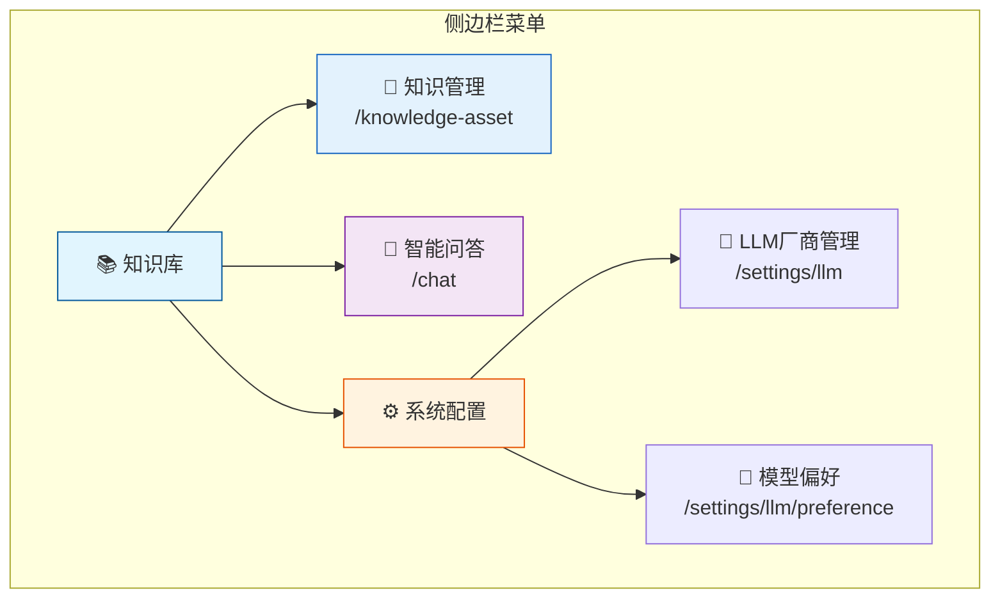
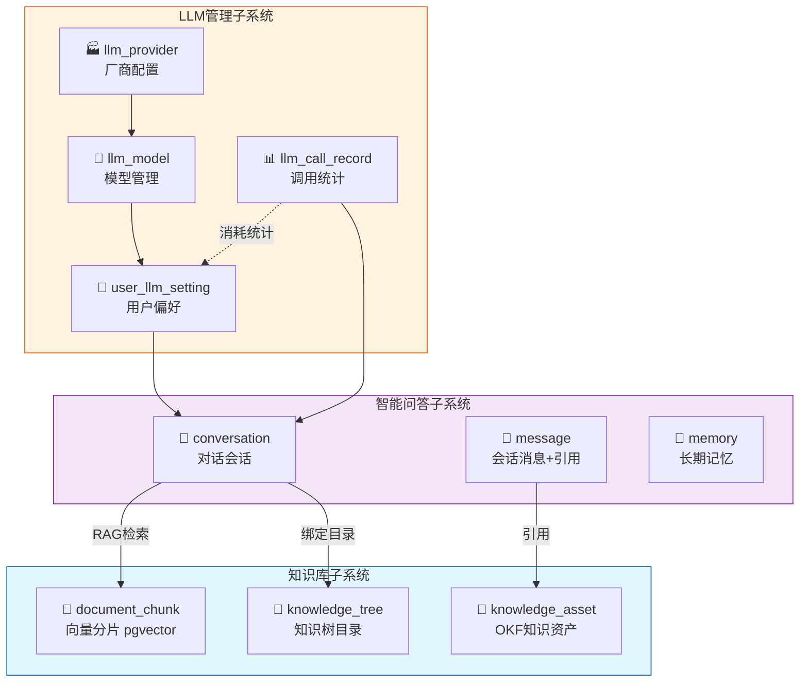
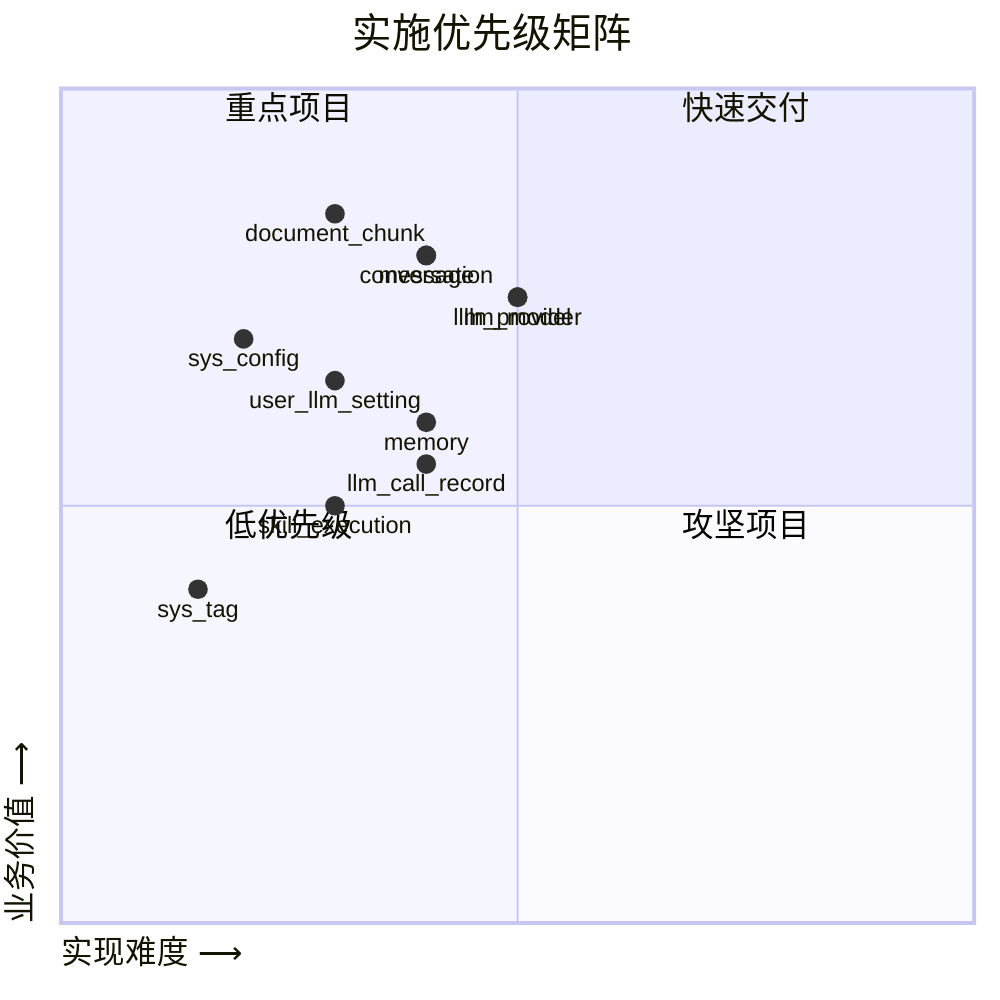

# 知识库模块

> 统一菜单入口：知识库、智能问答、LLM厂商配置

---

## 菜单结构

| 菜单项 | 路径 | 状态 | 说明 |
|--------|------|------|------|
| 📖 **知识管理** | `/knowledge-asset` | ✅ 已有 | 知识树 + Markdown编辑器 + 文件上传 |
| 💬 **智能问答** | `/chat` | ❌ 待建 | 多轮对话 + RAG检索 + 溯源引用 |
| 🧠 **LLM厂商管理** | `/settings/llm` | ❌ 待建 | 厂商密钥/模型/权重管理 |
| 👤 **模型偏好** | `/settings/llm/preference` | ❌ 待建 | 用户默认模型/温度/Token配置 |

---

## 文档索引

| 文档 | 文件 | 说明 |
|------|------|------|
| 架构梳理与重新设计方案 | [知识库模块架构梳理与重新设计方案.md](./知识库模块架构梳理与重新设计方案.md) | 整体架构、数据库设计、实施路线图 |
| 多LLM厂商兼容设计 | [多LLM厂商兼容设计方案.md](./多LLM厂商兼容设计方案.md) | 适配器模式、密钥安全、负载均衡、用量统计 |
| RAG多轮问答设计 | [智能问答系统（RAG多轮对话）设计方案.md](./智能问答系统（RAG多轮对话）设计方案.md) | RAG检索、会话管理、溯源引用、前端交互 |

---

## 子系统关系

---

## 数据表清单

| 表名 | 子系统 | 状态 | 说明 |
|------|--------|------|------|
| `knowledge_tree` | 知识库 | ✅ 已有 | 树形目录，node_type扩展为 folder/raw_file/wiki_node/skill |
| `knowledge_asset` | 知识库 | ✅ 已有 | OKF七层知识分类内容主体 |
| `document_chunk` | 知识库 | ❌ 待建 | 向量分片 + pgvector + HNSW索引 |
| `conversation` | 智能问答 | ❌ 待建 | 对话会话，绑定知识树目录 |
| `message` | 智能问答 | ❌ 待建 | 消息记录，含引用资产IDs + 原文快照 |
| `memory` | 智能问答 | ❌ 待建 | 长期记忆 + 遗忘曲线复习 |
| `skill_execution` | 智能问答 | ❌ 待建 | 技能执行日志 |
| `llm_provider` | LLM管理 | ❌ 待建 | 厂商配置，AES加密密钥存储 |
| `llm_model` | LLM管理 | ❌ 待建 | 模型明细，含价格/上下文窗口 |
| `user_llm_setting` | LLM管理 | ❌ 待建 | 用户模型偏好，一对一 |
| `llm_call_record` | LLM管理 | ❌ 待建 | 全链路调用日志 + 费用统计 |
| `sys_user_profile` | 系统 | ❌ 待建 | 用户个性化配置 |
| `sys_system_config` | 系统 | ❌ 待建 | 全局参数配置驱动 |
| `sys_file_type_parse` | 系统 | ❌ 待建 | 文件OCR/ASR解析规则 |
| `sys_scheduled_task` | 系统 | ❌ 待建 | 定时任务 |
| `sys_upload_task` | 系统 | ❌ 待建 | 分片上传替代 `file_uploads` |
| `sys_oper_log` | 系统 | ❌ 待建 | 用户操作日志 |
| `sys_error_log` | 系统 | ❌ 待建 | 系统异常日志 |
| `sys_tag` | 系统 | ❌ 待建 | 全局公共标签 |

---

## 实施优先级

| 优先级 | 表 | 建议分配 |
|--------|----|---------|
| 🥇 **P0** | document_chunk, conversation, message, llm_provider, llm_model | 第一波 |
| 🥈 **P1** | user_llm_setting, sys_system_config, memory | 第二波 |
| 🥉 **P2** | llm_call_record, sys_oper_log, sys_error_log, sys_upload_task | 第三波 |
| ⏳ **P3** | skill_execution, sys_tag, sys_scheduled_task, sys_file_type_parse, sys_user_profile | 后续迭代 |

---

## 关键文件索引

| 路径 | 说明 | 行数 | 状态 |
|------|------|------|------|
| `src-tauri/src/database/models.rs` | Rust Model 定义 | 842 | ✅ 含KnowledgeAsset |
| `src-tauri/src/service/knowledge_asset_service.rs` | 知识资产 Service | 250 | ✅ |
| `src-tauri/src/commands/knowledge_asset_commands.rs` | 知识资产 Command | 147 | ✅ |
| `src-tauri/src/commands/knowledge_asset_commands.rs` | 知识资产 Command | 147 | ✅ |
| `src-tauri/src/lib.rs` (213-231) | 已注册命令 | 249 | ✅ |
| `src-tauri/src/database/sql/tenant_tables.sql` | 业务表DDL | 632 | ✅ 含新旧表 |
| `src/app/knowledge-asset/page.tsx` | 知识资产管理页面 | 736 | ✅ 主页面 |
| `src/components/MarkdownEditor/` | 编辑器组件(5文件) | - | ✅ |
| `src/services/knowledgeAssetService.ts` | 前端知识资产API | 110 | ✅ |

---

*文档结束*