# 多 LLM 厂商兼容设计方案

> 统一管理各大模型厂商密钥、接口、参数；用户自定义默认对话/向量模型；全链路统计 token 消耗与费用核算

---

## 目录

1. [设计目标](#1-设计目标)
2. [整体架构](#2-整体架构)
3. [数据库设计](#3-数据库设计)
4. [密钥安全方案](#4-密钥安全方案)
5. [统一调用层（API Gateway）](#5-统一调用层api-gateway)
6. [负载均衡与高可用](#6-负载均衡与高可用)
7. [用户偏好体系](#7-用户偏好体系)
8. [前端配置管理](#8-前端配置管理)
9. [全链路用量统计](#9-全链路用量统计)
10. [实施路线图](#10-实施路线图)

---

## 1. 设计目标

### 1.1 核心能力

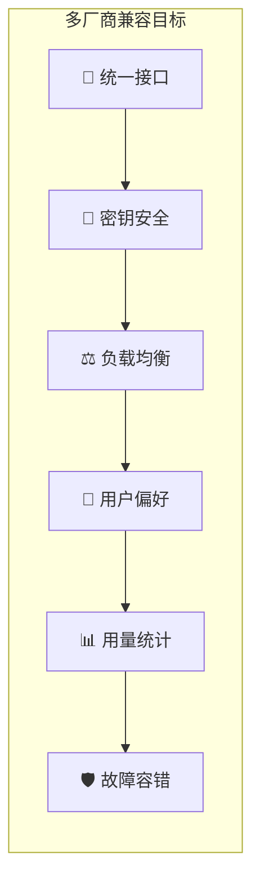

| 目标 | 说明 | 优先级 |
|------|------|--------|
| 🔌 **统一接口** | 不同厂商模型通过相同接口调用，业务代码零感知 | P0 |
| 🔑 **密钥安全** | API Key 加密存储，前端脱敏展示，支持环境变量注入 | P0 |
| ⚖️ **负载均衡** | 多厂商请求按权重分发，单点故障自动切换 | P1 |
| 👤 **用户偏好** | 每个用户可自定义默认对话/向量/语音模型 | P1 |
| 📊 **用量统计** | Token 消耗、费用核算、调用异常全链路追踪 | P2 |
| 🛡️ **故障容错** | 自动重试、熔断降级、供应商级别告警 | P2 |

### 1.2 支持的厂商与模型类型

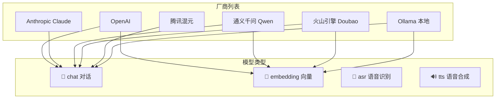

| 厂商 | 模型类型 | API 兼容 |
|------|---------|----------|
| OpenAI | chat, embedding | OpenAI 原生格式 |
| Anthropic Claude | chat | Messages API |
| 通义千问 Qwen | chat, embedding | OpenAI 兼容 |
| 火山引擎 Doubao | chat, embedding | 火山方舟 API |
| 腾讯混元 | chat | 腾讯云 API |
| Ollama | chat, embedding | OpenAI 兼容 |

---

## 2. 整体架构

### 2.1 分层架构

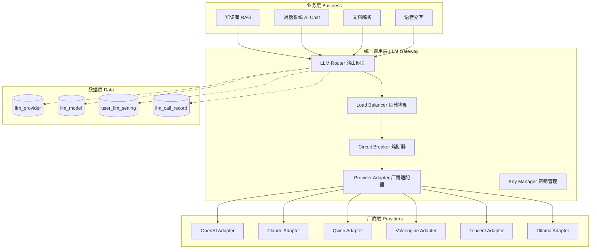

### 2.2 适配器模式设计

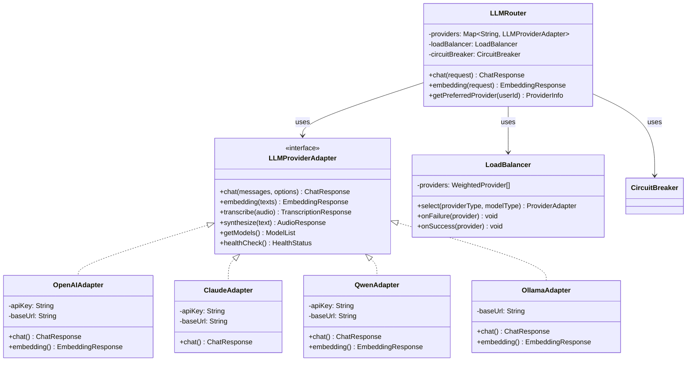

### 2.3 调用链时序

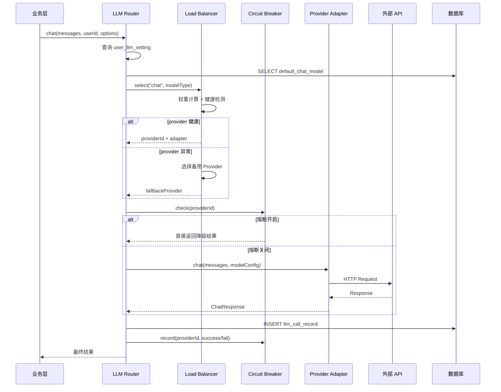

---

## 3. 数据库设计

### 3.1 统一设计规范

| 规则 | 说明 |
|------|------|
| 🔑 主键 | `BIGSERIAL` 自增主键 |
| 🗑️ 软删除 | `deleted SMALLINT DEFAULT 0` |
| ⏰ 时间 | 统一 `TIMESTAMPTZ` |
| 🔐 密钥 | API Key 数据库加密存储，仅解密使用时加载到内存 |

### 3.2 llm_provider 大模型服务商配置表

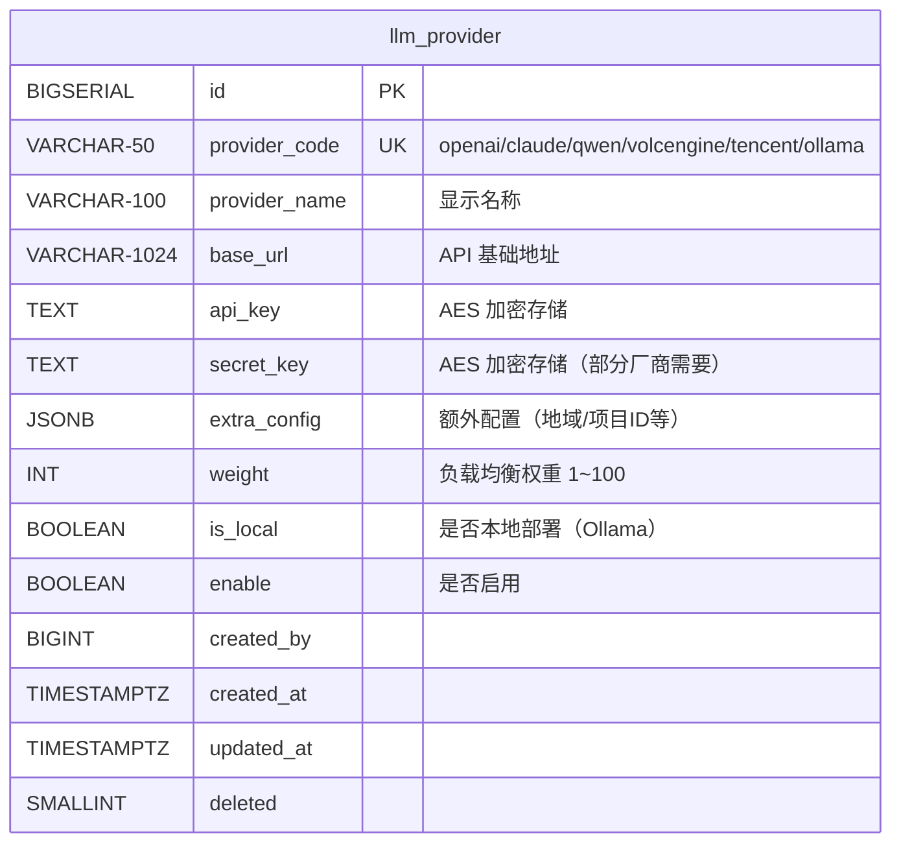

```sql
CREATE TABLE IF NOT EXISTS {schema}.llm_provider (
    id BIGSERIAL PRIMARY KEY,
    provider_code VARCHAR(50) NOT NULL UNIQUE,
        -- openai / claude / qwen / volcengine / tencent / ollama
    provider_name VARCHAR(100) NOT NULL,
    base_url VARCHAR(1024),
    api_key TEXT,                    -- AES-256-GCM 加密存储
    secret_key TEXT,                 -- AES-256-GCM 加密存储（部分厂商需要）
    extra_config JSONB,              -- 额外配置：region/project_id/endpoint_id 等
    weight INT NOT NULL DEFAULT 10,  -- 负载均衡权重
    is_local BOOLEAN NOT NULL DEFAULT false,  -- 是否本地部署
    enable BOOLEAN NOT NULL DEFAULT true,     -- 是否启用
    created_by BIGINT,
    created_at TIMESTAMPTZ NOT NULL DEFAULT NOW(),
    updated_at TIMESTAMPTZ NOT NULL DEFAULT NOW(),
    deleted SMALLINT NOT NULL DEFAULT 0
);

COMMENT ON TABLE {schema}.llm_provider IS '大模型服务商配置';
COMMENT ON COLUMN {schema}.llm_provider.api_key IS 'AES-256-GCM 加密存储，前端永不返回明文';
COMMENT ON COLUMN {schema}.llm_provider.extra_config IS '{"region":"cn-beijing","project_id":"xxx","endpoint_id":"ep-xxx"}';
COMMENT ON COLUMN {schema}.llm_provider.weight IS '负载均衡权重，越高优先被选择';

CREATE INDEX idx_llm_provider_code ON {schema}.llm_provider(provider_code, deleted);
CREATE INDEX idx_llm_provider_enable ON {schema}.llm_provider(enable, deleted);
```

### 3.3 llm_model 模型明细表

```mermaid
erDiagram
    llm_model {
        BIGSERIAL id PK
        BIGINT provider_id FK "→ llm_provider.id"
        VARCHAR-100 model_code UK-per-provider "gpt-4o/claude-3.5-sonnet/qwen-max"
        VARCHAR-100 model_name "显示名称"
        VARCHAR-30 model_type "chat/embedding/asr/tts"
        INT context_window "上下文窗口大小"
        FLOAT temperature_default "默认温度 0.7"
        INT max_tokens_default "默认最大输出 2048"
        NUMERIC-10-6 price_input "输入价格/1K tokens"
        NUMERIC-10-6 price_output "输出价格/1K tokens"
        BOOLEAN enable "是否可用"
        BIGINT created_by
        TIMESTAMPTZ created_at
        TIMESTAMPTZ updated_at
        SMALLINT deleted
    }
    llm_provider ||--o{ llm_model : "一对多"
```

```sql
CREATE TABLE IF NOT EXISTS {schema}.llm_model (
    id BIGSERIAL PRIMARY KEY,
    provider_id BIGINT NOT NULL REFERENCES {schema}.llm_provider(id) ON DELETE CASCADE,
    model_code VARCHAR(100) NOT NULL,      -- gpt-4o / claude-3.5-sonnet / qwen-max
    model_name VARCHAR(100) NOT NULL,       -- 显示名称
    model_type VARCHAR(30) NOT NULL,        -- chat / embedding / asr / tts
    context_window INT,                     -- 上下文窗口大小
    temperature_default FLOAT DEFAULT 0.7,
    max_tokens_default INT DEFAULT 2048,
    price_input NUMERIC(10,6) DEFAULT 0,    -- 输入价格（每 1K tokens）
    price_output NUMERIC(10,6) DEFAULT 0,   -- 输出价格（每 1K tokens）
    enable BOOLEAN NOT NULL DEFAULT true,
    created_by BIGINT,
    created_at TIMESTAMPTZ NOT NULL DEFAULT NOW(),
    updated_at TIMESTAMPTZ NOT NULL DEFAULT NOW(),
    deleted SMALLINT NOT NULL DEFAULT 0,
    UNIQUE(provider_id, model_code)
);

COMMENT ON TABLE {schema}.llm_model IS '模型明细表';
COMMENT ON COLUMN {schema}.llm_model.model_type IS 'chat=对话 embedding=向量 asr=语音识别 tts=语音合成';
COMMENT ON COLUMN {schema}.llm_model.price_input IS '输入价格（每1K tokens，单位：元）';
COMMENT ON COLUMN {schema}.llm_model.price_output IS '输出价格（每1K tokens，单位：元）';

CREATE INDEX idx_llm_model_provider ON {schema}.llm_model(provider_id, deleted);
CREATE INDEX idx_llm_model_type ON {schema}.llm_model(model_type, enable, deleted);
```

### 3.4 user_llm_setting 用户模型偏好配置表

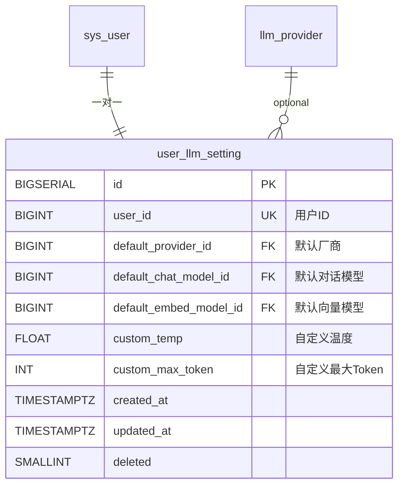

```sql
CREATE TABLE IF NOT EXISTS {schema}.user_llm_setting (
    id BIGSERIAL PRIMARY KEY,
    user_id BIGINT NOT NULL UNIQUE,
    default_provider_id BIGINT REFERENCES {schema}.llm_provider(id),
    default_chat_model_id BIGINT REFERENCES {schema}.llm_model(id),
    default_embed_model_id BIGINT REFERENCES {schema}.llm_model(id),
    custom_temp FLOAT,
    custom_max_token INT,
    created_at TIMESTAMPTZ NOT NULL DEFAULT NOW(),
    updated_at TIMESTAMPTZ NOT NULL DEFAULT NOW(),
    deleted SMALLINT NOT NULL DEFAULT 0
);

COMMENT ON TABLE {schema}.user_llm_setting IS '用户模型偏好配置';
COMMENT ON COLUMN {schema}.user_llm_setting.custom_temp IS '用户自定义温度，覆盖模型默认值';
COMMENT ON COLUMN {schema}.user_llm_setting.custom_max_token IS '用户自定义最大输出Token';

CREATE INDEX idx_user_llm_uid ON {schema}.user_llm_setting(user_id, deleted);
```

### 3.5 llm_call_record LLM 调用用量日志表

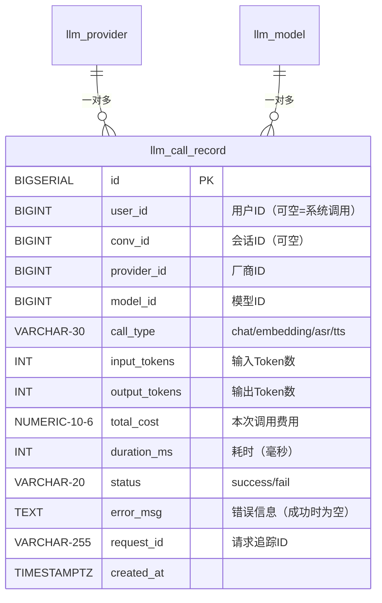

```sql
CREATE TABLE IF NOT EXISTS {schema}.llm_call_record (
    id BIGSERIAL PRIMARY KEY,
    user_id BIGINT,                              -- 用户ID（可空=系统级调用）
    conv_id BIGINT,                              -- 会话ID（可空）
    provider_id BIGINT NOT NULL,                 -- 厂商ID
    model_id BIGINT NOT NULL,                    -- 模型ID
    call_type VARCHAR(30) NOT NULL,               -- chat / embedding / asr / tts
    input_tokens INT NOT NULL DEFAULT 0,          -- 输入 Token 数
    output_tokens INT NOT NULL DEFAULT 0,         -- 输出 Token 数
    total_cost NUMERIC(10,6) DEFAULT 0,           -- 本次调用费用
    duration_ms INT DEFAULT 0,                    -- 调用耗时（毫秒）
    status VARCHAR(20) NOT NULL,                  -- success / fail
    error_msg TEXT,                               -- 错误信息（成功时为空）
    request_id VARCHAR(255),                      -- 请求追踪ID
    created_at TIMESTAMPTZ NOT NULL DEFAULT NOW()
);

COMMENT ON TABLE {schema}.llm_call_record IS 'LLM 调用全链路日志';
COMMENT ON COLUMN {schema}.llm_call_record.total_cost IS '费用=price_input*(输入tokens/1000) + price_output*(输出tokens/1000)';
COMMENT ON COLUMN {schema}.llm_call_record.duration_ms IS '调用耗时，用于性能监控';

CREATE INDEX idx_llm_call_user ON {schema}.llm_call_record(user_id);
CREATE INDEX idx_llm_call_conv ON {schema}.llm_call_record(conv_id);
CREATE INDEX idx_llm_call_time ON {schema}.llm_call_record(created_at);
CREATE INDEX idx_llm_call_status ON {schema}.llm_call_record(status);
```

### 3.6 全表关联

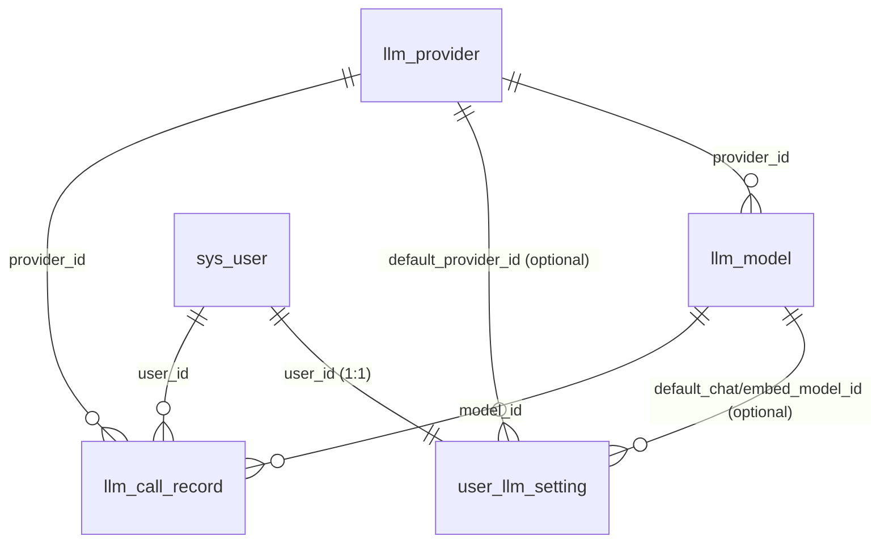

---

## 4. 密钥安全方案

### 4.1 密钥存储链路

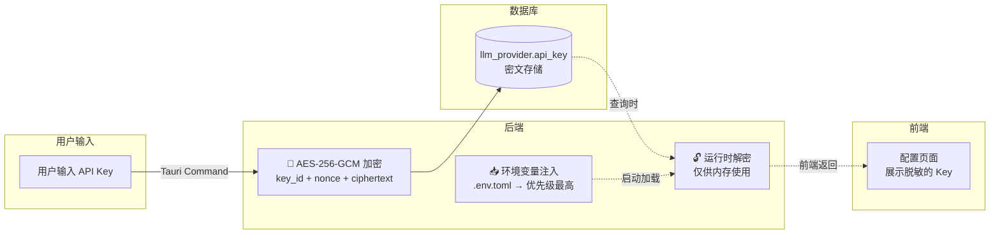

### 4.2 加密实现方案

```rust
/// AES-256-GCM 密钥加密
/// 使用固定的 master key（从环境变量读取）
fn encrypt_api_key(plaintext: &str) -> Result<String, String> {
    let master_key = std::env::var("LLM_KEY_ENCRYPT_KEY")
        .map_err(|_| "未设置 LLM_KEY_ENCRYPT_KEY 环境变量")?;
    
    // 生成随机 nonce
    let nonce = generate_random_nonce(); // 12 bytes
    // AES-256-GCM 加密
    let ciphertext = aes_256_gcm_encrypt(plaintext, &master_key, &nonce)?;
    
    // 返回 base64(key_id + nonce + ciphertext)
    Ok(base64_encode(&[nonce, ciphertext].concat()))
}

/// 解密
fn decrypt_api_key(encrypted: &str) -> Result<String, String> {
    let data = base64_decode(encrypted)?;
    let nonce = &data[..12];
    let ciphertext = &data[12..];
    
    let master_key = std::env::var("LLM_KEY_ENCRYPT_KEY")?;
    aes_256_gcm_decrypt(ciphertext, &master_key, nonce)
}
```

### 4.3 安全规则

| # | 规则 | 说明 |
|---|------|------|
| 1 | 数据库密文存储 | API Key 绝不存明文，AES-256-GCM 加密 |
| 2 | 前端脱敏展示 | 返回前端时只显示 `sk-****...****a3f`（前后各4位） |
| 3 | 环境变量注入 | `.env.toml` 中的 Key 优先级最高，数据库中不存在 |
| 4 | 内存安全 | 解密后的 Key 仅存在于当前请求内存，使用后立即释放 |
| 5 | 审计日志 | Key 的增删改操作记录 sys_oper_log |

---

## 5. 统一调用层（API Gateway）

### 5.1 核心接口定义

```rust
/// 模型调用请求
#[derive(Debug, Serialize, Deserialize)]
pub struct LLMChatRequest {
    pub messages: Vec<ChatMessage>,
    pub model: String,                    // model_code
    pub temperature: Option<f32>,
    pub max_tokens: Option<i32>,
    pub stream: Option<bool>,             // 是否流式输出
    pub user_id: Option<i64>,             // 用户ID（用于记录用量）
    pub conv_id: Option<i64>,             // 会话ID（用于记录用量）
}

/// 模型调用响应
#[derive(Debug, Serialize, Deserialize)]
pub struct LLMChatResponse {
    pub content: String,
    pub model: String,
    pub usage: TokenUsage,
    pub provider_id: i64,
    pub model_id: i64,
    pub request_id: String,
}

/// Token 用量
#[derive(Debug, Serialize, Deserialize)]
pub struct TokenUsage {
    pub input_tokens: i32,
    pub output_tokens: i32,
    pub total_tokens: i32,
    pub cost: f64,
}

/// Embedding 请求
#[derive(Debug, Serialize, Deserialize)]
pub struct LLMEmbeddingRequest {
    pub input: Vec<String>,               // 文本列表
    pub model: String,                    // model_code
    pub user_id: Option<i64>,
}

/// Embedding 响应
#[derive(Debug, Serialize, Deserialize)]
pub struct LLMEmbeddingResponse {
    pub embeddings: Vec<Vec<f32>>,
    pub model: String,
    pub usage: TokenUsage,
    pub provider_id: i64,
    pub model_id: i64,
}
```

### 5.2 适配器实现策略

| 厂商 | API 格式 | 适配策略 |
|------|---------|---------|
| **OpenAI** | OpenAI Chat Completions API | 原生格式，直接透传 |
| **Claude** | Anthropic Messages API | 消息格式转换 + 内容提取 |
| **Qwen** | OpenAI 兼容格式 | 复用 OpenAI Adapter，仅改 base_url |
| **火山引擎** | 火山方舟 API | 特殊鉴权（AppKey/AppSecret）+ 格式转换 |
| **腾讯混元** | 腾讯云 API | 3 次签名 + SSE 解析 |
| **Ollama** | OpenAI 兼容格式 | 复用 OpenAI Adapter，仅改 base_url |

```rust
/// 适配器工厂
pub fn create_adapter(provider: &LlmProvider) -> Box<dyn LLMProviderAdapter> {
    match provider.provider_code.as_str() {
        "openai" => Box::new(OpenAIAdapter::new(provider)),
        "claude" => Box::new(ClaudeAdapter::new(provider)),
        "qwen" => Box::new(QwenAdapter::new(provider)),       // OpenAI 兼容
        "volcengine" => Box::new(VolcengineAdapter::new(provider)),
        "tencent" => Box::new(TencentAdapter::new(provider)),
        "ollama" => Box::new(OllamaAdapter::new(provider)),   // OpenAI 兼容
        _ => panic!("不支持的厂商: {}", provider.provider_code),
    }
}
```

### 5.3 Rust 适配器代码结构

```rust
/// 厂商适配器 trait
#[async_trait]
pub trait LLMProviderAdapter: Send + Sync {
    /// 对话
    async fn chat(&self, request: LLMChatRequest) -> Result<LLMChatResponse, String>;
    
    /// Embedding
    async fn embedding(&self, request: LLMEmbeddingRequest) -> Result<LLMEmbeddingResponse, String>;
    
    /// 健康检查
    async fn health_check(&self) -> Result<bool, String>;
    
    /// 获取支持模型列表
    async fn list_models(&self) -> Result<Vec<String>, String>;
}

// ======================== OpenAI 适配器 ========================

pub struct OpenAIAdapter {
    api_key: String,
    base_url: String,
    http_client: reqwest::Client,
}

#[async_trait]
impl LLMProviderAdapter for OpenAIAdapter {
    async fn chat(&self, request: LLMChatRequest) -> Result<LLMChatResponse, String> {
        let url = format!("{}/v1/chat/completions", self.base_url);
        
        let body = serde_json::json!({
            "model": request.model,
            "messages": request.messages,
            "temperature": request.temperature.unwrap_or(0.7),
            "max_tokens": request.max_tokens.unwrap_or(2048),
            "stream": false,
        });
        
        let resp = self.http_client
            .post(&url)
            .header("Authorization", format!("Bearer {}", self.api_key))
            .json(&body)
            .send()
            .await
            .map_err(|e| format!("请求失败: {}", e))?;
        
        let status = resp.status();
        let text = resp.text().await.map_err(|e| format!("读取响应失败: {}", e))?;
        
        if !status.is_success() {
            return Err(format!("OpenAI API 错误 [{}]: {}", status, text));
        }
        
        let json: serde_json::Value = serde_json::from_str(&text)
            .map_err(|e| format!("解析响应失败: {}", e))?;
        
        Ok(LLMChatResponse {
            content: json["choices"][0]["message"]["content"]
                .as_str().unwrap_or("").to_string(),
            model: json["model"].as_str().unwrap_or("").to_string(),
            usage: TokenUsage {
                input_tokens: json["usage"]["prompt_tokens"].as_i64().unwrap_or(0) as i32,
                output_tokens: json["usage"]["completion_tokens"].as_i64().unwrap_or(0) as i32,
                total_tokens: json["usage"]["total_tokens"].as_i64().unwrap_or(0) as i32,
                cost: 0.0,  // 由调用记录器根据价格计算
            },
            provider_id: 0,  // 由调用链上层填充
            model_id: 0,
            request_id: "".to_string(),
        })
    }
    
    async fn embedding(&self, request: LLMEmbeddingRequest) -> Result<LLMEmbeddingResponse, String> {
        let url = format!("{}/v1/embeddings", self.base_url);
        
        let body = serde_json::json!({
            "model": request.model,
            "input": request.input,
        });
        
        let resp = self.http_client
            .post(&url)
            .header("Authorization", format!("Bearer {}", self.api_key))
            .json(&body)
            .send()
            .await
            .map_err(|e| format!("请求失败: {}", e))?;
        
        let text = resp.text().await.map_err(|e| format!("读取响应失败: {}", e))?;
        let json: serde_json::Value = serde_json::from_str(&text)
            .map_err(|e| format!("解析响应失败: {}", e))?;
        
        let embeddings: Vec<Vec<f32>> = json["data"]
            .as_array().unwrap_or(&vec![])
            .iter()
            .map(|item| {
                item["embedding"].as_array().unwrap_or(&vec![])
                    .iter()
                    .map(|v| v.as_f64().unwrap_or(0.0) as f32)
                    .collect()
            })
            .collect();
        
        Ok(LLMEmbeddingResponse {
            embeddings,
            model: json["model"].as_str().unwrap_or("").to_string(),
            usage: TokenUsage {
                input_tokens: json["usage"]["prompt_tokens"].as_i64().unwrap_or(0) as i32,
                output_tokens: 0,
                total_tokens: json["usage"]["total_tokens"].as_i64().unwrap_or(0) as i32,
                cost: 0.0,
            },
            provider_id: 0,
            model_id: 0,
        })
    }
    
    async fn health_check(&self) -> Result<bool, String> {
        let url = format!("{}/v1/models", self.base_url);
        let resp = self.http_client
            .get(&url)
            .header("Authorization", format!("Bearer {}", self.api_key))
            .send()
            .await
            .map_err(|e| format!("健康检查失败: {}", e))?;
        Ok(resp.status().is_success())
    }
    
    async fn list_models(&self) -> Result<Vec<String>, String> {
        let url = format!("{}/v1/models", self.base_url);
        let resp = self.http_client
            .get(&url)
            .header("Authorization", format!("Bearer {}", self.api_key))
            .send()
            .await
            .map_err(|e| format!("获取模型列表失败: {}", e))?;
        
        let text = resp.text().await.map_err(|e| format!("读取响应失败: {}", e))?;
        let json: serde_json::Value = serde_json::from_str(&text)
            .map_err(|e| format!("解析响应失败: {}", e))?;
        
        let models: Vec<String> = json["data"]
            .as_array().unwrap_or(&vec![])
            .iter()
            .filter_map(|m| m["id"].as_str().map(|s| s.to_string()))
            .collect();
        
        Ok(models)
    }
}

// ======================== Claude 适配器（示例） ========================

pub struct ClaudeAdapter {
    api_key: String,
    base_url: String,
    http_client: reqwest::Client,
}

#[async_trait]
impl LLMProviderAdapter for ClaudeAdapter {
    async fn chat(&self, request: LLMChatRequest) -> Result<LLMChatResponse, String> {
        // Claude Messages API: POST /v1/messages
        // 格式转换: messages → system + messages（首条 system role 单独提取）
        let (system, messages) = Self::extract_system(&request.messages);
        
        let url = format!("{}/v1/messages", self.base_url);
        let mut body = serde_json::json!({
            "model": request.model,
            "messages": messages,
            "max_tokens": request.max_tokens.unwrap_or(2048),
        });
        
        if let Some(s) = system {
            body["system"] = serde_json::json!(s);
        }
        if let Some(temp) = request.temperature {
            body["temperature"] = serde_json::json!(temp);
        }
        
        let resp = self.http_client
            .post(&url)
            .header("x-api-key", &self.api_key)
            .header("anthropic-version", "2023-06-01")
            .json(&body)
            .send()
            .await
            .map_err(|e| format!("请求失败: {}", e))?;
        
        // ... 处理响应 ...
        unimplemented!("Claude 适配器实现中")
    }
    
    fn extract_system(messages: &[ChatMessage]) -> (Option<String>, Vec<ChatMessage>) {
        let mut system = None;
        let mut rest = Vec::new();
        for msg in messages {
            if msg.role == "system" && system.is_none() {
                system = Some(msg.content.clone());
            } else {
                rest.push(msg.clone());
            }
        }
        (system, rest)
    }
    
    async fn embedding(&self, _request: LLMEmbeddingRequest) -> Result<LLMEmbeddingResponse, String> {
        Err("Claude 不支持 embedding".to_string())
    }
    
    async fn health_check(&self) -> Result<bool, String> {
        Ok(true) // Claude 没有专门的 health endpoint
    }
    
    async fn list_models(&self) -> Result<Vec<String>, String> {
        Ok(vec![
            "claude-3-5-sonnet-20241022".to_string(),
            "claude-3-5-haiku-20241022".to_string(),
            "claude-3-opus-20240229".to_string(),
        ])
    }
}
```

---

## 6. 负载均衡与高可用

### 6.1 权重轮询算法

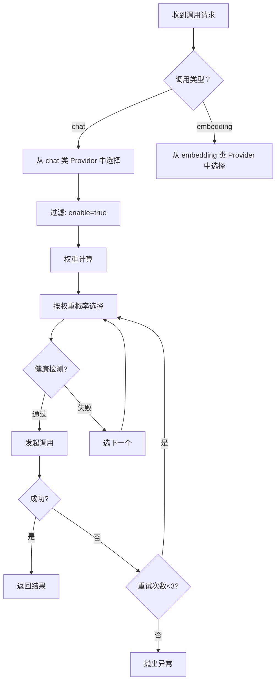

```rust
/// 带权重的 Provider
#[derive(Debug, Clone)]
pub struct WeightedProvider {
    pub provider_id: i64,
    pub adapter: Box<dyn LLMProviderAdapter>,
    pub weight: i32,
    pub model_type: String,  // chat / embedding
}

/// 负载均衡器
pub struct LoadBalancer {
    providers: Vec<WeightedProvider>,
    failure_counts: HashMap<i64, i32>,  // provider_id → 连续失败次数
    success_counts: HashMap<i64, i32>,  // provider_id → 连续成功次数
}

impl LoadBalancer {
    /// 按类型和权重选择 Provider
    pub fn select(&mut self, model_type: &str) -> Result<&WeightedProvider, String> {
        let candidates: Vec<&WeightedProvider> = self.providers
            .iter()
            .filter(|p| p.model_type == model_type)
            .filter(|p| {
                let fails = self.failure_counts.get(&p.provider_id).unwrap_or(&0);
                *fails < 3  // 连续失败超过3次，暂时排除
            })
            .collect();
        
        if candidates.is_empty() {
            return Err("没有可用的 Provider".to_string());
        }
        
        // 权重随机选择
        let total_weight: i32 = candidates.iter().map(|p| p.weight).sum();
        let mut rng = rand::thread_rng();
        let mut threshold = rng.gen_range(1..=total_weight);
        
        for candidate in candidates {
            threshold -= candidate.weight;
            if threshold <= 0 {
                return Ok(candidate);
            }
        }
        
        Ok(candidates.last().unwrap())
    }
    
    /// 记录成功
    pub fn record_success(&mut self, provider_id: i64) {
        self.failure_counts.insert(provider_id, 0);
        let count = self.success_counts.entry(provider_id).or_insert(0);
        *count += 1;
    }
    
    /// 记录失败
    pub fn record_failure(&mut self, provider_id: i64) {
        self.success_counts.insert(provider_id, 0);
        let count = self.failure_counts.entry(provider_id).or_insert(0);
        *count += 1;
    }
}
```

### 6.2 熔断器

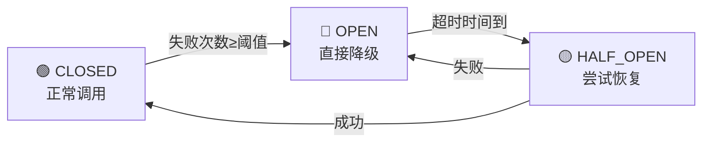

```rust
/// 熔断器状态
enum CircuitState {
    Closed,     // 正常
    Open,       // 熔断
    HalfOpen,   // 半开
}

/// 熔断器
pub struct CircuitBreaker {
    state: CircuitState,
    failure_threshold: i32,      // 熔断阈值
    recovery_timeout: Duration,  // 恢复超时
    failure_count: i32,
    last_failure_time: Instant,
}

impl CircuitBreaker {
    pub fn call<F, T, E>(&mut self, f: F) -> Result<T, String>
    where
        F: FnOnce() -> Result<T, E>,
        E: ToString,
    {
        match self.state {
            CircuitState::Open => {
                // 检查是否到了恢复时间
                if self.last_failure_time.elapsed() >= self.recovery_timeout {
                    self.state = CircuitState::HalfOpen;
                } else {
                    return Err("熔断器开启，请求被拒绝".to_string());
                }
            }
            CircuitState::Closed | CircuitState::HalfOpen => {}
        }
        
        match f() {
            Ok(result) => {
                self.on_success();
                Ok(result)
            }
            Err(e) => {
                self.on_failure();
                Err(e.to_string())
            }
        }
    }
    
    fn on_success(&mut self) {
        self.failure_count = 0;
        self.state = CircuitState::Closed;
    }
    
    fn on_failure(&mut self) {
        self.failure_count += 1;
        self.last_failure_time = Instant::now();
        
        if self.failure_count >= self.failure_threshold {
            self.state = CircuitState::Open;
        }
    }
}
```

### 6.3 健康检查机制

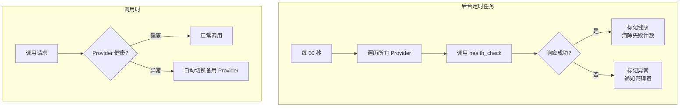

---

## 7. 用户偏好体系

### 7.1 模型选择优先级

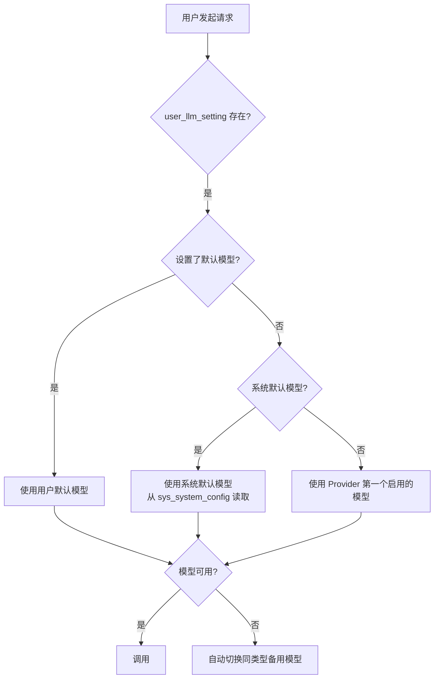

### 7.2 默认配置初始化

```sql
-- 新用户注册时自动创建 user_llm_setting
CREATE OR REPLACE FUNCTION init_user_llm_setting()
RETURNS TRIGGER AS $$
DECLARE
    v_provider_id BIGINT;
    v_chat_model_id BIGINT;
    v_embed_model_id BIGINT;
BEGIN
    -- 找第一个启用的 chat provider
    SELECT id INTO v_provider_id FROM {schema}.llm_provider 
    WHERE enable = true AND deleted = 0 
    ORDER BY weight DESC LIMIT 1;
    
    IF v_provider_id IS NOT NULL THEN
        -- 找该 provider 的默认 chat 模型
        SELECT id INTO v_chat_model_id FROM {schema}.llm_model 
        WHERE provider_id = v_provider_id AND model_type = 'chat' AND enable = true
        ORDER BY id LIMIT 1;
        
        -- 找默认 embedding 模型
        SELECT id INTO v_embed_model_id FROM {schema}.llm_model 
        WHERE model_type = 'embedding' AND enable = true
        ORDER BY id LIMIT 1;
    END IF;
    
    INSERT INTO {schema}.user_llm_setting (user_id, default_provider_id, default_chat_model_id, default_embed_model_id)
    VALUES (NEW.id, v_provider_id, v_chat_model_id, v_embed_model_id)
    ON CONFLICT (user_id) DO NOTHING;
    
    RETURN NEW;
END;
$$ LANGUAGE plpgsql;

-- 挂载到 sys_user 插入触发器
CREATE TRIGGER trg_user_llm_setting
AFTER INSERT ON public.sys_user
FOR EACH ROW EXECUTE FUNCTION init_user_llm_setting();
```

### 7.3 前端模型选择器 Props

```typescript
interface ModelSelectorProps {
    // 用户当前配置
    userId: string;
    defaultProviderId: string | null;
    defaultChatModelId: string | null;
    defaultEmbedModelId: string | null;
    customTemp: number | null;
    customMaxToken: number | null;
    
    // 可选厂商列表
    providers: LlmProvider[];
    
    // 可用模型列表（按厂商分组）
    models: LlmModel[];
    
    // 事件
    onProviderChange: (providerId: string) => void;
    onChatModelChange: (modelId: string) => void;
    onEmbedModelChange: (modelId: string) => void;
    onTempChange: (temp: number) => void;
    onMaxTokenChange: (maxToken: number) => void;
    onSave: () => void;
}

interface LlmProvider {
    id: string;
    providerCode: string;  // openai / claude / qwen / ...
    providerName: string;
    baseUrl: string;
    apiKeyMasked: string;  // sk-****...a3f
    weight: number;
    enable: boolean;
}

interface LlmModel {
    id: string;
    providerId: string;
    modelCode: string;
    modelName: string;
    modelType: string;  // chat / embedding / asr / tts
    contextWindow: number;
    temperatureDefault: number;
    maxTokensDefault: number;
    priceInput: number;
    priceOutput: number;
    enable: boolean;
}
```

---

## 8. 前端配置管理

### 8.1 厂商管理页面布局

```
┌─────────────────────────────────────────────────────────┐
│  🧠 LLM 厂商配置                                  [+新增] │
├─────────────────────────────────────────────────────────┤
│ ┌─────────────────────────────────────────────────────┐ │
│ │ 🔵 OpenAI                            ⚡ 10   ✅ 启用 │ │
│ │    gpt-4o / gpt-4o-mini / text-embedding-3-small   │ │
│ │    [编辑] [删除] [同步模型] [健康检查]               │ │
│ ├─────────────────────────────────────────────────────┤ │
│ │ 🟣 Anthropic Claude                   ⚡ 8    ✅ 启用 │ │
│ │    claude-3.5-sonnet / claude-3.5-haiku             │ │
│ │    [编辑] [删除] [同步模型] [健康检查]               │ │
│ ├─────────────────────────────────────────────────────┤ │
│ │ 🟢 通义千问 Qwen                       ⚡ 5    ✅ 启用 │ │
│ │    qwen-max / qwen-turbo / text-embedding-v2        │ │
│ │    [编辑] [删除] [同步模型] [健康检查]               │ │
│ ├─────────────────────────────────────────────────────┤ │
│ │ ⚪ Ollama 本地                          ⚡ 3    ✅ 启用 │ │
│ │    llama3.1 / qwen2.5 / nomic-embed-text            │ │
│ │    [编辑] [删除] [同步模型] [健康检查]               │ │
│ └─────────────────────────────────────────────────────┘ │
└─────────────────────────────────────────────────────────┘
```

### 8.2 厂商编辑对话框

```
┌──────────────────────────────────────────────┐
│  编辑厂商: OpenAI                       [✕]   │
├──────────────────────────────────────────────┤
│  厂商编码    openai                          │
│  厂商名称    OpenAI                          │
│  API 地址    https://api.openai.com          │
│  API Key     sk-pr...****...a3f    [修改]    │
│  Secret Key  ************          [修改]    │
│  权重        ═══●══════════════ 10           │
│  本地部署    ◻ 是                            │
│  启用        ☑ 启用                          │
│                                              │
│  ┌────────────────────────────────────────┐  │
│  │ 关联模型                               │  │
│  │ ☑ gpt-4o          chat   ✅ 已同步     │  │
│  │ ☑ gpt-4o-mini     chat   ✅ 已同步     │  │
│  │ ☐ text-embedding  emb    🔄 待同步     │  │
│  │ [+手动添加模型]  [从API同步模型列表]   │  │
│  └────────────────────────────────────────┘  │
│                                              │
│          [取消]              [保存]          │
└──────────────────────────────────────────────┘
```

### 8.3 用户偏好设置页面

```
┌──────────────────────────────────────────────┐
│  ⚙️ AI 模型偏好设置                          │
├──────────────────────────────────────────────┤
│  默认厂商       [OpenAI ▼]                   │
│                                              │
│  默认对话模型   [gpt-4o ▼]                   │
│                上下文: 128K tokens            │
│                默认温度: 0.7                  │
│                                              │
│  默认向量模型   [text-embedding-3-small ▼]   │
│                维度: 1536                     │
│                                              │
│  自定义温度     ═══●════════ 0.7             │
│                (0.0 ~ 2.0, 空=使用模型默认)   │
│                                              │
│  最大输出Token  [4096       ]                │
│                (空=使用模型默认)              │
│                                              │
│  📊 本月用量                                 │
│  对话: 15,230 tokens  |  ¥ 0.23              │
│  向量: 89,100 tokens  |  ¥ 0.09              │
│  总计: ¥ 0.32                                │
│                                              │
│          [重置为默认]            [保存]      │
└──────────────────────────────────────────────┘
```

### 8.4 用量统计页面

```
┌──────────────────────────────────────────────────────────┐
│  📊 LLM 调用统计                              [导出CSV]  │
├──────────────────────────────────────────────────────────┤
│  时间范围: [最近7天 ▼]  厂商: [全部 ▼]  类型: [全部 ▼]  │
├──────────────────────────────────────────────────────────┤
│  ┌──────────┐ ┌──────────┐ ┌──────────┐ ┌──────────────┐│
│  │ 总调用    │ │ 总Tokens  │ │ 总费用   │ │ 平均耗时     ││
│  │ 1,234 次 │ │ 2.1M     │ │ ¥ 12.45 │ │ 1,234ms     ││
│  └──────────┘ └──────────┘ └──────────┘ └──────────────┘│
│                                                          │
│  ┌──────────────────────────────────────────────────┐   │
│  │  📈 每日调用趋势（折线图）                        │   │
│  │  ██                                              │   │
│  │  ██ ██                                           │   │
│  │  ██ ██ ██  ██                                    │   │
│  │  ██ ██ ██  ██ ██ ██                             │   │
│  │  ──・──・──・──・──・──・──・                    │   │
│  │  06/25  06/26  06/27  06/28  06/29  06/30  07/01 │   │
│  └──────────────────────────────────────────────────┘   │
│                                                          │
│  ┌──────────────────────────────────────────────────┐   │
│  │  厂商费用占比（饼图）                            │   │
│  │  ┌─────┐                                        │   │
│  │  │ 🟦  │  OpenAI    ¥ 6.23  50%                 │   │
│  │  │ 🟪  │  Claude    ¥ 3.45  28%                 │   │
│  │  │ 🟩  │  Qwen      ¥ 1.87  15%                 │   │
│  │  │ ⬜  │  其他      ¥ 0.90   7%                 │   │
│  │  └─────┘                                        │   │
│  └──────────────────────────────────────────────────┘   │
└──────────────────────────────────────────────────────────┘
```

---

## 9. 全链路用量统计

### 9.1 调用日志记录器

```rust
/// 调用日志记录器（中间件模式）
pub struct CallRecorder {
    pool: PgPool,
}

impl CallRecorder {
    /// 记录一次调用
    pub async fn record_call(
        &self,
        user_id: Option<i64>,
        conv_id: Option<i64>,
        provider_id: i64,
        model_id: i64,
        call_type: &str,
        input_tokens: i32,
        output_tokens: i32,
        duration_ms: i32,
        status: &str,
        error_msg: Option<&str>,
        request_id: &str,
    ) -> Result<(), String> {
        // 从 model 表获取价格
        let price = sqlx::query_as::<_, ModelPrice>(
            "SELECT price_input, price_output FROM {schema}.llm_model WHERE id = $1"
        )
        .bind(model_id)
        .fetch_one(&self.pool)
        .await
        .map_err(|e| format!("查询模型价格失败: {}", e))?;
        
        // 计算费用
        let total_cost = (price.price_input * input_tokens as f64
            + price.price_output * output_tokens as f64) / 1000.0;
        
        sqlx::query(
            "INSERT INTO {schema}.llm_call_record 
             (user_id, conv_id, provider_id, model_id, call_type, 
              input_tokens, output_tokens, total_cost, duration_ms, 
              status, error_msg, request_id, created_at)
             VALUES ($1, $2, $3, $4, $5, $6, $7, $8, $9, $10, $11, $12, NOW())"
        )
        .bind(user_id)
        .bind(conv_id)
        .bind(provider_id)
        .bind(model_id)
        .bind(call_type)
        .bind(input_tokens)
        .bind(output_tokens)
        .bind(total_cost)
        .bind(duration_ms)
        .bind(status)
        .bind(error_msg)
        .bind(request_id)
        .execute(&self.pool)
        .await
        .map_err(|e| format!("插入调用记录失败: {}", e))?;
        
        Ok(())
    }
}
```

### 9.2 用量统计 SQL

```sql
-- 统计用户月度用量
SELECT 
    u.username,
    SUM(r.input_tokens) AS total_input_tokens,
    SUM(r.output_tokens) AS total_output_tokens,
    SUM(r.total_cost) AS total_cost,
    COUNT(*) AS total_calls,
    AVG(r.duration_ms) AS avg_duration_ms
FROM {schema}.llm_call_record r
JOIN public.sys_user u ON r.user_id = u.id
WHERE r.created_at >= date_trunc('month', NOW())
  AND r.status = 'success'
GROUP BY u.username
ORDER BY total_cost DESC;

-- 统计厂商用量分布
SELECT 
    p.provider_name,
    COUNT(*) AS call_count,
    SUM(r.input_tokens + r.output_tokens) AS total_tokens,
    SUM(r.total_cost) AS total_cost,
    COUNT(CASE WHEN r.status = 'fail' THEN 1 END) AS fail_count
FROM {schema}.llm_call_record r
JOIN {schema}.llm_provider p ON r.provider_id = p.id
WHERE r.created_at >= NOW() - INTERVAL '7 days'
GROUP BY p.provider_name
ORDER BY total_cost DESC;

-- 统计模型调用趋势（按天）
SELECT 
    DATE(r.created_at) AS day,
    m.model_name,
    COUNT(*) AS call_count,
    SUM(r.input_tokens + r.output_tokens) AS total_tokens,
    SUM(r.total_cost) AS total_cost
FROM {schema}.llm_call_record r
JOIN {schema}.llm_model m ON r.model_id = m.id
WHERE r.created_at >= NOW() - INTERVAL '30 days'
  AND r.status = 'success'
GROUP BY DATE(r.created_at), m.model_name
ORDER BY day, total_cost DESC;
```

---

## 10. 实施路线图

### 阶段划分

```mermaid
gantt
    title 多LLM厂商兼容 实施路线图
    dateFormat  YYYY-MM-DD
    axisFormat  %m-%d
    
    section Phase 1 数据库
    四张表 DDL 创建              :p1, 2026-07-07, 1d
    Rust Model 结构体            :p1, 1d
    
    section Phase 2 核心适配器
    LLM Router 路由引擎          :p2, after p1, 2d
    OpenAI 适配器                :p2, 2d
    Qwen/Ollama 适配器           :p2, 1d
    密钥加密存储                  :p2, 1d
    
    section Phase 3 高级适配器
    Claude 适配器                :p3, after p2, 1d
    火山引擎/腾讯适配器          :p3, 2d
    负载均衡+熔断器              :p3, 1d
    
    section Phase 4 前端
    Service API 封装             :p4, after p3, 1d
    厂商管理页面                  :p4, 2d
    用户偏好设置页面              :p4, 1d
    用量统计页面                  :p4, 2d

    section Phase 5 完善
    健康检查+自动降级            :p5, after p4, 1d
    Tauri Command 注册           :p5, 1d
    集成测试                     :p5, 2d
```

| 阶段 | 内容 | 工作量 |
|------|------|--------|
| **Phase 1** 🗄️ | 四张表 DDL + Model struct | 2天 |
| **Phase 2** 🔌 | 核心适配器（OpenAI/Qwen/Ollama）+ 密钥加密 + 路由引擎 | 6天 |
| **Phase 3** 🚀 | 高级适配器（Claude/火山/腾讯）+ 负载均衡 + 熔断器 | 4天 |
| **Phase 4** 🖥️ | 前端配置管理 + 用户偏好 + 用量统计 | 6天 |
| **Phase 5** ✅ | 健康检查 + Tauri 注册 + 集成测试 | 4天 |

### 每个阶段的交付物

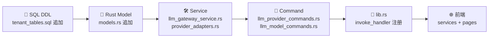

---

## 附录：配置示例

### .env.toml 密钥配置

```toml
[llm]
# 用于加密数据库中的 API Key
key_encrypt_key = "your-32-byte-aes-key-here..."

# 可选：直接通过环境变量注入密钥（优先级高于数据库）
# [llm.providers.openai]
# api_key = "sk-xxx..."
# base_url = "https://api.openai.com"

[llm.providers.ollama]
# Ollama 本地部署，无需 API Key
base_url = "http://localhost:11434"
is_local = true
weight = 5
```

### 厂商初始化种子数据

```sql
-- 内置厂商（首次部署时初始化）
INSERT INTO {schema}.llm_provider (provider_code, provider_name, base_url, weight, is_local) VALUES
('openai',     'OpenAI',           'https://api.openai.com',             10, false),
('claude',     'Anthropic Claude', 'https://api.anthropic.com',          8,  false),
('qwen',       '通义千问',          'https://dashscope.aliyuncs.com',    5,  false),
('volcengine', '火山引擎',          'https://ark.cn-beijing.volces.com', 3,  false),
('tencent',    '腾讯混元',          'https://api.hunyuan.cloud.tencent.com', 3, false),
('ollama',     'Ollama 本地',       'http://localhost:11434',            3,  true);

-- OpenAI 内置模型
INSERT INTO {schema}.llm_model (provider_id, model_code, model_name, model_type, context_window, price_input, price_output) VALUES
((SELECT id FROM {schema}.llm_provider WHERE provider_code='openai'), 'gpt-4o', 'GPT-4o', 'chat', 128000, 0.0025, 0.01),
((SELECT id FROM {schema}.llm_provider WHERE provider_code='openai'), 'gpt-4o-mini', 'GPT-4o Mini', 'chat', 128000, 0.00015, 0.0006),
((SELECT id FROM {schema}.llm_provider WHERE provider_code='openai'), 'text-embedding-3-small', 'Text Embedding 3 Small', 'embedding', null, 0.00002, 0);
```

---

## 版本历史

| 版本 | 日期 | 变更 |
|------|------|------|
| V1.0 | 2026-07-02 | 初始版本，完整的多LLM厂商兼容设计方案 |

---

*文档结束*