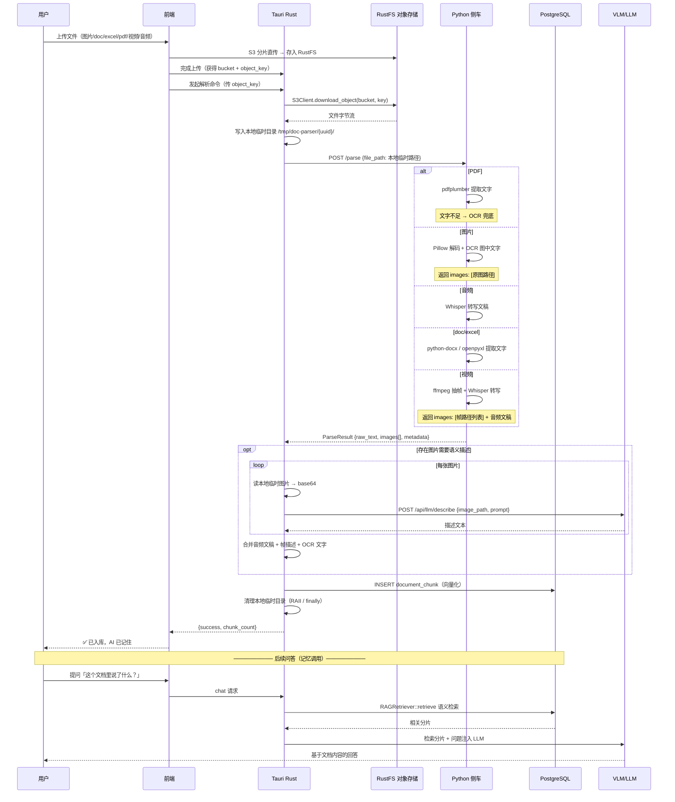
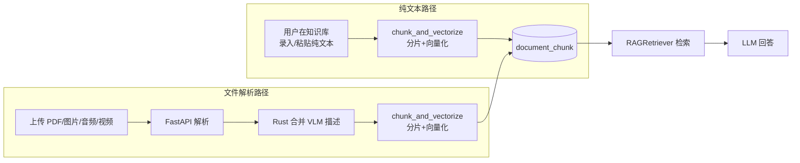
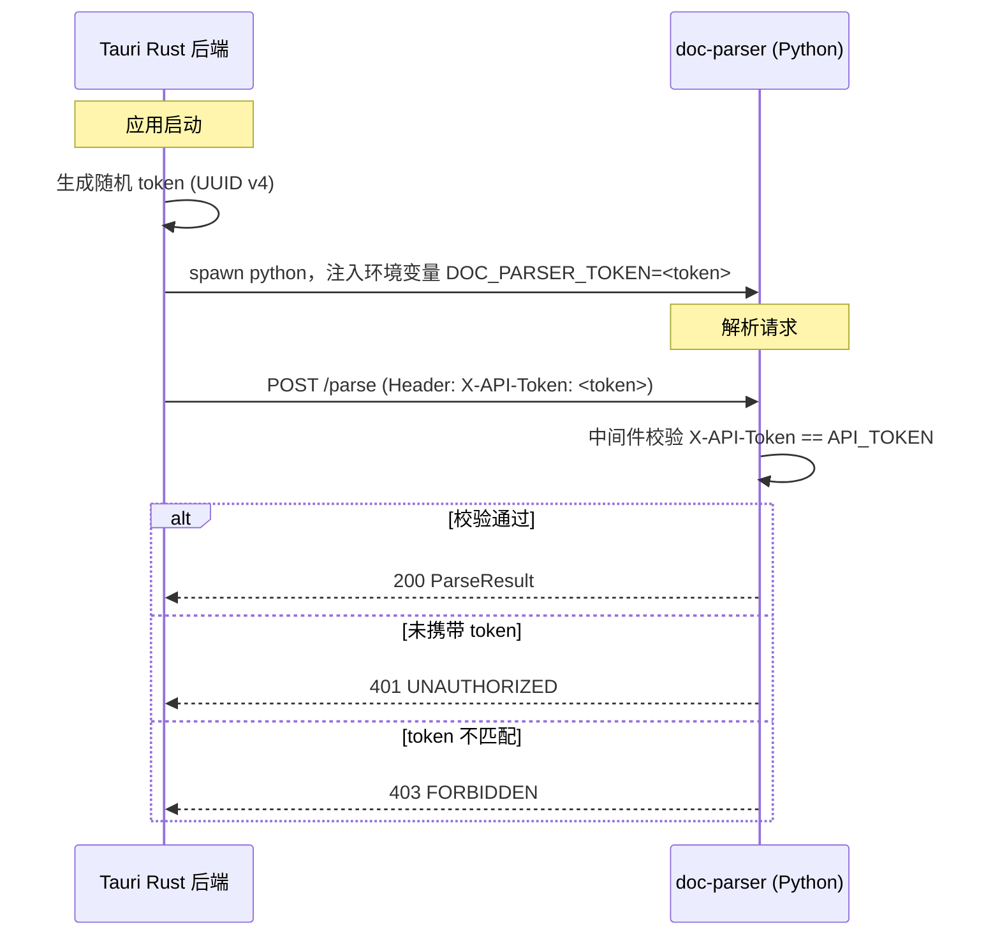

# 文档解析与 RAG 长期记忆链路设计方案

> 核心思路：**FastAPI 只做解析，VLM 描述由 Rust 调用**。解析出的文本直接入库，使 LLM 具备对已上传文档的「长期记忆」能力。

---

## 目录

1. [背景与目标](#1-背景与目标)
2. [整体架构](#2-整体架构)
3. [职责边界](#3-职责边界)
4. [完整数据流](#4-完整数据流)
5. [记忆闭环原理](#5-记忆闭环原理)
6. [API 接口设计](#6-api-接口设计)
7. [Rust 侧改动清单](#7-rust-侧改动清单)
8. [Python 侧简化清单](#8-python-侧简化清单)
9. [错误处理与降级](#9-错误处理与降级)
10. [实施路线图](#10-实施路线图)
11. [认证与安全](#11-认证与安全)

---

## 1. 背景与目标

### 1.1 当前问题

现有架构中，Python 侧车服务（`apps/doc-parser`）不仅承担「非文本 → 文本」解析，还承担了 **VLM 图片描述**职责（`apps/doc-parser/vlm/` 目录）。但 VLM 能力（厂商路由、负载均衡、熔断、API Key 管理）**在 Rust 的 `llm_gateway_service.rs` 中已完整实现**，Python 侧再维护一套 VLM 调用属于重复建设，且带来以下问题：

| 问题 | 说明 |
|------|------|
| 模型配置分散 | Python 硬编码 `llava`，无法使用数据库 `llm_model` 表按需配置视觉模型 |
| 故障切换重复 | Python 维护一套 Ollama/云端切换，Rust 已有负载均衡 + 熔断 |
| 传输冗余 | Python 读图 → base64 → 转发，Rust 再解密转发，多一次内存复制 |
| API Key 安全 | Ollama 直连模式绕过 Rust 网关，Key/地址管理不统一 |

### 1.2 核心目标

1. **职责分离**：FastAPI 只做「非文本 → 原始内容」解析（文字提取、OCR、转写、抽帧），VLM 语义描述统一由 Rust 调用。
2. **长期记忆**：解析结果 → 分片向量化 → 入库 `document_chunk` → 后续问答自动检索注入 → LLM「记住」已上传的文档。
3. **零重复**：完全复用现有 `TextChunker`、`RAGRetriever`、`LLMRouter` 链路。

---

## 2. 整体架构

```mermaid
graph TB
    subgraph Tauri 桌面应用
        FE[Next.js 前端] -->|1. 上传文件| TR[Tauri Rust 后端]
        TR -->|2. S3 直传| FS[(RustFS 对象存储)]
        FE -->|3. 分片直传| FS
        
        TR -->|4. 调用命令| PC[parser_commands.rs<br/>编排命令]
        
        subgraph Rust 后端（核心）
            S3D[S3Client.download_object<br/>从 RustFS 下载到本地临时目录]
            DPC[doc_parser.rs<br/>Python 侧车客户端]
            LGS[llm_gateway_service<br/>LLMRouter · 负载均衡 · 熔断]
            DBR[POST /api/llm/describe<br/>多模态描述端点]
            TC[TextChunker 分片]
            RR[RAGRetriever 检索]
        end
        
        PC -->|5. object_key| S3D
        S3D -->|6. 本地临时文件路径| DPC
        DPC -->|7. raw_text + images[]| PC
        PC -->|8. 逐图描述| DBR
        DBR --> LGS
        LGS -->|vision 模型| VLM[云端 / Ollama]
        PC --> TC
        TC -->|9. INSERT| DB[(PostgreSQL<br/>document_chunk)]
        DB -->|SELECT| RR
        RR -->|ChunkResult| LGS
    end
    
    subgraph Python 侧车服务 :8321
        PSC[FastAPI doc-parser<br/>只做解析]
        
        subgraph 解析器
            PDF[PDF Parser<br/>pdfplumber + OCR]
            IMG[Image Parser<br/>Pillow + OCR<br/>仅产出图片路径]
            AUD[Audio Parser<br/>Whisper 转写]
            VID[Video Parser<br/>ffmpeg 抽帧 + Whisper]
        end
        
        PSC --> PDF
        PSC --> IMG
        PSC --> AUD
        PSC --> VID
    end
    
    TR -->|HTTP| PSC
```

**关键设计点：**

1. **文件在 RustFS（S3），不在本地文件系统**：用户上传的所有文件（图片/doc/excel/pdf/视频/音频）都经 S3 分片直传存入 RustFS 对象存储，数据库 `file_uploads` 表只记录 `bucket` + `object_key`（格式：`uploads/{YYYY-MM}/{file_group_id}/v{version}/{uuid}-{filename}`）。
2. **Python 服务无法直接访问 RustFS**：Python 进程看不到 S3 中的对象。必须在 Rust 侧**先从 RustFS 下载到本地临时目录**，再把**本地临时路径**传给 Python 解析。
3. **Rust 直接读图片文件 → base64 → 调 LLM**：VLM 描述阶段，Rust 读本地临时图片文件，无需再传路径给 Python。
4. **临时文件生命周期管理**：解析完成后清理临时目录。
5. Rust 的 `POST /api/llm/describe` 接收**本地临时图片路径**，利用现有 `LLMRouter` 的 `vision` 模型类型完成描述。

---

## 3. 职责边界

| 职责 | 归属 | 说明 |
|------|:----:|------|
| PDF 文字提取（pdfplumber） | Python | 解析 |
| Word 文字提取（python-docx） | Python | 解析（doc/docx） |
| Excel 表格提取（openpyxl） | Python | 解析（xls/xlsx） |
| 扫描件 OCR（pytesseract） | Python | 解析（提取图中文字） |
| 音频转写（Whisper） | Python | 解析 |
| 视频抽帧 + 音频分离（ffmpeg） | Python | 解析（产出帧文件路径） |
| 图片/帧的 **VLM 语义描述** | Rust | LLM 能力（网关路由） |
| 从 RustFS 下载文件到本地临时目录 | Rust | 新增 `S3Client.download_object` |
| 本地临时目录生命周期管理 | Rust | RAII guard，解析后自动清理 |
| 文本分片（TextChunker） | Rust | 已有代码，零改动 |
| 向量化入库（chunk_and_vectorize） | Rust | 已有代码，零改动 |
| 语义检索（RAGRetriever） | Rust | 已有代码，零改动 |
| LLM 厂商路由 / 负载均衡 / 熔断 | Rust | 已有代码，零改动 |

> **原则：** 「提取内容」归 Python，「理解内容」归 Rust。

---

## 4. 完整数据流



### 4.1 本地临时目录结构

```
/tmp/doc-parser/{job_uuid}/          # 每次解析任务一个独立目录
├── original.{ext}                   # 从 RustFS 下载的原始文件（PDF/图片/音频/视频/doc/excel）
└── frames/                          # Python 视频抽帧产物（仅视频）
    ├── frame_000000.jpg
    ├── frame_000030.jpg
    └── ...
```

| 说明 | 值 |
|------|----|
| 根目录 | 系统临时目录（`std::env::temp_dir()`）下的 `doc-parser/` |
| 任务目录 | `{job_uuid}`（每次解析生成 UUID） |
| 生命周期 | 解析 + VLM 描述完成后立即删除（`Drop` guard 或 `finally`） |
| 异常兜底 | 进程退出/崩溃时由 OS 临时目录回收（Windows 注册表清理 / 系统 tmp 清理） |

---

## 5. 记忆闭环原理

「AI 记忆」= **RAG（检索增强生成）**，无需微调模型：

```mermaid
flowchart LR
    subgraph 写入（记忆形成）
        A[解析结果 raw_text] --> B[TextChunker 分片]
        B --> C[INSERT document_chunk<br/>含向量]
        C --> D[(PostgreSQL<br/>document_chunk)]
    end
    
    subgraph 读取（记忆调用）
        E[用户提问] --> F[RAGRetriever 语义检索]
        F -->|按相似度| D
        D -->|相关分片| G[注入 LLM 上下文]
        G --> H[基于记忆回答]
    end
    
    style C fill:#c8e6c9
    style D fill:#c8e6c9
    style F fill:#fff9c4
```

### 5.1 记忆类型对照

| 类型 | 机制 | 实现位置 | 状态 |
|------|------|---------|:----:|
| **长期记忆** | 文档 → 入库 → 检索注入 | `chunk_and_vectorize` + `RAGRetriever` | ✅ 已有 |
| 短期记忆 | 对话历史（conv_id + ChatMessage） | chat 会话 | ✅ 已有 |

### 5.2 关键代码位置

| 环节 | 代码 | 改动 |
|------|------|:----:|
| 分片 | `rag_service.rs` → `TextChunker::chunk()` | ❌ 不改 |
| 入库 | `rag_service.rs` → `chunk_and_vectorize()` | ❌ 不改 |
| 检索 | `rag_service.rs` → `RAGRetriever::retrieve()` | ❌ 不改 |
| LLM 回答 | `llm_gateway_service.rs` → `LLMRouter` | 需扩展 vision 模型支持 |

### 5.3 不同输入类型的记忆路径

| 输入类型 | 需要 FastAPI 解析？ | 进入记忆的路径 | 说明 |
|---------|:---:|--------------|------|
| **纯文本**（知识库手动录入/粘贴） | ❌ 不需要 | 内容 → `chunk_and_vectorize()` → `document_chunk` 分片 → 检索 | 纯文本本身就是 `raw_text`，直接走现有 `rag_commands::chunk_and_vectorize` 命令即可，**无需经过解析服务** |
| PDF / 图片 / 音频 / 视频 文件 | ✅ 需要 | 文件 → FastAPI 解析 → Rust 合并 VLM 描述 → `chunk_and_vectorize()` → `document_chunk` 分片 → 检索 | 本文档的核心改造路径 |



**关键点：**

1. **殊途同归**：两种路径最终都汇入同一张 `document_chunk` 表，由 `RAGRetriever::retrieve()` 统一检索——这就是「统一记忆」，LLM 回答时无需区分内容来源是纯文本还是解析文档。
2. **两张表各司其职**：
   - `asset_knowledge` 表 = **原文存档**（知识库列表展示用，`insert_knowledge` 写入）
   - `document_chunk` 表 = **分片记忆**（RAG 问答检索用，`chunk_and_vectorize` 写入）
3. **⚠️ 纯文本需要补齐的点**：`insert_knowledge` 目前只写 `asset_knowledge`，**不会自动分片**。若想让纯文本也进入问答记忆，需在保存后调用 `chunk_and_vectorize`（前端调 Tauri 命令，或后端在 `insert_knowledge` 内串联），并将内容同时写入 `document_chunk`。

---

## 6. API 接口设计

### 6.1 FastAPI `POST /parse`（响应扩展 `images`）

**请求（需携带认证头，见 [第 11 章](#11-认证与安全)）：**
```http
POST /parse HTTP/1.1
Host: 127.0.0.1:8321
X-API-Token: <DOC_PARSER_TOKEN>
Content-Type: application/json
```

```json
{
    "file_path": "/data/uploads/document.pdf",
    "options": {
        "ocr_language": "chi_sim+eng",
        "frame_interval": 30
    }
}
```

**响应（新增 `images` 字段）：**
```json
{
    "file_name": "meeting.mp4",
    "file_type": "video",
    "raw_text": "【音频文稿】\n本次会议讨论了……",
    "images": [
        "/data/tmp/frame_000000.jpg",
        "/data/tmp/frame_000030.jpg"
    ],
    "metadata": {
        "duration_sec": 300,
        "frames_analyzed": 2,
        "parse_duration_ms": 3560
    }
}
```

| 字段 | 类型 | 说明 |
|------|------|------|
| `images` | `string[]` | 需要 VLM 语义描述的本地图片路径（图片原图 / 视频抽帧） |

> 图片解析器同时返回 OCR 文字进 `raw_text`，图片路径进 `images`，语义描述由 Rust 补充。

### 6.2 Rust 新增 `POST /api/llm/describe`

图片语义描述端点，**复用现有 `LLMRouter`**。

**请求：**
```json
{
    "image_path": "/data/tmp/frame_000000.jpg",
    "prompt": "请详细描述这张图片的内容，包括文字、图表、人物、场景等。",
    "provider_id": null
}
```

**成功响应 `200`：**
```json
{
    "content": "图片显示一张季度销售柱状图，Q1 销售额 120 万……",
    "model": "qwen-vl-max",
    "provider_id": 3,
    "model_id": 12
}
```

**处理逻辑：**
1. 读 `image_path` 文件 → base64 编码
2. 构造 OpenAI 兼容多模态消息：
   ```json
   [
       {
           "role": "user",
           "content": [
               {"type": "text", "text": "请详细描述这张图片的内容"},
               {"type": "image_url", "image_url": {"url": "data:image/jpeg;base64,..."}}
           ]
       }
   ]
   ```
3. 调 `LLMRouter::chat()`（provider 选择 `model_type='vision'` 的模型）
4. 返回描述文本

### 6.3 Rust 新增 `service/doc_parser.rs`（Python 客户端）

```rust
/// Python 解析服务的统一返回结构
#[derive(Debug, Clone, Serialize, Deserialize)]
pub struct ParseResult {
    pub file_name: String,
    pub file_type: String,
    pub raw_text: String,
    #[serde(default)]
    pub images: Vec<String>,   // 需要 VLM 描述的图片路径
    pub metadata: Option<serde_json::Value>,
}

/// Python 侧车 HTTP 客户端
pub struct DocParserClient {
    base_url: String,
    client: reqwest::Client,
}

impl DocParserClient {
    pub fn new() -> Self { /* http://127.0.0.1:8321 */ }

    /// 解析文件 → 返回原始文本 + 图片路径
    pub async fn parse_file(&self, file_path: &str) -> Result<ParseResult, String>;
}
```

### 6.4 Rust 新增 `commands/parser_commands.rs`（编排命令）

**输入是 S3 object_key（RustFS），不是本地路径。**

```rust
use crate::storage::s3::{S3Client, S3Config};

/// 临时解析任务目录 guard（Drop 时自动清理）
struct ParseJobDir(PathBuf);

impl ParseJobDir {
    fn new() -> Result<Self, String> {
        let dir = std::env::temp_dir()
            .join("doc-parser")
            .join(Uuid::new_v4().to_string());
        std::fs::create_dir_all(&dir)
            .map_err(|e| format!("创建临时目录失败: {}", e))?;
        Ok(Self(dir))
    }
    fn path(&self) -> &Path { &self.0 }
}

impl Drop for ParseJobDir {
    fn drop(&mut self) {
        let _ = std::fs::remove_dir_all(&self.0); // 解析完成后自动清理
    }
}

#[tauri::command]
pub async fn parse_and_vectorize(
    bucket: String,           // S3 存储桶
    object_key: String,       // S3 对象键（RustFS 中的文件位置）
    tree_node_id: Option<i64>,
    title: String,
    okf_type: String,
    tags: Vec<String>,
) -> Result<serde_json::Value, String> {
    // 1. 创建本地临时目录（RAII，函数结束自动清理）
    let job_dir = ParseJobDir::new()?;

    // 2. 从 RustFS 下载文件到本地临时目录
    let s3 = S3Client::from_env().await.map_err(|e| e.to_string())?;
    let local_path = s3
        .download_object(&bucket, &object_key, job_dir.path())
        .await
        .map_err(|e| format!("从 RustFS 下载失败: {}", e))?;

    // 3. 调 Python 解析本地文件 → raw_text + images[]
    let result = DocParserClient::new().parse_file(&local_path).await?;

    // 4. 对每张图片调 /api/llm/describe → 合并描述（图片仍在临时目录内）
    let mut full_text = result.raw_text;
    for img in &result.images {
        match describe_image(img, None).await {
            Ok(desc) => {
                full_text.push_str(&format!("\n\n【图片解读】\n{}", desc));
            }
            Err(e) => {
                full_text.push_str(&format!("\n\n【图片解读失败】\n{}", e));
            }
        }
    }

    // 5. 分片入库（复用现有 RAG 链路，零改动）
    let chunks = RAGRetriever::chunk_and_vectorize(
        asset_id, &full_text, &title, &okf_type, &tags, tree_node_id,
    ).await?;

    Ok(serde_json::json!({
        "success": true,
        "chunk_count": chunks.len(),
        "file_type": result.file_type,
        "images_analyzed": result.images.len(),
    }))
    // job_dir 在此函数返回时 Drop，临时目录自动删除
}
```

---

## 7. Rust 侧改动清单

### 7.1 `database/models.rs` — `ChatMessage` 支持多模态

**现状：** `content: String`（纯文本）
**改造：** 保持向后兼容，新增多模态内容构造方式

```rust
/// 多模态内容片段
#[derive(Debug, Clone, Serialize, Deserialize)]
#[serde(untagged)]
pub enum ContentPart {
    Text { r#type: String, text: String },
    Image { r#type: String, image_url: ImageUrl },
}

#[derive(Debug, Clone, Serialize, Deserialize)]
pub struct ImageUrl {
    pub url: String,   // data:image/jpeg;base64,...
}

pub struct ChatMessage {
    pub role: String,
    pub content: String,
    /// 多模态消息（图片），与 content 二选一
    #[serde(default, skip_serializing_if = "Option::is_none")]
    pub content_parts: Option<Vec<ContentPart>>,
}
```

### 7.2 `llm_gateway_service.rs` — 三处扩展

| 改动 | 说明 |
|------|------|
| `OpenAIAdapter.chat()` | 若 `content_parts` 存在则原样透传 `content` 数组，否则走现有字符串逻辑 |
| `refresh_providers()` | 查询模型时增加 `model_type = 'vision'` 分支，注册为 `model_type: "vision"` 的 `WeightedProvider` |
| `LoadBalancer.select()` | 已支持任意 `model_type` 匹配，无需改动 |

```rust
// refresh_providers() 中新增 vision 模型加载
let vision_model: Option<String> = sqlx::query_scalar(
    sqlx::AssertSqlSafe(format!(
        "SELECT model_code FROM {}llm_model WHERE provider_id = $1 AND model_type = 'vision' AND enable = true AND deleted = 0 ORDER BY id LIMIT 1",
        prefix
    ))
)
.bind(p.id)
.fetch_optional(&pool)
.await?;

if let Some(model) = &vision_model {
    weighted.push(WeightedProvider {
        provider_id: p.id,
        provider_code: p.provider_code.clone(),
        adapter,
        weight,
        model_type: "vision".to_string(),
    });
}
```

### 7.3 `storage/s3.rs` — 新增 `download_object()` 方法

**现状：** `S3Client` 只有 `presign_get_object`（生成 URL），**没有直接下载对象到本地的能力**。Python 需要本地文件路径，必须新增下载方法。

```rust
// storage/s3.rs — 新增方法

/// 从 RustFS 下载对象到本地目录，返回本地文件路径
pub async fn download_object(
    &self,
    bucket: &str,
    key: &str,
    dest_dir: &Path,
) -> Result<PathBuf, S3Error> {
    // 1. 发起 S3 GetObject
    let resp = self
        .client
        .get_object()
        .bucket(bucket)
        .key(key)
        .send()
        .await
        .map_err(|e| S3Error::AwsError(aws_sdk_s3::Error::from(e)))?;

    // 2. 从 object_key 提取文件名（最后一个 / 之后）
    let file_name = key
        .rsplit('/')
        .next()
        .unwrap_or("original")
        .to_string();
    let dest_path = dest_dir.join(file_name);

    // 3. 流式写入本地文件
    let mut bytes = resp.body.collect().await
        .map_err(|e| S3Error::OperationFailed(format!("读取 S3 数据失败: {}", e)))?
        .into_bytes();
    tokio::fs::write(&dest_path, &bytes).await
        .map_err(|e| S3Error::OperationFailed(format!("写入本地文件失败: {}", e)))?;

    Ok(dest_path)
}

/// 新增 `pub fn new(config: S3Config)` 已存在，无改动。
```

> 补充说明：`aws_sdk_s3` 的 `get_object()` 返回流式 body，适合大文件（PDF/视频）下载，不会一次性占满内存。

### 7.4 新增 `api/llm_routes.rs` — `POST /api/llm/describe`

- 接收 `{image_path, prompt, provider_id}`（image_path 为本地临时目录内的图片）
- 读文件 → base64 → 构造 `ChatMessage { content_parts: [text, image] }`
- 调 `LLMRouter::chat_with_provider_id(request, provider_id)`
- 返回 `LLMChatResponse`

### 7.5 新增 `service/doc_parser.rs` + `commands/parser_commands.rs`

见 [6.3](#63-rust-新增-servicedoc_parserrspython-客户端) 与 [6.4](#64-rust-新增-commandsparser_commandsrs编排命令)。

---

## 8. Python 侧简化清单

### 8.1 删除 `vlm/` 目录

```
apps/doc-parser/vlm/
├── __init__.py          ✂️ 删除
├── base.py              ✂️ 删除
├── ollama_client.py     ✂️ 删除
└── cloud_client.py      ✂️ 删除
```

### 8.2 `models/parse_result.py` — 增加 `images` 字段

```python
@dataclass
class ParseResult:
    file_name: str
    file_type: str          # pdf / image / audio / video
    raw_text: str           # 提取的文本（图片含 OCR 文字）
    images: List[str] = field(default_factory=list)  # NEW: 待 VLM 描述的图片路径
    metadata: dict = None
```

### 8.3 `parsers/image_parser.py` — 只做 OCR + 产出路径

```python
class ImageParser:
    async def parse(self, file_path: str, options: dict = None) -> ParseResult:
        # 1. Pillow 解码获取元数据
        # 2. pytesseract OCR → 提取图中文字（进 raw_text）
        # 3. 原图路径进 images（Rust 负责语义描述）
        return ParseResult(
            file_name=...,
            file_type="image",
            raw_text=ocr_text,           # 图中文字（可能为空）
            images=[file_path],          # 原图 → Rust 调 VLM
            metadata={...},
        )
```

### 8.4 `parsers/video_parser.py` — 抽帧路径随结果返回

```python
class VideoParser:
    async def parse(self, file_path: str, options: dict = None) -> ParseResult:
        # 1. ffprobe 元数据
        # 2. ffmpeg 提取音频 → Whisper 转写（进 raw_text）
        # 3. ffmpeg 定时抽帧 → 帧路径进 images（Rust 负责逐帧 VLM 解读）
        # 4. 删除 VLM 描述逻辑
        return ParseResult(
            file_name=...,
            file_type="video",
            raw_text=audio_text,
            images=frame_paths,
            metadata={...},
        )
```

### 8.5 新增 `parsers/docs_parser.py` — Word / Excel 文字提取

```python
# parsers/docs_parser.py — NEW: 支持 doc/docx/xls/xlsx
from docx import Document          # python-docx
from openpyxl import load_workbook # openpyxl

class DocsParser:
    """Office 文档解析器：Word/Excel → 纯文本"""

    async def parse(self, file_path: str, options: dict = None) -> ParseResult:
        ext = file_path.rsplit(".", 1)[-1].lower()

        if ext in ("docx", "doc"):
            raw_text = self._parse_word(file_path)
        elif ext in ("xlsx", "xls"):
            raw_text = self._parse_excel(file_path)
        else:
            raw_text = ""

        return ParseResult(
            file_name=file_path.rsplit("/", 1)[-1],
            file_type="document",
            raw_text=raw_text,
            images=[],   # Office 文档无需 VLM 描述
            metadata={"sub_type": ext},
        )

    def _parse_word(self, file_path: str) -> str:
        # python-docx 只支持 .docx；.doc 需先经 LibreOffice 转换或 docx2txt
        doc = Document(file_path)
        paragraphs = [p.text for p in doc.paragraphs if p.text.strip()]
        # 提取表格内容
        for table in doc.tables:
            for row in table.rows:
                cells = [cell.text.strip() for cell in row.cells if cell.text.strip()]
                if cells:
                    paragraphs.append(" | ".join(cells))
        return "\n".join(paragraphs)

    def _parse_excel(self, file_path: str) -> str:
        # openpyxl 只支持 .xlsx；.xls 需先经 xlrd 或 LibreOffice 转换
        wb = load_workbook(file_path, read_only=True, data_only=True)
        lines = []
        for sheet in wb.sheetnames:
            ws = wb[sheet]
            lines.append(f"【工作表: {sheet}】")
            for row in ws.iter_rows(values_only=True):
                cells = [str(c) for c in row if c is not None]
                if cells:
                    lines.append(" | ".join(cells))
        return "\n".join(lines)
```

> ⚠️ 注意：`python-docx` / `openpyxl` 仅支持 OOXML 格式（docx/xlsx）。旧版 `.doc` / `.xls` 二进制格式需额外引入 `docx2txt`（doc）和 `xlrd`（xls），或依赖 LibreOffice 命令行转换。RustFS 上传侧建议直接限制为 docx/xlsx，或上传时统一转 OOXML。

### 8.6 `main.py` — 注册 docs 解析器 + 扩展格式映射

```python
# main.py — SUPPORTED_FORMATS 增加 document 类型
SUPPORTED_FORMATS = {
    "pdf": ["pdf"],
    "document": ["doc", "docx", "xls", "xlsx"],   # NEW
    "image": ["jpg", "jpeg", "png", "gif", "bmp", "webp", "tiff"],
    "audio": ["mp3", "wav", "ogg", "flac", "m4a", "aac"],
    "video": ["mp4", "avi", "mov", "mkv", "wmv", "flv"],
}

# _detect_and_parse() 中增加分支
elif file_type == "document":
    return await docs_parser.parse(file_path, options)
```

### 8.7 `config.py` — 删除 VLM 配置 + 增加认证配置

```python
# 删除：
# VLM_MODE / OLLAMA_BASE_URL / OLLAMA_VLM_MODEL / RUST_GATEWAY_URL

# 新增（见第 11 章认证）：
# ─── 认证 ────────────────────────────────────────────
# Tauri 启动 doc-parser 时注入的动态密钥，不要写死在 .env
API_TOKEN = os.getenv("DOC_PARSER_TOKEN", "")
```

---

## 9. 错误处理与降级

| 场景 | 策略 |
|------|------|
| 从 RustFS 下载失败（网络/对象不存在） | 返回错误「从 RustFS 下载失败」，**不创建本地临时文件**，不进入解析流程 |
| 本地临时目录创建失败 | 返回错误，不进入解析流程 |
| 图片 OCR 失败 | `raw_text` 为该图片空文本，`images` 仍提交给 Rust 做 VLM 描述 |
| VLM 描述失败（单张） | 在合并文本中标注 `【图片解读失败】`，不中断整篇入库 |
| VLM 全部失败 | 入库仅含 OCR 文字/转写文本，标记 `images_analyzed: 0` |
| Python 解析失败 | 返回 `PARSE_FAILED`，Rust 侧不建 chunk，向用户报错 |
| 解析结果为空 | Rust 侧校验 `raw_text.trim().is_empty()`，报「解析结果为空」 |
| 临时目录清理失败 | `Drop` guard 内忽略错误（`let _ =`），由 OS 临时目录回收兜底 |

---

## 10. 实施路线图

### Phase A：Rust 基础（P0，约 3h）

| 任务 | 预估 |
|------|------|
| `S3Client.download_object()` 新增 | 1h |
| `ChatMessage` 支持多模态 content_parts | 1h |
| `OpenAIAdapter.chat()` 透传多模态 | 1h |

### Phase B：Rust LLM 网关扩展（P0，约 2h）

| 任务 | 预估 |
|------|------|
| `refresh_providers()` 加载 vision 模型 | 1h |
| 新增 `POST /api/llm/describe` 端点 | 1h |

### Phase C：Python 侧改造（P1，约 4.5h）

| 任务 | 预估 |
|------|------|
| `ParseResult` 增加 `images` 字段 | 0.5h |
| 图片/视频解析器改为只产路径 | 1h |
| 新增 `docs_parser.py`（Word/Excel）+ main.py 注册 | 1.5h |
| 删除 `vlm/` 目录 + 清理 config + 依赖调整 | 1h |
| 认证中间件（X-API-Token）+ 测试适配 | 0.5h |

### Phase D：Rust 集成（P1，约 1.5h）

| 任务 | 预估 |
|------|------|
| 新增 `service/doc_parser.rs` 客户端 | 0.5h |
| 新增 `commands/parser_commands.rs` 编排命令（RustFS 下载 → 解析 → VLM → 入库） | 1h |

### Phase E：端到端验证（P1，约 1.5h）

| 任务 | 预估 |
|------|------|
| 上传 doc/excel/PDF → RustFS 下载 → 解析 → 入库 → 提问检索 | 0.5h |
| 上传图片/视频 → 解析 → VLM 描述并入库 → 提问 | 0.5h |
| 异常场景：下载失败 / 解析失败 / VLM 全挂（降级验证） | 0.5h |

---

## 附录：涉及文件总览

```
修改项：
  apps/backend/src-tauri/src/storage/s3.rs             # NEW download_object()
  apps/backend/src-tauri/src/database/models.rs        # ChatMessage 多模态
  apps/backend/src-tauri/src/service/llm_gateway_service.rs  # vision 模型 + 透传
  apps/backend/src-tauri/src/api/mod.rs                # 注册 /api/llm/describe 路由
  apps/doc-parser/models/parse_result.py              # images 字段
  apps/doc-parser/parsers/image_parser.py             # 只做 OCR + 路径
  apps/doc-parser/parsers/video_parser.py             # 只做抽帧 + 路径
  apps/doc-parser/main.py                             # 注册 DocsParser + document 格式 + 认证中间件
  apps/doc-parser/config.py                           # 删除 VLM 配置 + 增加 API_TOKEN

新增项：
  apps/backend/src-tauri/src/api/llm_routes.rs        # POST /api/llm/describe
  apps/backend/src-tauri/src/service/doc_parser.rs    # Python 客户端
  apps/backend/src-tauri/src/commands/parser_commands.rs  # 编排命令
  apps/doc-parser/parsers/docs_parser.py              # Word/Excel 解析器

删除项：
  apps/doc-parser/vlm/                                # 整个目录

---

## 11. 认证与安全

### 11.1 背景

doc-parser 作为 Tauri 桌面应用的本地 sidecar，只监听 `127.0.0.1:8321`。但当前**没有任何认证机制**，本机任何进程都能调用解析接口——存在以下风险：

| 风险 | 说明 |
|------|------|
| 本地恶意进程偷调 | 任意本机程序可 POST /parse，读取文件路径下内容并触发 Whisper/VLM 等资源消耗 |
| 误调用 / 端口扫描 | 其他应用探测 8321 端口，消耗 CPU/内存 |
| 越权文件读取 | Python 解析服务能读取其当前用户权限范围内的任意文件路径 |

### 11.2 方案选型

| 方案 | 实现 | 安全性 | 运维成本 | 结论 |
|------|------|--------|---------|:----:|
| **A. 动态共享密钥** | Rust 启动时生成随机 UUID token → 通过环境变量传入 Python 子进程；请求头 `X-API-Token` 校验 | 每次启动 token 不同，防本机偷调 | 低（零配置） | ✅ **采用** |
| B. 静态共享密钥 | `.env` 配置固定 `API_TOKEN` | 固定密钥泄露后永久有效 | 低 | ❌ |
| C. 回环 IP 白名单 | 校验 source IP = 127.0.0.1 | 防外部网络，防不了本机恶意进程 | 中 | ❌ |
| D. 不认证 | 维持现状 | 无 | 无 | ❌ |

### 11.3 认证数据流



### 11.4 Python 侧实现（main.py）

```python
import config
from fastapi import FastAPI, Request, HTTPException

# 认证中间件：除 /health 外，所有请求校验 X-API-Token
@app.middleware("http")
async def auth_middleware(request: Request, call_next):
    if request.url.path == "/health":
        return await call_next(request)

    token = request.headers.get("X-API-Token")
    if token is None:
        raise HTTPException(status_code=401, detail={"error_code": "UNAUTHORIZED"})
    if not _token_matches(token):
        raise HTTPException(status_code=403, detail={"error_code": "FORBIDDEN"})

    return await call_next(request)

def _token_matches(token: str) -> bool:
    # 常量时间比较，防时序攻击
    import hmac
    return hmac.compare_digest(token, config.API_TOKEN)
```

### 11.5 配置（config.py）

```python
# ─── 认证 ────────────────────────────────────────────
# Tauri 启动 doc-parser 时注入的动态密钥
API_TOKEN = os.getenv("DOC_PARSER_TOKEN", "")
```

> ⚠️ 生产注意：`DOC_PARSER_TOKEN` 由 Rust 端生成并注入，**不要写死在 .env 中**（否则退化为方案 B）。`/health` 豁免认证以便健康检查；若需更强限制，可对 `/formats` 也豁免（无敏感操作）。

### 11.6 错误响应格式

| 场景 | HTTP 状态码 | error_code |
|------|:-----------:|------------|
| 未携带 X-API-Token | 401 | `UNAUTHORIZED` |
| token 不匹配 | 403 | `FORBIDDEN` |
| token 匹配 | 200 | — |

### 11.7 Rust 侧配合（对接时实现）

```rust
// lib.rs — start_doc_parser()
let token = uuid::Uuid::new_v4().to_string();
Command::new("python")
    .env("DOC_PARSER_TOKEN", &token)   // 注入动态密钥
    .args(["-m", "uvicorn", "main:app", "--host", "127.0.0.1", "--port", "8321"])
    .spawn();

// service/doc_parser.rs — 请求时携带
client.post(...).header("X-API-Token", &token).json(&body).send()
```

### 11.8 测试验证（tests/test_api.py）

```python
def test_auth_missing_token():
    resp = client.post("/parse", json={"file_path": "/tmp/a.pdf"})
    assert resp.status_code == 401
    assert resp.json()["detail"]["error_code"] == "UNAUTHORIZED"

def test_auth_wrong_token():
    resp = client.post("/parse",
        json={"file_path": "/tmp/a.pdf"},
        headers={"X-API-Token": "wrong-token"})
    assert resp.status_code == 403

def test_health_no_auth():
    # /health 应豁免认证
    resp = client.get("/health")
    assert resp.status_code == 200
```
