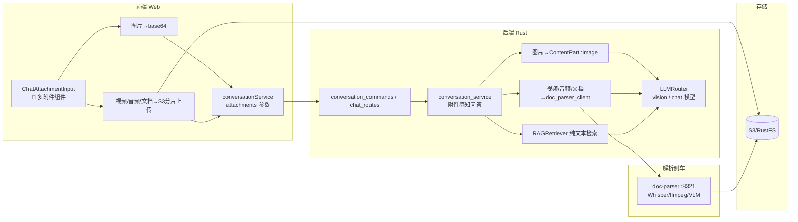

# 智能问答多模态（文件与视频上传）设计方案

> 在现有纯文本 RAG 问答基础上，为聊天页增加**文件/视频上传**能力，实现真正的多模态问答（文本 + 图片 + 视频理解）。
> 关联文档：[智能问答系统（RAG多轮对话）设计方案](./智能问答系统（RAG多轮对话）设计方案.md)、[文档解析与RAG记忆链路设计方案](./文档解析与RAG记忆链路设计方案.md)、[多模态文档解析与文本化归一设计方案](../多模态文档解析与文本化归一设计方案.md)

---

## 目录
1. [背景与目标](#1-背景与目标)
2. [现状分析](#2-现状分析)
3. [整体架构](#3-整体架构)
4. [附件类型与处理链路](#4-附件类型与处理链路)
5. [多附件交互与限制](#5-多附件交互与限制)
6. [后端设计](#6-后端设计)
7. [数据库设计](#7-数据库设计)
8. [API 接口设计](#8-api-接口设计)
9. [前端改动清单](#9-前端改动清单)
10. [实施路线图](#10-实施路线图)
11. [验证方案](#11-验证方案)
12. [风险与取舍](#12-风险与取舍)

---

## 1. 背景与目标

### 1.1 背景
智能问答页面 `/chat` 当前仅支持**纯文本输入**（`TextInput`），无法上传文件与视频。项目已具备：
- **doc-parser 解析服务**（Python，`127.0.0.1:8321`）：PDF/Word/Excel/图片/音频/视频 → 文本（Whisper + ffmpeg 抽帧 + VLM）；
- **S3 分片上传栈**（`useChunkedUpload` + `UploadManager` + `/api/upload/*`）；
- **LLM 网关**（`llm_gateway_service.rs`）支持多厂商，但 `ChatMessage` 仅支持字符串 content，**无视觉/多模态消息能力**。

### 1.2 目标
| 输入 | 处理方式 | 说明 |
|------|---------|------|
| 图片 | base64 → `image_url` 内容块 → **视觉 LLM 直接理解** | 真·看图问答 |
| 视频 | doc-parser（Whisper 转写 + 抽帧）→ 转写文本 + 关键帧图片 → 视觉 LLM | 视频内容理解 |
| 音频 | doc-parser（Whisper 转写）→ 文本上下文 | 语音问答 |
| PDF/Word/Excel | doc-parser 提取文本 → 文本上下文 | 文档问答 |
| 纯文本 | 走现有 RAG 链路，零改动 | 向后兼容 |

---

## 2. 现状分析

| 层 | 现状 | 缺口 |
|----|------|------|
| 前端 `/chat` | 纯文本 `TextInput`，模型下拉只过滤 `model_type='chat'` | 无附件 UI、无附件参数 |
| 前端 `conversationService.ts` | 只传 `question` | 需扩展 `attachments` |
| 后端 `conversation_service.rs` | 纯文本 → RAG → LLM | 需附件感知链路 |
| `llm_gateway_service.rs` | `ChatMessage{role, content:String}`；`OpenAIAdapter.chat()` 只序列化字符串 | 无 `content_parts`、无 vision 模型注册 |
| `message` 表 | 有 `metadata JSONB`，无附件列 | 附件信息可存 metadata，**无需改表** |
| SSE 路由 `/api/chat/stream` | 处理函数已实现但**未注册**进 axum 路由 | 需修复接线 |
| 已有上传组件 | `FileUploader`（支持 `multiple`）、`useChunkedUpload` | 可直接复用 |

---

## 3. 整体架构



核心原则（沿用 `文档解析与RAG记忆链路设计方案`）：
- **图片直接给视觉 LLM**（真·多模态），不转文本；
- **视频/音频/文档先解析成文本 + 关键帧**，再交给 LLM；
- **纯文本问题照常走 RAG**，与附件上下文合并。

---

## 4. 附件类型与处理链路

### 4.1 图片（真·视觉理解）
```
图片文件 → 前端读 base64 data URL → attachments[{type:'image', dataUrl, name}]
  → 后端读 base64 → ContentPart::Image { image_url: { url: "data:image/jpeg;base64,..." } }
  → LLMRouter 选 vision 模型 → 返回描述/回答
```
- 前端限制单张 ≤ 10MB；本地 `FileReader.readAsDataURL` 即时预览。

### 4.2 视频
```
视频文件 → useChunkedUpload 分片上传 S3 → attachments[{type:'video', url, name}]
  → 后端 S3Client.download_object() 下载到临时目录
  → doc-parser POST /parse（skip_index=true，仅解析不向量化）
  → 返回：Whisper 转写文本 + N 张关键帧图片路径
  → 关键帧读 base64 → 多个 ContentPart::Image；转写文本作为文本上下文
  → LLMRouter 选 vision 模型
```
- 关键帧默认取前 **6 张**（`FRAME_INTERVAL_SEC` 抽帧后取开头段），防 token 爆炸；
- 临时目录 RAII（`ParseJobDir`），解析完自动清理。

### 4.3 音频
```
音频 → S3 上传 → 后端下载 → doc-parser（Whisper 转写）→ 转写文本作为上下文 → chat 模型
```

### 4.4 PDF / Word / Excel / 文本
```
文档 → S3 上传 → 后端下载 → doc-parser 提取文本 → 文本上下文 → chat 模型
```

### 4.5 纯文本
现有 RAG 链路，零改动（`build_rag_prompt` 前追加附件解析出的文本上下文）。

---

## 5. 多附件交互与限制

### 5.1 交互
- 输入框左侧「📎 附件」按钮 + 隐藏 file input（`multiple`）；
- 支持**连续添加多个文件**，每个文件独立进度、独立移除；
- 图片即时预览（缩略图）；视频/音频/PDF 显示上传进度条；
- 输入框上方附件 chips 横向排列，超出滚动；
- 全部就绪后随问题一起「发送」。

### 5.2 限制（前端校验 + 后端兜底）
| 类型 | 每条消息上限 | 原因 |
|------|-------------|------|
| 图片 | ≤ 5 张 | 视觉模型单请求图片数 / token 限制（每张约 1000+ token） |
| 视频/音频 | ≤ 1 个（可再配少量图片） | 解析耗时长 |
| PDF/Word/Excel | ≤ 3 个 | 上下文长度控制 |
| 合计 | ≤ 5 个附件/消息 | 防 token 爆炸 |

- 超限时前端 toast 提示，后端返回 `400` 清晰错误，不静默丢弃。

---

## 6. 后端设计

### 6.1 `database/models.rs` — ChatMessage 多模态
```rust
/// 多模态内容片段
#[derive(Debug, Clone, Serialize, Deserialize)]
#[serde(untagged)]
pub enum ContentPart {
    Text { r#type: String, text: String },
    Image { r#type: String, image_url: ImageUrl },
}

#[derive(Debug, Clone, Serialize, Deserialize)]
pub struct ImageUrl {
    pub url: String, // data:image/jpeg;base64,...
}

pub struct ChatMessage {
    pub role: String,
    pub content: String,
    /// 多模态消息（图片），与 content 二选一；向后兼容
    #[serde(default, skip_serializing_if = "Option::is_none")]
    pub content_parts: Option<Vec<ContentPart>>,
}
```

### 6.2 `llm_gateway_service.rs` — 三处扩展
| 改动 | 说明 |
|------|------|
| `OpenAIAdapter.chat()` | `content_parts` 存在则原样透传 `content` 数组（`image_url`），否则走现有字符串逻辑 |
| `refresh_providers()` | 查询 `model_type='vision'` 模型，注册为 `model_type:"vision"` 的 `WeightedProvider` |
| `LoadBalancer.select()` | 已支持任意 `model_type` 匹配，无需改动 |

新增 `chat_multimodal()`：附件请求优先选所选厂商的 **vision** 模型；所选厂商无 vision 模型时返回清晰错误（前端提示「请配置视觉模型，如 qwen-vl / gpt-4o / glm-4v / llava」）。

### 6.3 `service/doc_parser.rs`（新建）— Python 侧车客户端
```rust
pub struct DocParserClient { base_url: String, token: String, client: reqwest::Client }
impl DocParserClient {
    /// POST /parse，带 X-API-Token
    pub async fn parse_file(&self, file_path: &str, options: &serde_json::Value) -> Result<ParseResult, String>;
}
```
`ParseResult { file_name, file_type, raw_text, images: Vec<String>, metadata }`。

### 6.4 `storage/s3.rs` — 新增 `download_object()`
将 S3 对象下载到本地临时目录，供 doc-parser 解析（doc-parser 需要本地路径）。

### 6.5 `conversation_service.rs` — 附件感知问答
新增入参 `attachments: Vec<AttachmentParam>`，`AttachmentParam { r#type, name, url?, data_url?, mime? }`：

```
answer_with_attachments:
  1. 按 type 分流处理每个附件
     - image     → 读 base64 → ContentPart::Image
     - video     → S3 下载 → doc-parser → 转写文本 + ≤6 张关键帧 → ContentPart::Image × N
     - audio/pdf/doc → S3 下载 → doc-parser → 文本上下文
  2. 纯文本问题照常 RAG 检索
  3. 组装 messages（system + user(content_parts/文本)）
  4. chat_multimodal 调用 LLM（vision / chat 模型）
  5. 降级：LLM 失败 → 返回解析出的附件文本摘要（同现有 build_rag_answer 思路）
  6. 附件信息写入 message.metadata
```

---

## 7. 数据库设计

**不改表结构**，附件信息存入 `message.metadata` JSONB：

```json
{
  "attachments": [
    { "type": "image", "name": "chart.png", "dataUrl": "data:image/png;base64,...", "mime": "image/png" },
    { "type": "video", "name": "demo.mp4", "url": "https://.../demo.mp4", "mime": "video/mp4" }
  ],
  "parsedText": "视频转写摘要……（可选，供历史回看）"
}
```
- 前端 `get_conversation_messages` 返回 `metadata`，历史消息可还原附件渲染（图片缩略图 / video 播放 / 文件卡片）；
- `insert_message` 现有 `metadata: Option<&str>` 参数即可支持，**无 SQL 迁移**。

---

## 8. API 接口设计

### 8.1 Tauri 命令（桌面版，主链路）
```
create_conversation(userId, question, attachments?, providerId?, modelName?, bindTreeNodeId?)
send_message(convId, userId, question, attachments?, providerId?, modelName?)
```
`attachments?: Array<{ type: 'image'|'video'|'audio'|'document'; name: string; dataUrl?: string; url?: string; mime?: string }>`

### 8.2 HTTP 流式（SSE）
- **修复**：`/api/chat/stream` 未注册进 `api/mod.rs` 的存量问题；
- **改造**：由 `GET + query` 改为 `POST + JSON body`（携带 attachments，避免 URL 超长），同步更新 `useChatStream.ts`；
- 事件不变：`event: token` / `event: done` / `event: error`。

---


## 9. 前端改动清单

| 文件 | 改动 |
|------|------|
| `apps/web/src/components/Chat/ChatAttachmentInput.tsx` | **新建**：📎 多附件选择 / 图片 base64 预览 / 视频·音频·文档 S3 上传进度 / 移除 / 上限校验 |
| `apps/web/src/components/Chat/MessageBubble.tsx` | **改**：渲染附件（图片缩略图、`<video>`、文件卡片） |
| `apps/web/src/app/chat/page.tsx` | **改**：集成 `ChatAttachmentInput`，发送带 `attachments`，有附件无 vision 模型时提示 |
| `apps/web/src/services/conversationService.ts` | **改**：`ChatAttachment` 类型 + 参数扩展 |
| `apps/web/src/hooks/useChatStream.ts` | **改**（可选）：POST + attachments |
| `apps/web/src/app/settings/llm/page.tsx` | **改**：`modelTypeLabel` 增加 `vision → '视觉'` |

复用（零改动）：`FileUploader.tsx`（`multiple` 属性）、`useChunkedUpload.ts`、`UploadService`。

---

## 10. 实施路线图

| 阶段 | 内容 | 涉及文件 | 状态 |
|------|------|---------|------|
| **P1 后端 LLM 多模态** | `ContentPart`/`content_parts`；OpenAIAdapter 透传；vision 模型注册；`chat_multimodal` | `models.rs`、`llm_gateway_service.rs` | ✅ 已完成 |
| **P2 后端附件解析** | `DocParserClient`；S3 `download_object`；`conversation_service` 附件感知链路 | `service/doc_parser.rs`、`storage/s3.rs`、`conversation_service.rs` | ✅ 已完成 |
| **P3 命令与路由** | Tauri 命令加 `attachments`；SSE 路由注册 + 改 POST | `conversation_commands.rs`、`chat_routes.rs`、`api/mod.rs` | ✅ 已完成 |
| **P4 前端 UI** | `ChatAttachmentInput`、`MessageBubble`、`/chat` 页、`conversationService` | 见 §9 | ✅ 已完成 |
| **P5 模型配置** | LLM 配置页 vision 标签与引导 | `settings/llm/page.tsx` | ✅ 已完成 |
| **P6 验证** | cargo build / tsc / 端到端手测 | — | ⏳ 待验证 |

---

## 11. 验证方案

1. **编译**：后端 `cargo check`（Tauri 目录）、前端 `pnpm tsc --noEmit` + `pnpm build`；
2. **端到端**（需本机配置视觉模型 + doc-parser 服务运行）：
   - 纯文本（回归，验证老链路无损）；
   - 文本 + 图片（1 张、5 张上限）→ 视觉 LLM 理解；
   - 文本 + 视频 → 转写 + 关键帧回答，验证临时目录自动清理；
   - 文本 + 音频 / PDF → 解析文本回答；
   - 超限附件 → 前端拦截提示；
   - 历史会话回看附件渲染；
   - 所选厂商无 vision 模型 → 明确错误提示。

---

## 12. 风险与取舍

| 风险/取舍 | 说明 | 对策 |
|-----------|------|------|
| token 爆炸 | 多图片 + 长文本 | 每消息 ≤5 附件、视频关键帧 ≤6 张、附件上限表（§5.2） |
| 视频解析慢 | doc-parser Whisper/ffmpeg 耗时长 | 后端异步处理 + 前端「解析中...」状态；建议视频时长限制 |
| 视觉模型缺失 | 厂商无 vision 模型 | 前端先校验 + 后端清晰报错；LLM 配置页引导添加 |
| 大 base64 传输 | Tauri invoke 传大量 base64 | 图片限 ≤10MB；大文件走 S3 分片上传 |
| SSE 存量 bug | `/api/chat/stream` 未注册 | P3 顺带修复并改造 POST |
| 向后兼容 | 老链路 | `content_parts` 可选、`content` 保留；纯文本问答零改动 |

---

*文档结束*
