# 智能问答系统（RAG 多轮对话）设计方案

> 多轮上下文文档问答：会话隔离、RAG 向量检索、溯源引用
> 支撑数据表：conversation、message、document_chunk、knowledge_asset

---

## 目录

1. [设计目标](#1-设计目标)
2. [整体架构](#2-整体架构)
3. [数据库设计](#3-数据库设计)
4. [RAG 检索引擎](#4-rag-检索引擎)
5. [多轮对话管理](#5-多轮对话管理)
6. [溯源引用系统](#6-溯源引用系统)
7. [API 接口设计](#7-api-接口设计)
8. [前端交互设计](#8-前端交互设计)
9. [实施路线图](#9-实施路线图)

---

## 1. 设计目标

### 1.1 核心能力

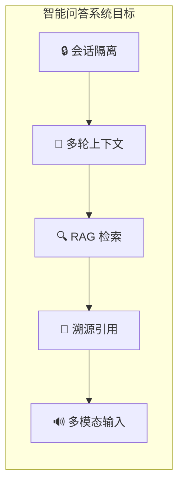

| 目标 | 说明 | 优先级 |
|------|------|--------|
| 🔒 **会话隔离** | 每个会话绑定指定知识库目录，检索范围严格限定 | P0 |
| 🔄 **多轮上下文** | 持久存储每轮对话，LLM 感知完整上下文 | P0 |
| 🔍 **RAG 检索** | 用户提问 → 向量化 → 语义检索 → 拼接原文 → LLM 回答 | P0 |
| 📎 **溯源引用** | 记录回答引用的知识资产 ID，前端标注来源文档 | P1 |
| 🔊 **多模态输入** | 支持文本/语音输入，语音自动转文字后走 RAG | P2 |

### 1.2 系统流程全景

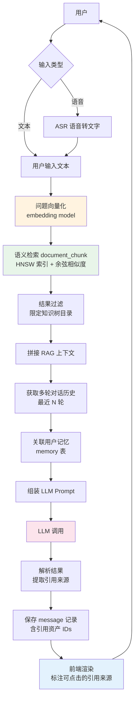

---

## 2. 整体架构

### 2.1 分层架构

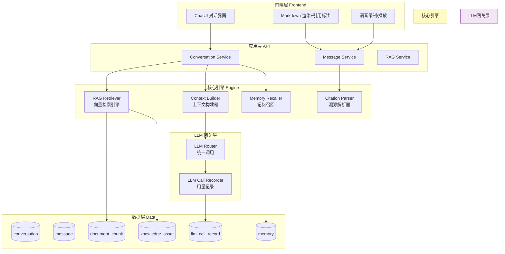

### 2.2 RAG 检索核心流程

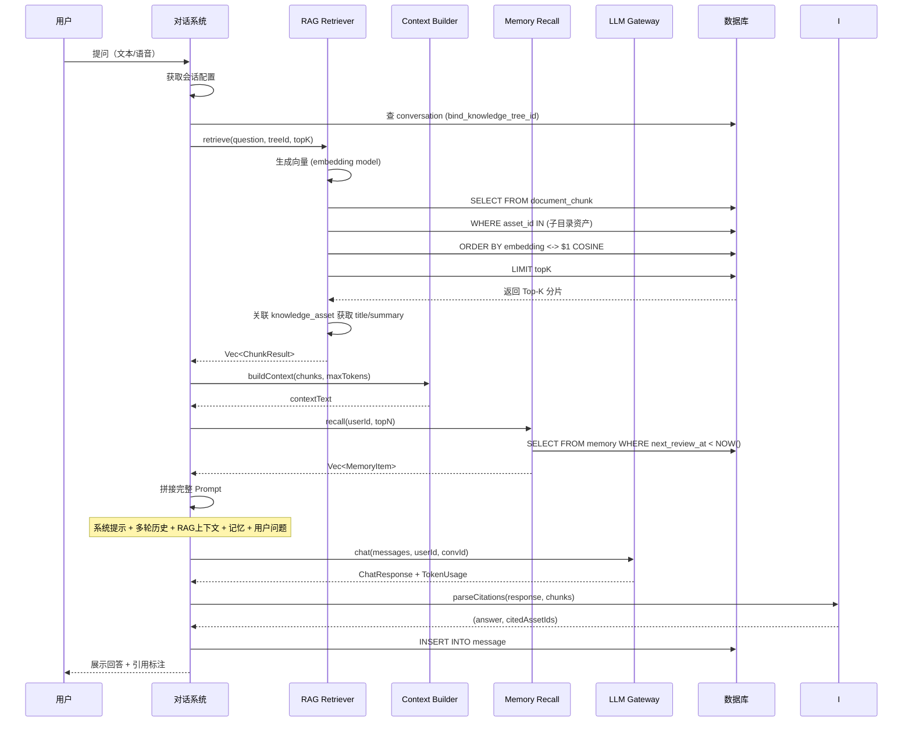

---

## 3. 数据库设计

### 3.1 统一设计规范

| 规则 | 说明 |
|------|------|
| 🔑 主键 | `BIGSERIAL` 自增主键 |
| 🗑️ 软删除 | `deleted SMALLINT DEFAULT 0` |
| ⏰ 时间 | 统一 `TIMESTAMPTZ` |
| 📎 引用 | 使用 `BIGINT[]` 数组字段存储引用的资产 ID 列表 |

### 3.2 conversation 对话会话表

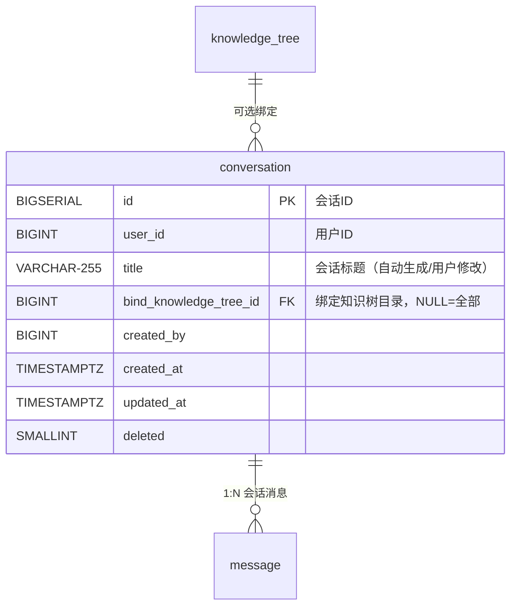

```sql
CREATE TABLE IF NOT EXISTS {schema}.conversation (
    id BIGSERIAL PRIMARY KEY,
    user_id BIGINT NOT NULL,
    title VARCHAR(255),                              -- 自动生成/用户重命名
    bind_knowledge_tree_id BIGINT REFERENCES {schema}.knowledge_tree(id),
        -- NULL = 全局检索，非NULL = 限定到该目录及子目录
    created_at TIMESTAMPTZ NOT NULL DEFAULT NOW(),
    updated_at TIMESTAMPTZ NOT NULL DEFAULT NOW(),
    deleted SMALLINT NOT NULL DEFAULT 0
);

COMMENT ON TABLE {schema}.conversation IS '多轮对话会话';
COMMENT ON COLUMN {schema}.conversation.title IS '[自动] 首次提问截取前30字，[手动] 用户可重命名';
COMMENT ON COLUMN {schema}.conversation.bind_knowledge_tree_id IS '绑定知识树目录ID，NULL=全部知识库，非NULL=仅检索该目录';

CREATE INDEX idx_conv_user ON {schema}.conversation(user_id, deleted);
CREATE INDEX idx_conv_tree ON {schema}.conversation(bind_knowledge_tree_id, deleted);
CREATE INDEX idx_conv_time ON {schema}.conversation(created_at DESC);
```

### 3.3 message 会话消息表

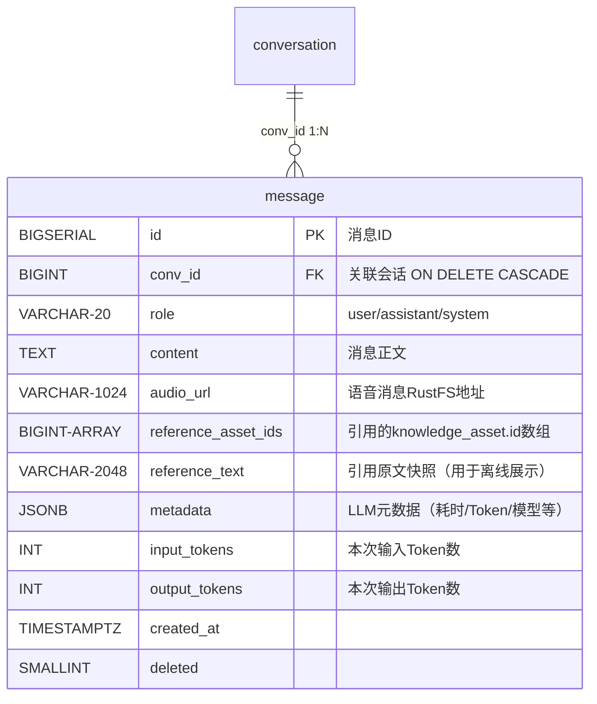

```sql
CREATE TABLE IF NOT EXISTS {schema}.message (
    id BIGSERIAL PRIMARY KEY,
    conv_id BIGINT NOT NULL REFERENCES {schema}.conversation(id) ON DELETE CASCADE,
    role VARCHAR(20) NOT NULL,           -- user / assistant / system
    content TEXT NOT NULL,               -- 消息正文
    audio_url VARCHAR(1024),             -- 语音消息 RustFS 存储地址
    reference_asset_ids BIGINT[],        -- 引用的 knowledge_asset.id 数组
    reference_text VARCHAR(2048),        -- 引用原文快照（用于引用面板展示）
    metadata JSONB,                      -- { model, provider, temperature, duration_ms }
    input_tokens INT DEFAULT 0,          -- 输入 Token 数
    output_tokens INT DEFAULT 0,         -- 输出 Token 数
    created_at TIMESTAMPTZ NOT NULL DEFAULT NOW(),
    deleted SMALLINT NOT NULL DEFAULT 0
);

COMMENT ON TABLE {schema}.message IS '会话消息记录';
COMMENT ON COLUMN {schema}.message.role IS '消息角色：user=用户 assistant=AI system=系统提示词';
COMMENT ON COLUMN {schema}.message.reference_asset_ids IS '本次回答引用的 knowledge_asset.id 数组，前端可点击跳转';
COMMENT ON COLUMN {schema}.message.reference_text IS '引用原文快照，返回相关文档片段的原文';
COMMENT ON COLUMN {schema}.message.input_tokens IS '本次请求消耗的输入Token数';
COMMENT ON COLUMN {schema}.message.output_tokens IS '本次回复消耗的输出Token数';

CREATE INDEX idx_msg_conv ON {schema}.message(conv_id, deleted);
CREATE INDEX idx_msg_conv_time ON {schema}.message(conv_id, created_at ASC);
```

### 3.4 document_chunk 向量分片检索表（补充 RAG 字段）

在原有 `document_chunk` 基础上增加 RAG 需要的字段：

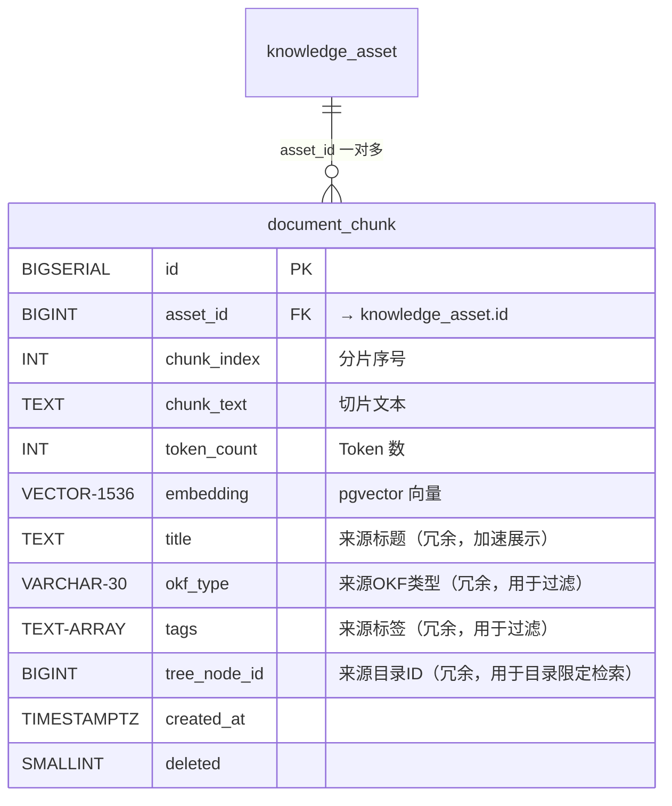

```sql
CREATE TABLE IF NOT EXISTS {schema}.document_chunk (
    id BIGSERIAL PRIMARY KEY,
    asset_id BIGINT NOT NULL REFERENCES {schema}.knowledge_asset(id) ON DELETE CASCADE,
    chunk_index INT NOT NULL,
    chunk_text TEXT NOT NULL,
    token_count INT,
    embedding vector(1536),              -- pgvector 向量
    title VARCHAR(512),                  -- 来源资产标题（冗余）
    okf_type VARCHAR(30),                -- 来源OKF类型（冗余）
    tags TEXT[],                         -- 来源标签（冗余）
    tree_node_id BIGINT,                 -- 来源目录ID（冗余，加速目录过滤）
    created_at TIMESTAMPTZ NOT NULL DEFAULT NOW(),
    deleted SMALLINT NOT NULL DEFAULT 0
);

COMMENT ON TABLE {schema}.document_chunk IS 'RAG向量分片检索表';
COMMENT ON COLUMN {schema}.document_chunk.embedding IS '1536维pgvector向量，HNSW索引加速';
COMMENT ON COLUMN {schema}.document_chunk.title IS '来源资产标题（冗余，避免每次关联查询）';
COMMENT ON COLUMN {schema}.document_chunk.tree_node_id IS '来源目录ID（冗余，用于限定目录检索）';

CREATE INDEX idx_chunk_asset ON {schema}.document_chunk(asset_id, deleted);
CREATE INDEX idx_chunk_tree ON {schema}.document_chunk(tree_node_id, deleted);
CREATE INDEX idx_chunk_embedding ON {schema}.document_chunk USING hnsw (embedding vector_cosine_ops);
```

### 3.5 表关联总览

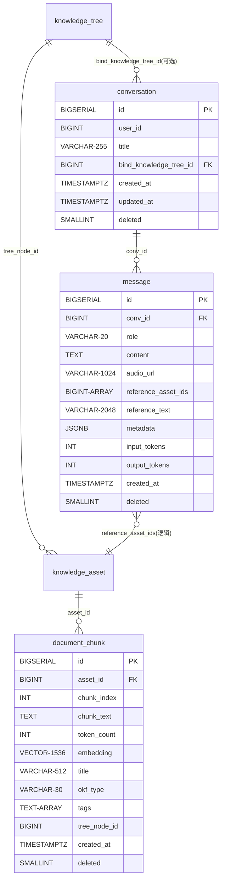

---

## 4. RAG 检索引擎

### 4.1 检索策略

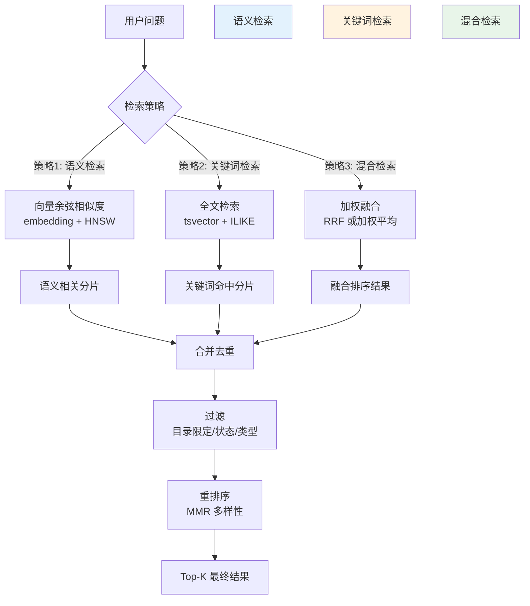

### 4.2 语义检索 SQL

```sql
-- 基础语义检索（限定目录）
SELECT 
    dc.id,
    dc.chunk_text,
    dc.chunk_index,
    dc.title,
    dc.okf_type,
    dc.token_count,
    dc.asset_id,
    -- 余弦距离 （越小越相似）
    1 - (dc.embedding <=> $1::vector) AS similarity
FROM {schema}.document_chunk dc
WHERE dc.deleted = 0
  -- 限定目录检索（bind_knowledge_tree_id）
  AND ($2 IS NULL OR dc.tree_node_id IN (
      WITH RECURSIVE sub_tree AS (
          SELECT id FROM {schema}.knowledge_tree WHERE id = $2 AND deleted = 0
          UNION ALL
          SELECT kt.id FROM {schema}.knowledge_tree kt
          JOIN sub_tree st ON kt.parent_id = st.id
          WHERE kt.deleted = 0
      )
      SELECT id FROM sub_tree
  ))
  -- 可选：按 OKF 类型过滤
  AND ($3 IS NULL OR dc.okf_type = $3)
ORDER BY dc.embedding <=> $1::vector  -- 余弦距离升序
LIMIT $4;  -- Top-K
```

### 4.3 Rust RAG 检索器实现

```rust
/// RAG 检索结果
#[derive(Debug, Clone, Serialize, Deserialize)]
pub struct ChunkResult {
    pub chunk_id: i64,
    pub chunk_text: String,
    pub chunk_index: i32,
    pub title: String,
    pub okf_type: String,
    pub asset_id: i64,
    pub similarity: f64,
    pub token_count: i32,
}

/// RAG 检索参数
#[derive(Debug, Clone)]
pub struct RetrieveParams {
    pub question: String,              // 用户问题
    pub bind_tree_node_id: Option<i64>, // 绑定的知识树目录ID
    pub top_k: i32,                     // 返回 Top-K 结果
    pub max_tokens: i32,                // 最大 Token 数（用于上下文裁剪）
    pub okf_type_filter: Option<String>, // OKF 类型过滤
    pub min_similarity: f64,            // 最低相似度阈值
}

/// RAG 检索器
pub struct RAGRetriever {
    pool: PgPool,
    embed_provider: Arc<dyn LLMProviderAdapter>,  // LLM 适配器（用于生成向量）
}

impl RAGRetriever {
    /// 执行 RAG 检索
    pub async fn retrieve(&self, params: &RetrieveParams) -> Result<Vec<ChunkResult>, String> {
        // 1. 生成问题向量
        let embedding = self.generate_embedding(&params.question).await?;
        
        // 2. 语义检索
        let chunks = self.semantic_search(&embedding, params).await?;
        
        // 3. 过滤低相似度结果
        let filtered: Vec<ChunkResult> = chunks
            .into_iter()
            .filter(|c| c.similarity >= params.min_similarity)
            .collect();
        
        // 4. Token 预算裁剪
        let trimmed = self.trim_by_token_budget(filtered, params.max_tokens);
        
        Ok(trimmed)
    }
    
    /// 生成问题向量
    async fn generate_embedding(&self, text: &str) -> Result<Vec<f32>, String> {
        let request = LLMEmbeddingRequest {
            input: vec![text.to_string()],
            model: String::new(),  // 由 LLM Router 选择默认模型
            user_id: None,
        };
        let response = self.embed_provider.embedding(request).await?;
        
        response.embeddings
            .into_iter()
            .next()
            .ok_or_else(|| "生成向量失败：返回为空".to_string())
    }
    
    /// 语义检索
    async fn semantic_search(
        &self,
        embedding: &[f32],
        params: &RetrieveParams,
    ) -> Result<Vec<ChunkResult>, String> {
        let prefix = database::schema_prefix();
        
        let sql = format!(
            r#"SELECT 
                dc.id, dc.chunk_text, dc.chunk_index,
                COALESCE(dc.title, '') AS title,
                COALESCE(dc.okf_type, '') AS okf_type,
                dc.asset_id, dc.token_count,
                1 - (dc.embedding <=> $1::vector) AS similarity
            FROM {}document_chunk dc
            WHERE dc.deleted = 0
                AND ($2::BIGINT IS NULL OR dc.tree_node_id IN (
                    WITH RECURSIVE sub_tree AS (
                        SELECT id FROM {}knowledge_tree WHERE id = $2 AND deleted = 0
                        UNION ALL
                        SELECT kt.id FROM {}knowledge_tree kt
                        JOIN sub_tree st ON kt.parent_id = st.id
                        WHERE kt.deleted = 0
                    )
                    SELECT id FROM sub_tree
                ))
                AND ($3::VARCHAR IS NULL OR dc.okf_type = $3)
            ORDER BY dc.embedding <=> $1::vector
            LIMIT $4"#,
            prefix, prefix, prefix
        );
        
        let embedding_str: String = embedding
            .iter()
            .map(|v| v.to_string())
            .collect::<Vec<_>>()
            .join(",");
        let embedding_pg = format!("[{}]", embedding_str);
        
        struct DbChunk {
            id: i64,
            chunk_text: String,
            chunk_index: i32,
            title: String,
            okf_type: String,
            asset_id: i64,
            token_count: Option<i32>,
            similarity: Option<f64>,
        }
        
        let rows = sqlx::query_as::<_, DbChunk>(&sql)
            .bind(&embedding_pg)
            .bind(params.bind_tree_node_id)
            .bind(&params.okf_type_filter)
            .bind(params.top_k)
            .fetch_all(&self.pool)
            .await
            .map_err(|e| format!("RAG 检索失败: {}", e))?;
        
        Ok(rows
            .into_iter()
            .map(|r| ChunkResult {
                chunk_id: r.id,
                chunk_text: r.chunk_text,
                chunk_index: r.chunk_index,
                title: r.title,
                okf_type: r.okf_type,
                asset_id: r.asset_id,
                similarity: r.similarity.unwrap_or(0.0),
                token_count: r.token_count.unwrap_or(0),
            })
            .collect())
    }
    
    /// 按 Token 预算裁剪
    fn trim_by_token_budget(&self, mut chunks: Vec<ChunkResult>, max_tokens: i32) -> Vec<ChunkResult> {
        let mut total = 0;
        chunks.retain(|c| {
            if total >= max_tokens {
                return false;
            }
            total += c.token_count.max(50);  // 至少每个分片算 50 tokens
            true
        });
        chunks
    }
}
```

### 4.4 上下文构建器

```rust
/// 上下文构建器
pub struct ContextBuilder {
    max_context_tokens: i32,     // RAG 上下文最大 Token
    max_history_tokens: i32,     // 历史消息最大 Token
    max_memory_tokens: i32,      // 记忆最大 Token
    max_system_tokens: i32,      // 系统提示最大 Token
}

impl ContextBuilder {
    /// 构建完整 LLM Prompt
    pub async fn build_prompt(
        &self,
        question: &str,
        conv_id: i64,
        user_id: i64,
        chunks: &[ChunkResult],
        memories: &[MemoryItem],
    ) -> Result<Vec<ChatMessage>, String> {
        let mut messages = Vec::new();
        
        // 1. 系统提示词
        let system_prompt = self.build_system_prompt(chunks);
        messages.push(ChatMessage {
            role: "system".to_string(),
            content: system_prompt,
        });
        
        // 2. 多轮对话历史（最近 N 轮，裁剪到 max_history_tokens）
        let history = self.get_conversation_history(conv_id).await?;
        messages.extend(history);
        
        // 3. 用户记忆（如果有）
        if !memories.is_empty() {
            let memory_text = self.format_memories(memories);
            messages.push(ChatMessage {
                role: "system".to_string(),
                content: format!("【用户相关记忆】\n{}", memory_text),
            });
        }
        
        // 4. 当前用户问题
        messages.push(ChatMessage {
            role: "user".to_string(),
            content: question.to_string(),
        });
        
        Ok(messages)
    }
    
    /// 构建系统提示词（包含 RAG 上下文）
    fn build_system_prompt(&self, chunks: &[ChunkResult]) -> String {
        let mut prompt = String::from(
            "你是一个知识库智能助手。请基于以下参考资料回答用户问题。\n\n"
        );
        
        prompt.push_str("【参考资料】\n");
        for (i, chunk) in chunks.iter().enumerate() {
            prompt.push_str(&format!(
                "[来源 {}] 《{}》 (类型: {})\n{}\n\n",
                i + 1,
                chunk.title,
                self.okf_type_label(&chunk.okf_type),
                chunk.chunk_text
            ));
        }
        
        prompt.push_str(
            "回答要求：\n\
            1. 优先使用参考资料回答，如果资料不足以回答请明确说明\n\
            2. 引用资料时请标注来源编号，例如「根据[来源1]所述...」\n\
            3. 如果用户问题与知识库无关，可以直接回答\n\
            4. 使用中文回答，保持简洁专业"
        );
        
        prompt
    }
    
    fn okf_type_label(&self, okf_type: &str) -> &str {
        match okf_type {
            "raw_source" => "原始素材",
            "concept" => "概念",
            "fact" => "事实",
            "rule" => "规则",
            "param" => "参数",
            "process" => "流程",
            "case" => "案例",
            _ => "知识",
        }
    }
    
    /// 获取多轮对话历史
    async fn get_conversation_history(&self, conv_id: i64) -> Result<Vec<ChatMessage>, String> {
        // 查询最近的消息（按时间 ASC）
        let pool = database::get_read_pool().map_err(|e| format!("数据库连接失败: {}", e))?;
        let prefix = database::schema_prefix();
        
        let sql = format!(
            "SELECT role, content, input_tokens, output_tokens FROM {}message \
             WHERE conv_id = $1 AND deleted = 0 \
             ORDER BY created_at ASC \
             LIMIT 20",  // 最多取最近 20 轮
            prefix
        );
        
        struct MsgRow {
            role: String,
            content: String,
            input_tokens: Option<i32>,
            output_tokens: Option<i32>,
        }
        
        let rows = sqlx::query_as::<_, MsgRow>(&sql)
            .bind(conv_id)
            .fetch_all(&pool)
            .await
            .map_err(|e| format!("查询历史消息失败: {}", e))?;
        
        let mut messages = Vec::new();
        let mut total_tokens = 0;
        
        for row in rows {
            let tokens = row.input_tokens.unwrap_or(0) + row.output_tokens.unwrap_or(0);
            if total_tokens + tokens > self.max_history_tokens {
                break;  // 超出历史预算，丢弃更早的消息
            }
            total_tokens += tokens;
            
            messages.push(ChatMessage {
                role: row.role,
                content: row.content,
            });
        }
        
        Ok(messages)
    }
    
    /// 格式化记忆
    fn format_memories(&self, memories: &[MemoryItem]) -> String {
        memories
            .iter()
            .map(|m| format!("- [{}] {} (重要性: {:.1})", m.category, m.content, m.importance))
            .collect::<Vec<_>>()
            .join("\n")
    }
}
```

---

## 5. 多轮对话管理

### 5.1 会话生命周期

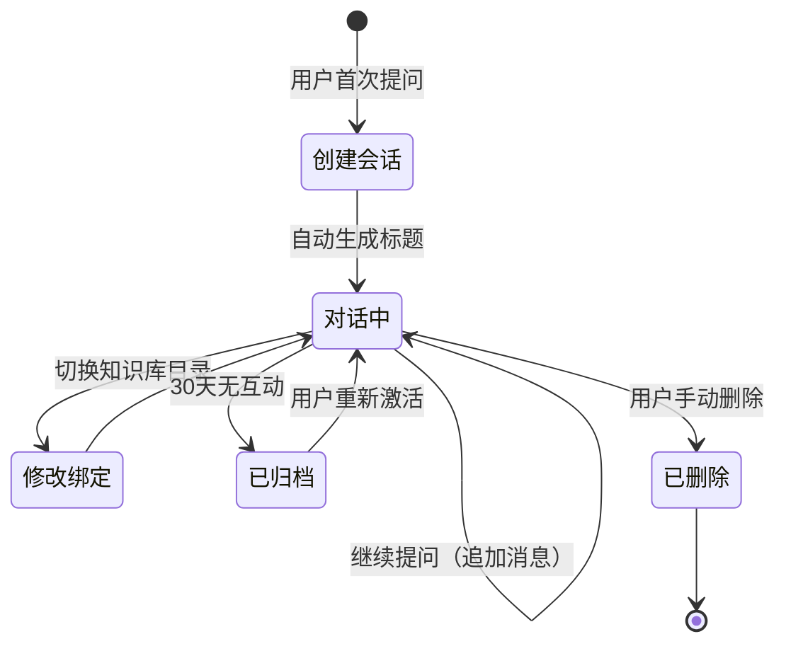

### 5.2 标题自动生成策略

```typescript
/// 会话标题自动生成规则
function generateConversationTitle(firstQuestion: string): string {
    // 1. 取前 30 个字符
    let title = firstQuestion.trim().slice(0, 30);
    
    // 2. 如果包含换行或问号，截断
    const breakIdx = Math.min(
        title.indexOf('\n') > -1 ? title.indexOf('\n') : 30,
        title.indexOf('？') > -1 ? title.indexOf('？') + 1 : 30,
        title.indexOf('?') > -1 ? title.indexOf('?') + 1 : 30,
    );
    
    if (breakIdx < 30) {
        title = title.slice(0, breakIdx);
    }
    
    // 3. 添加省略号如果被截断
    if (title.length < firstQuestion.trim().length) {
        title += '...';
    }
    
    return title;
}
```

### 5.3 Rust 会话服务

```rust
/// 对话系统 Service
pub struct ConversationService {
    retriever: RAGRetriever,
    context_builder: ContextBuilder,
    llm_router: LLMRouter,
    call_recorder: CallRecorder,
    pool: PgPool,
}

impl ConversationService {
    /// 创建新会话并回答
    pub async fn create_conversation_and_answer(
        &self,
        user_id: i64,
        question: &str,
        bind_tree_node_id: Option<i64>,
    ) -> Result<ConversationResponse, String> {
        // 1. 创建会话
        let title = generate_title(question);
        let conv = self.insert_conversation(user_id, &title, bind_tree_node_id).await?;
        
        // 2. 保存用户消息
        self.insert_message(conv.id, "user", question, None, None, None, None, 0, 0).await?;
        
        // 3. 执行 RAG 检索
        let params = RetrieveParams {
            question: question.to_string(),
            bind_tree_node_id,
            top_k: 5,
            max_tokens: 2000,
            okf_type_filter: None,
            min_similarity: 0.5,
        };
        let chunks = self.retriever.retrieve(&params).await?;
        
        // 4. 召回用户记忆
        let memories = self.memory_recall(user_id, 3).await?;
        
        // 5. 构建 Prompt
        let messages = self.context_builder.build_prompt(
            question, conv.id, user_id, &chunks, &memories,
        ).await?;
        
        // 6. 调用 LLM
        let llm_response = self.llm_router.chat(LLMChatRequest {
            messages,
            model: String::new(),   // 由 Router 选择
            temperature: None,
            max_tokens: None,
            stream: Some(false),
            user_id: Some(user_id),
            conv_id: Some(conv.id),
        }).await?;
        
        // 7. 解析引用
        let (clean_answer, cited_ids) = self.parse_citations(&llm_response.content, &chunks);
        
        // 8. 保存 AI 消息（含引用信息）
        self.insert_message(
            conv.id,
            "assistant",
            &clean_answer,
            None,
            Some(&cited_ids),
            Some(&serde_json::json!({
                "model": llm_response.model,
                "provider_id": llm_response.provider_id,
                "model_id": llm_response.model_id,
                "chunks_count": chunks.len(),
            }).to_string()),
            None,
            llm_response.usage.input_tokens,
            llm_response.usage.output_tokens,
        ).await?;
        
        Ok(ConversationResponse {
            conv_id: conv.id,
            answer: clean_answer,
            cited_assets: self.get_cited_asset_info(&cited_ids).await?,
            usage: llm_response.usage,
        })
    }
    
    /// 继续已有会话
    pub async fn continue_conversation(
        &self,
        conv_id: i64,
        user_id: i64,
        question: &str,
    ) -> Result<ConversationResponse, String> {
        // 1. 验证会话所有权
        let conv = self.get_conversation_by_id(conv_id).await?;
        if conv.user_id != user_id {
            return Err("无权访问此会话".to_string());
        }
        
        // 2. 保存用户消息
        self.insert_message(conv_id, "user", question, None, None, None, None, 0, 0).await?;
        
        // 3-8. 与创建流程相同
        // ... (复用上述逻辑)
        
        unimplemented!()
    }
    
    /// 解析引用标记
    fn parse_citations(&self, answer: &str, chunks: &[ChunkResult]) -> (String, Vec<i64>) {
        let mut cited_ids = Vec::new();
        let mut clean = answer.to_string();
        
        // 查找 [来源 N] 标记
        let re = regex::Regex::new(r"\[来源 (\d+)\]").unwrap();
        for cap in re.captures_iter(answer) {
            if let Ok(idx) = cap[1].parse::<usize>() {
                if idx > 0 && idx <= chunks.len() {
                    let asset_id = chunks[idx - 1].asset_id;
                    if !cited_ids.contains(&asset_id) {
                        cited_ids.push(asset_id);
                    }
                }
            }
        }
        
        // 替换为 Markdown 链接格式（前端渲染跳转）
        clean = re.replace_all(&clean, |caps: &regex::Captures| {
            if let Ok(idx) = caps[1].parse::<usize>() {
                if idx > 0 && idx <= chunks.len() {
                    let chunk = &chunks[idx - 1];
                    format!("[📎 {}](asset:{})", chunk.title, chunk.asset_id)
                } else {
                    caps[0].to_string()
                }
            } else {
                caps[0].to_string()
            }
        }).to_string();
        
        (clean, cited_ids)
    }
    
    /// 生成标题
    fn generate_title(question: &str) -> String {
        let trimmed = question.trim();
        let max_len = 30;
        if trimmed.chars().count() <= max_len {
            return trimmed.to_string();
        }
        // 取前 30 个字符
        let title: String = trimmed.chars().take(max_len).collect();
        format!("{}...", title)
    }
    
    /// 插入会话
    async fn insert_conversation(&self, user_id: i64, title: &str, bind_tree_node_id: Option<i64>) -> Result<Conversation, String> {
        // INSERT RETURNING ...
        unimplemented!()
    }
    
    /// 插入消息
    async fn insert_message(
        &self, conv_id: i64, role: &str, content: &str,
        audio_url: Option<&str>, reference_asset_ids: Option<&Vec<i64>>,
        metadata: Option<&str>, reference_text: Option<&str>,
        input_tokens: i32, output_tokens: i32,
    ) -> Result<i64, String> {
        // INSERT RETURNING id ...
        unimplemented!()
    }
    
    /// 获取引用资产信息
    async fn get_cited_asset_info(&self, asset_ids: &[i64]) -> Result<Vec<AssetInfo>, String> {
        // SELECT id, title, okf_type FROM knowledge_asset WHERE id = ANY($1)
        unimplemented!()
    }
    
    /// 记忆召回
    async fn memory_recall(&self, user_id: i64, top_n: i32) -> Result<Vec<MemoryItem>, String> {
        // SELECT content, category, importance FROM memory WHERE user_id = $1 AND next_review_at < NOW()
        unimplemented!()
    }
}
```

---

## 6. 溯源引用系统

### 6.1 引用数据流

```mermaid
flowchart LR
    subgraph RAG检索阶段
        A[检索到 Top-K 分片] --> B[每个分片含 asset_id]
        B --> C[拼接 Prompt: [来源1] [来源2]...]
    end
    
    subgraph LLM回答阶段
        C --> D[LLM 回答时引用来源]
        D --> E["根据[来源1]所述..."]
    end
    
    subgraph 解析阶段
        E --> F[CitationParser 解析]
        F --> G[提取被引用的 asset_id 列表]
        F --> H[生成 Markdown 链接]
    end
    
    subgraph 持久化阶段
        G --> I[存入 message.reference_asset_ids]
        H --> J[存入 message.content（已替换为链接）]
    end
    
    subgraph 前端展示
        I --> K[引用面板展示来源文档列表]
        J --> L[回答中的 📎 可点击跳转]
        K --> M[点击跳转到知识资产详情页]
        L --> M
    end
```

### 6.2 引用格式规范

LLM 回答时要求使用 `[来源 N]` 标记引用，系统自动解析：

```
用户提问：采购资产的审批流程是什么？

AI 回答：
根据知识库中的相关资料，采购资产的审批流程如下：

1. **需求提出**：使用部门填写采购申请单，注明资产名称、规格、数量、预算等信息。[来源1]
2. **部门审批**：部门负责人审核采购需求的合理性和预算可行性。[来源1]
3. **财务审核**：财务部门审核预算是否充足。[来源2]
4. **领导审批**：根据金额大小进入不同审批层级：
   - 5万元以下：部门分管领导审批
   - 5-50万元：总经理审批
   - 50万元以上：董事会审批 [来源2][来源3]
5. **采购执行**：审批通过后，采购部门执行采购。[来源1]

> 📎 引用来源：
> - [来源1] 《资产采购流程规范》· 流程规则
> - [来源2] 《审批权限管理制度》· 规则
> - [来源3] 《合同管理办法》· 案例
```

解析后存储的引用结构：

```json
{
    "reference_asset_ids": [101, 205, 308],
    "reference_text": "- 《资产采购流程规范》· 流程规则：第2.3条...\n- 《审批权限管理制度》· 规则：第5条...\n- 《合同管理办法》· 案例：采购合同示例...",
    "reference_assets": [
        {"id": "101", "title": "资产采购流程规范", "okf_type": "process"},
        {"id": "205", "title": "审批权限管理制度", "okf_type": "rule"},
        {"id": "308", "title": "合同管理办法", "okf_type": "case"}
    ]
}
```

### 6.3 前端引用渲染

```typescript
/// 引用标记组件
interface CitationProps {
    assetId: string;
    title: string;
    children: React.ReactNode;
}

const CitationLink: React.FC<CitationProps> = ({ assetId, title, children }) => (
    <Anchor
        href={`/knowledge-asset?id=${assetId}`}
        target="_blank"
        style={{
            color: 'var(--mantine-color-blue-6)',
            textDecoration: 'underline',
            cursor: 'pointer',
        }}
        title={`查看：${title}`}
    >
        {children}
    </Anchor>
);

/// 引用面板
interface CitationPanelProps {
    citedAssets: AssetInfo[];      // 被引用的资产列表
    referenceText: string;         // 引用原文快照
}

const CitationPanel: React.FC<CitationPanelProps> = ({ citedAssets, referenceText }) => (
    <Card withBorder padding="sm" mt="sm" style={{ backgroundColor: '#f8f9fa' }}>
        <Text size="sm" fw={600} mb="xs">
            📎 引用来源 ({citedAssets.length})
        </Text>
        {citedAssets.map((asset) => (
            <Group key={asset.id} gap="xs" mb={4}>
                <Badge variant="light" color="blue" size="xs">
                    {okfTypeLabel(asset.okf_type)}
                </Badge>
                <Anchor
                    href={`/knowledge-asset?id=${asset.id}`}
                    target="_blank"
                    size="sm"
                >
                    {asset.title}
                </Anchor>
            </Group>
        ))}
        {referenceText && (
            <>
                <Divider my="xs" />
                <Text size="xs" c="dimmed" lineClamp={3}>
                    {referenceText}
                </Text>
            </>
        )}
    </Card>
);

/// 消息气泡（含引用）
interface MessageBubbleProps {
    role: 'user' | 'assistant';
    content: string;                 // Markdown 内容（含 [📎 title](asset:id) 链接）
    citedAssets?: AssetInfo[];
    referenceText?: string;
    metadata?: {
        model?: string;
        duration_ms?: number;
    };
}

const MessageBubble: React.FC<MessageBubbleProps> = ({
    role, content, citedAssets, referenceText, metadata,
}) => {
    const isUser = role === 'user';
    
    return (
        <Group
            justify={isUser ? 'flex-end' : 'flex-start'}
            align="flex-start"
            mb="md"
        >
            {!isUser && <Avatar color="violet" radius="xl">AI</Avatar>}
            
            <Paper
                withBorder
                p="md"
                style={{
                    maxWidth: '70%',
                    backgroundColor: isUser
                        ? 'var(--mantine-color-blue-light)'
                        : 'white',
                }}
            >
                {/* Markdown 渲染（含引用链接自动可点击） */}
                <MarkdownRenderer content={content} />
                
                {/* 引用面板 */}
                {citedAssets && citedAssets.length > 0 && (
                    <CitationPanel
                        citedAssets={citedAssets}
                        referenceText={referenceText || ''}
                    />
                )}
                
                {/* 模型元数据 */}
                {metadata && (
                    <Text size="xs" c="dimmed" ta="right" mt="xs">
                        {metadata.model} · {metadata.duration_ms}ms
                    </Text>
                )}
            </Paper>
            
            {isUser && <Avatar color="blue" radius="xl">👤</Avatar>}
        </Group>
    );
};
```

---

## 7. API 接口设计

### 7.1 Tauri Command 定义

```rust
// ======================== 对话管理 ========================

/// 创建新会话并发送第一条消息
#[tauri::command]
pub async fn create_conversation(
    userId: String,
    question: String,
    bindTreeNodeId: Option<String>,
) -> Result<ConversationResponse, String> {
    // ...
}

/// 继续已有会话
#[tauri::command]
pub async fn send_message(
    convId: String,
    userId: String,
    question: String,
) -> Result<ConversationResponse, String> {
    // ...
}

/// 获取会话列表
#[tauri::command]
pub async fn get_conversations(
    userId: String,
    page: Option<i32>,
    pageSize: Option<i32>,
) -> Result<ConversationListResponse, String> {
    // ...
}

/// 获取会话历史消息
#[tauri::command]
pub async fn get_conversation_messages(
    convId: String,
    page: Option<i32>,
    pageSize: Option<i32>,
) -> Result<Vec<MessageResponse>, String> {
    // ...
}

/// 修改会话标题
#[tauri::command]
pub async fn update_conversation_title(
    convId: String,
    title: String,
) -> Result<(), String> {
    // ...
}

/// 修改会话绑定的知识树目录
#[tauri::command]
pub async fn update_conversation_bind_tree(
    convId: String,
    bindTreeNodeId: Option<String>,
) -> Result<(), String> {
    // ...
}

/// 删除会话（软删除）
#[tauri::command]
pub async fn delete_conversation(
    convId: String,
) -> Result<(), String> {
    // ...
}

// ======================== 向量分片管理 ========================

/// 对知识资产执行向量切片（文档解析后调用）
#[tauri::command]
pub async fn chunk_and_vectorize(
    assetId: String,
    chunkSize: Option<i32>,
    chunkOverlap: Option<i32>,
) -> Result<Vec<DocumentChunk>, String> {
    // ...
}

/// 手动触发重新向量化
#[tauri::command]
pub async fn re_vectorize_asset(
    assetId: String,
) -> Result<(), String> {
    // ...
}

// ======================== RAG 检索 ========================

/// 手动测试 RAG 检索
#[tauri::command]
pub async fn test_rag_retrieval(
    question: String,
    bindTreeNodeId: Option<String>,
    topK: Option<i32>,
) -> Result<Vec<ChunkResult>, String> {
    // ...
}
```

### 7.2 前端 Service

```typescript
// ======================== 对话相关 ========================

/** 创建新会话 */
export function createConversation(params: {
    userId: string;
    question: string;
    bindTreeNodeId?: string;
}): Promise<ConversationResponse> {
    return api.post('create_conversation', params);
}

/** 继续会话 */
export function sendMessage(params: {
    convId: string;
    userId: string;
    question: string;
}): Promise<ConversationResponse> {
    return api.post('send_message', params);
}

/** 获取会话列表 */
export function getConversations(params: {
    userId: string;
    page?: number;
    pageSize?: number;
}): Promise<ConversationListResponse> {
    return api.get('get_conversations', params);
}

/** 获取会话消息 */
export function getConversationMessages(params: {
    convId: string;
    page?: number;
    pageSize?: number;
}): Promise<MessageResponse[]> {
    return api.get('get_conversation_messages', params);
}

/** 更新会话标题 */
export function updateConversationTitle(params: {
    convId: string;
    title: string;
}): Promise<void> {
    return api.put('update_conversation_title', params);
}

/** 更新会话绑定目录 */
export function updateConversationBindTree(params: {
    convId: string;
    bindTreeNodeId?: string;
}): Promise<void> {
    return api.put('update_conversation_bind_tree', params);
}

/** 删除会话 */
export function deleteConversation(convId: string): Promise<void> {
    return api.delete('delete_conversation', { convId });
}

// ======================== 向量分片 ========================

/** 对资产执行分片 + 向量化 */
export function chunkAndVectorize(params: {
    assetId: string;
    chunkSize?: number;
    chunkOverlap?: number;
}): Promise<DocumentChunk[]> {
    return api.post('chunk_and_vectorize', params);
}

/** 触发重新向量化 */
export function reVectorizeAsset(assetId: string): Promise<void> {
    return api.post('re_vectorize_asset', { assetId });
}

/** 测试 RAG 检索 */
export function testRagRetrieval(params: {
    question: string;
    bindTreeNodeId?: string;
    topK?: number;
}): Promise<ChunkResult[]> {
    return api.get('test_rag_retrieval', params);
}

// ======================== 类型定义 ========================

export interface ConversationResponse {
    convId: string;
    answer: string;
    citedAssets: AssetInfo[];
    usage: TokenUsage;
}

export interface ConversationListResponse {
    items: ConversationSummary[];
    total: number;
    page: number;
    pageSize: number;
}

export interface ConversationSummary {
    id: string;
    title: string;
    bindKnowledgeTreeId: string | null;
    messageCount: number;
    lastMessageAt: string;
    createdAt: string;
}

export interface MessageResponse {
    id: string;
    role: 'user' | 'assistant';
    content: string;
    citedAssets?: AssetInfo[];
    referenceText?: string;
    metadata?: {
        model?: string;
        durationMs?: number;
    };
    createdAt: string;
}

export interface AssetInfo {
    id: string;
    title: string;
    okfType: string;
    summary?: string;
}

export interface DocumentChunk {
    id: string;
    assetId: string;
    chunkIndex: number;
    chunkText: string;
    tokenCount: number;
    title: string;
}

export interface ChunkResult {
    chunkId: string;
    chunkText: string;
    title: string;
    okfType: string;
    assetId: string;
    similarity: number;
}
```

---

## 8. 前端交互设计

### 8.1 对话界面布局

```
┌─────────────────────────────────────────────────────┐
│  💬 智能问答                                   [设置] │
├─────────────────────────────────────────────────────┤
│  ┌───────────┐  ┌─────────────────────────────────┐│
│  │ 📋 会话列表  │  │          对话区域               ││
│  │            │  │                                 ││
│  │ 今日        │  │  2026-07-02                    ││
│  │ ├ 📎 资产   │  │  ┌─────────────────────────┐   ││
│  │ │  采购流程  │  │  │ 👤 采购资产的审批流程是  │   ││
│  │ ├ 📎 合同   │  │  │   什么样的？              │   ││
│  │ │  模板管理  │  │  └─────────────────────────┘   ││
│  │            │  │  ┌─────────────────────────┐   ││
│  │ 昨天        │  │  │ 🤖 根据知识库资料...     │   ││
│  │ ├ 🔍 报废   │  │  │                        │   ││
│  │ │  流程咨询  │  │  │ 1. 需求提出[📎 采购流程]│   ││
│  │            │  │  │ 2. 部门审批[📎 采购流程]│   ││
│  │ 更早        │  │  │ 3. 财务审核[📎 审批权限]│   ││
│  │ ├ 🔍 维修   │  │  │ 4. 领导审批[📎 审批权限]│   ││
│  │ │  费用标准  │  │  │ 5. 采购执行[📎 采购流程]│   ││
│  │            │  │  │                        │   ││
│  │ [+新对话]   │  │  │ ┌────────────────┐     │   ││
│  │            │  │  │ │ 📎 引用来源(3)   │     │   ││
│  │            │  │  │ │ ├ 流程 采购流程  │     │   ││
│  │            │  │  │ │ ├ 规则 审批权限  │     │   ││
│  │            │  │  │ │ └ 案例 合同管理  │     │   ││
│  │            │  │  │ └────────────────┘     │   ││
│  │            │  │  │                        │   ││
│  │            │  │  │ gpt-4o · 1,234ms      │   ││
│  │            │  │  └─────────────────────────┘   ││
│  │            │  │                                 ││
│  │            │  ├─────────────────────────────────┤│
│  │            │  │ 📁 当前知识库: 全部     [切换]   ││
│  │            │  │ [                         ] [🎤]││
│  │            │  │ [      输入问题...        ] [📎]││
│  │            │  │ [                         ] [➤]││
│  └───────────┘  └─────────────────────────────────┘│
└─────────────────────────────────────────────────────┘
```

### 8.2 知识库目录绑定交互

```
┌──────────────────────────────────┐
│  选择检索范围                    │
├──────────────────────────────────┤
│  ☑ 全部知识库                   │
│  ○ 限定目录:                    │
│     ┌───────────────────────┐  │
│     │ 📁 知识库              │  │
│     │  ├ 📁 资产管理         │  │
│     │  │  ├ 📄 采购流程      │  │
│     │  │  ├ 📄 报废条件      │  │
│     │  │  └ ⚡ 采购审批      │  │
│     │  ├ 📁 合同模板         │  │
│     │  └ 📁 上传文件         │  │
│     └───────────────────────┘  │
│                                │
│  已选择: 资产管理及其子目录     │
│  涵盖 3 个知识资产, 24 个分片  │
│                                │
│          [取消]  [确认]        │
└──────────────────────────────────┘
```

### 8.3 流式输出体验

```typescript
/// 流式输出钩子
function useStreamAnswer() {
    const [answer, setAnswer] = useState('');
    const [isStreaming, setIsStreaming] = useState(false);
    const answerRef = useRef('');
    
    const startStream = useCallback(async (convId: string, question: string) => {
        setIsStreaming(true);
        answerRef.current = '';
        setAnswer('');
        
        try {
            // 模拟 SSE 流式接收
            const eventSource = new EventSource(`/api/chat/stream?convId=${convId}&question=${encodeURIComponent(question)}`);
            
            eventSource.onmessage = (event) => {
                const data = JSON.parse(event.data);
                if (data.type === 'token') {
                    answerRef.current += data.text;
                    setAnswer(answerRef.current);
                } else if (data.type === 'done') {
                    eventSource.close();
                    setIsStreaming(false);
                } else if (data.type === 'citations') {
                    // 完成时返回引用信息
                    setCitedAssets(data.citedAssets);
                }
            };
            
            eventSource.onerror = () => {
                eventSource.close();
                setIsStreaming(false);
            };
        } catch (err) {
            setIsStreaming(false);
        }
    }, []);
    
    return { answer, isStreaming, startStream };
}
```

---

## 9. 实施路线图

### 阶段划分

```mermaid
gantt
    title 智能问答系统 实施路线图
    dateFormat  YYYY-MM-DD
    axisFormat  %m-%d
    
    section Phase 1 数据库
    conversation + message 表 DDL     :p1, 2026-07-10, 1d
    document_chunk 补充字段            :p1, 1d
    Rust Model 结构体                 :p1, 1d
    
    section Phase 2 RAG 检索引擎
    向量检索 SQL + HNSW 索引           :p2, after p1, 2d
    RAGRetriever 实现                 :p2, 2d
    ContextBuilder 实现                :p2, 1d
    
    section Phase 3 对话系统
    ConversationService 实现           :p3, after p2, 2d
    引用解析系统                       :p3, 1d
    Tauri Command 注册                :p3, 1d
    
    section Phase 4 前端
    API Service 封装                  :p4, after p3, 1d
    对话界面 UI                       :p4, 3d
    流式输出体验                      :p4, 1d
    引用展示组件                      :p4, 1d
    
    section Phase 5 集成
    端到端测试                        :p5, after p4, 2d
    性能优化（缓存/预加载）            :p5, 1d
```

| 阶段 | 内容 | 工作量 |
|------|------|--------|
| **Phase 1** 🗄️ | conversation + message + document_chunk 补充字段 + Model | 3天 |
| **Phase 2** 🔍 | RAG检索引擎（Retriever + ContextBuilder） | 5天 |
| **Phase 3** 💬 | 对话系统 Service + 引用解析 + Command | 4天 |
| **Phase 4** 🖥️ | 前端对话界面 + 流式输出 + 引用组件 | 6天 |
| **Phase 5** ✅ | 集成测试 + 性能优化 | 3天 |

### 每个阶段的交付物

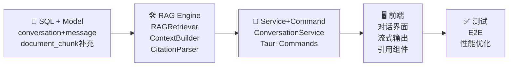

---

## 附录：关键代码索引

| 文件 | 说明 |
|------|------|
| `{schema}.conversation` | 会话表 |
| `{schema}.message` | 消息表（含引用） |
| `{schema}.document_chunk` | 向量分片表（已存在，补充字段） |
| `models.rs` | Conversation + Message + DocumentChunk struct |
| `rag_retriever.rs` | RAG 检索引擎（新建） |
| `context_builder.rs` | 上下文构建器（新建） |
| `conversation_service.rs` | 对话系统 Service（新建） |
| `citations.rs` | 引用解析器（新建） |
| `conversation_commands.rs` | Tauri Command（新建） |
| `conversationService.ts` | 前端对话 API Service（新建） |
| `ChatUI.tsx` | 对话界面组件（新建） |
| `MessageBubble.tsx` | 消息气泡组件（新建） |
| `CitationPanel.tsx` | 引用面板组件（新建） |

---

## 版本历史

| 版本 | 日期 | 变更 |
|------|------|------|
| V1.0 | 2026-07-02 | 初始版本：RAG 多轮问答系统完整设计方案 |

---

*文档结束*