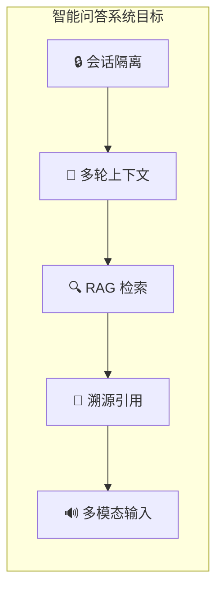
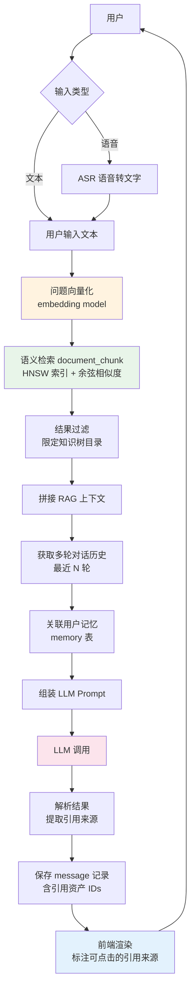
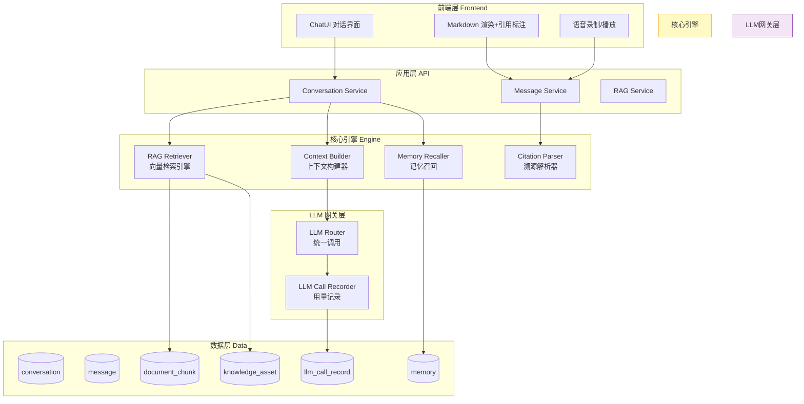
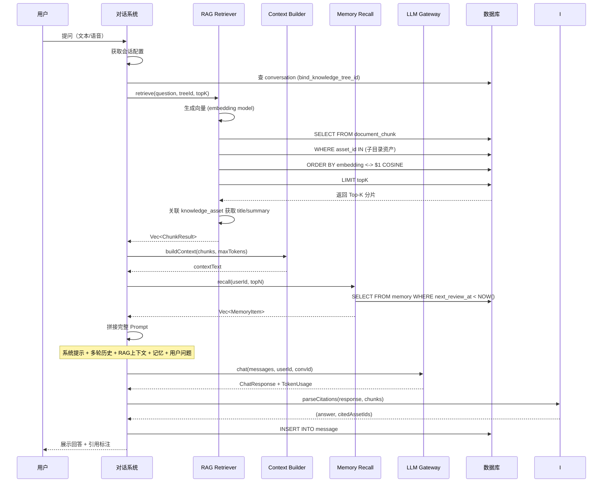
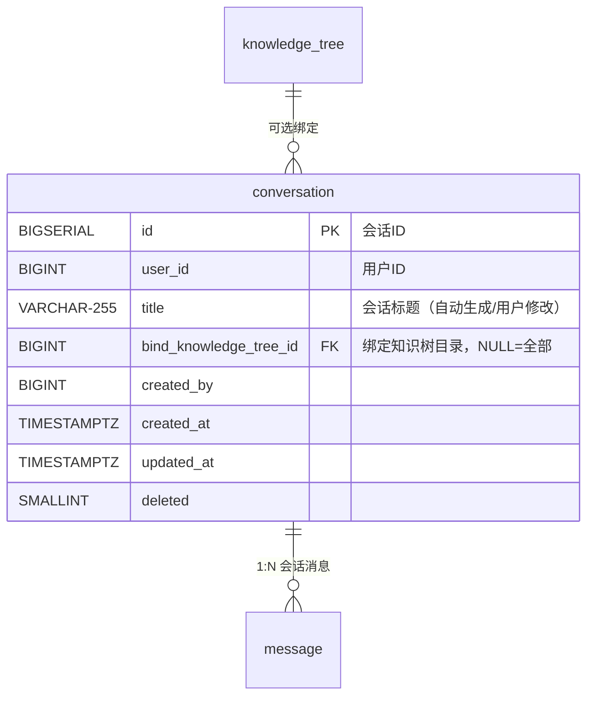
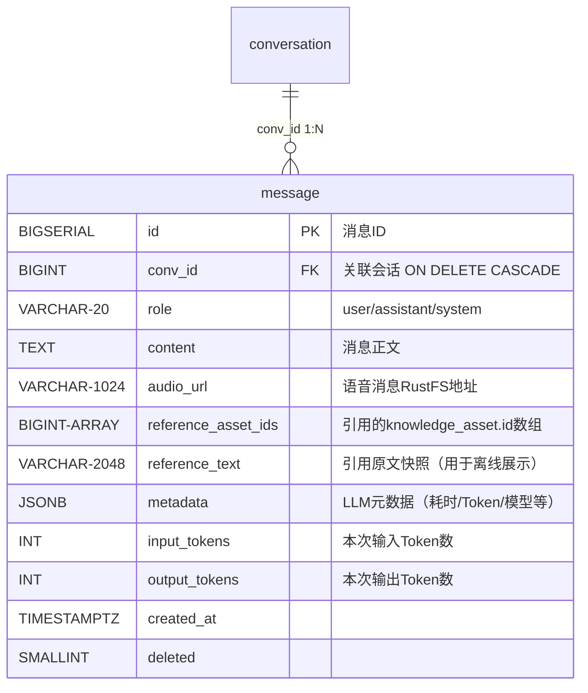
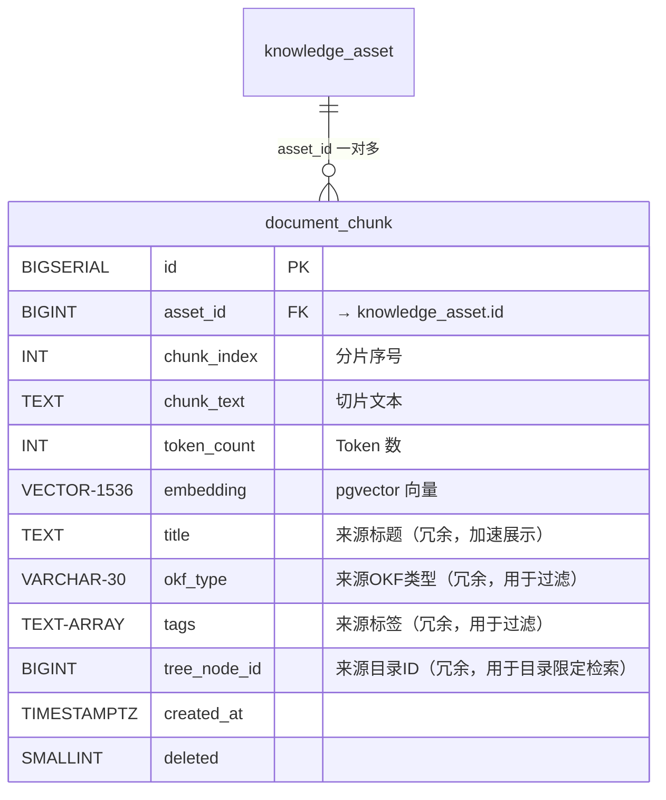
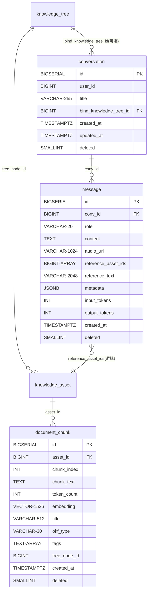
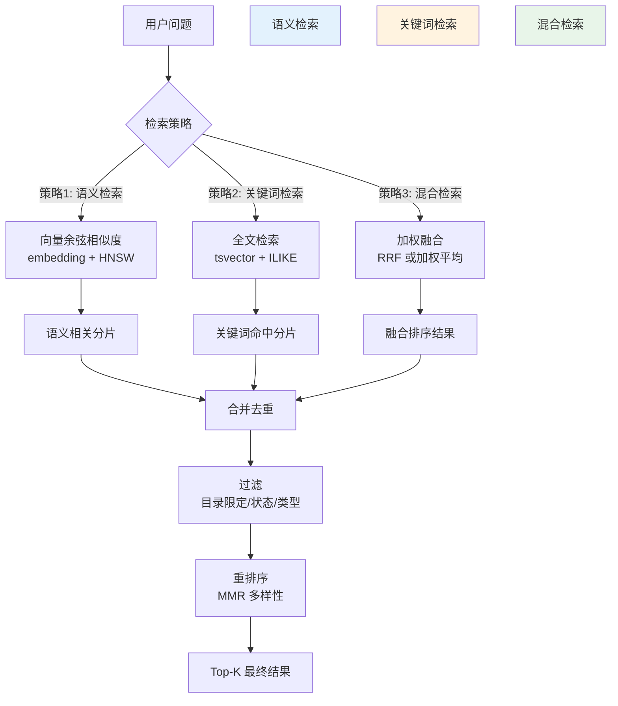
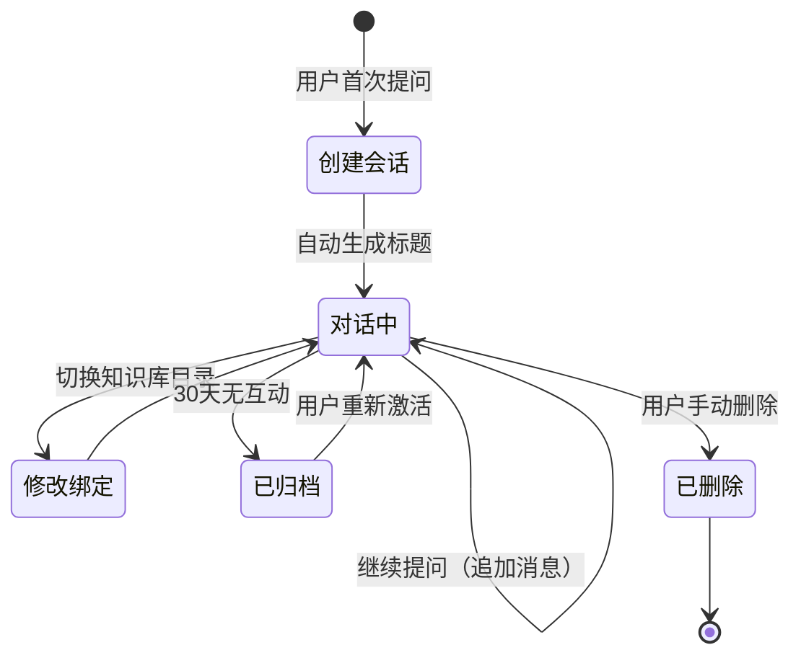

# 智能问答系统（RAG 多轮对话）设计方案

> 多轮上下文文档问答：会话隔离、RAG 向量检索、溯源引用
> 支撑数据表：conversation、message、document_chunk、knowledge_asset

---

## 目录

1. [设计目标](#1-设计目标)
2. [整体架构](#2-整体架构)
3. [数据库设计](#3-数据库设计)
4. [RAG 检索引擎](#4-rag-检索引擎)
5. [多轮对话管理](#5-多轮对话管理)
6. [溯源引用系统](#6-溯源引用系统)
7. [API 接口设计](#7-api-接口设计)
8. [前端交互设计](#8-前端交互设计)
9. [实施路线图](#9-实施路线图)
10. [附录：关于 langchain-rust 集成的评估](#10-附录关于-langchain-rust-集成的评估)

---

## 1. 设计目标

### 1.1 核心能力



| 目标 | 说明 | 优先级 |
|------|------|--------|
| 🔒 **会话隔离** | 每个会话绑定指定知识库目录，检索范围严格限定 | P0 |
| 🔄 **多轮上下文** | 持久存储每轮对话，LLM 感知完整上下文 | P0 |
| 🔍 **RAG 检索** | 用户提问 → 向量化 → 语义检索 → 拼接原文 → LLM 回答 | P0 |
| 📎 **溯源引用** | 记录回答引用的知识资产 ID，前端标注来源文档 | P1 |
| 🔊 **多模态输入** | 支持文本/语音输入，语音自动转文字后走 RAG | P2 |

### 1.2 系统流程全景



---

## 2. 整体架构

### 2.1 分层架构



### 2.2 RAG 检索核心流程



---

## 3. 数据库设计

### 3.1 统一设计规范

| 规则 | 说明 |
|------|------|
| 🔑 主键 | `BIGSERIAL` 自增主键 |
| 🗑️ 软删除 | `deleted SMALLINT DEFAULT 0` |
| ⏰ 时间 | 统一 `TIMESTAMPTZ` |
| 📎 引用 | 使用 `BIGINT[]` 数组字段存储引用的资产 ID 列表 |

### 3.2 conversation 对话会话表



```sql
CREATE TABLE IF NOT EXISTS {schema}.conversation (
    id BIGSERIAL PRIMARY KEY,
    user_id BIGINT NOT NULL,
    title VARCHAR(255),                              -- 自动生成/用户重命名
    bind_knowledge_tree_id BIGINT REFERENCES {schema}.knowledge_tree(id),
        -- NULL = 全局检索，非NULL = 限定到该目录及子目录
    created_at TIMESTAMPTZ NOT NULL DEFAULT NOW(),
    updated_at TIMESTAMPTZ NOT NULL DEFAULT NOW(),
    deleted SMALLINT NOT NULL DEFAULT 0
);

COMMENT ON TABLE {schema}.conversation IS '多轮对话会话';
COMMENT ON COLUMN {schema}.conversation.title IS '[自动] 首次提问截取前30字，[手动] 用户可重命名';
COMMENT ON COLUMN {schema}.conversation.bind_knowledge_tree_id IS '绑定知识树目录ID，NULL=全部知识库，非NULL=仅检索该目录';

CREATE INDEX idx_conv_user ON {schema}.conversation(user_id, deleted);
CREATE INDEX idx_conv_tree ON {schema}.conversation(bind_knowledge_tree_id, deleted);
CREATE INDEX idx_conv_time ON {schema}.conversation(created_at DESC);
```

### 3.3 message 会话消息表



```sql
CREATE TABLE IF NOT EXISTS {schema}.message (
    id BIGSERIAL PRIMARY KEY,
    conv_id BIGINT NOT NULL REFERENCES {schema}.conversation(id) ON DELETE CASCADE,
    role VARCHAR(20) NOT NULL,           -- user / assistant / system
    content TEXT NOT NULL,               -- 消息正文
    audio_url VARCHAR(1024),             -- 语音消息 RustFS 存储地址
    reference_asset_ids BIGINT[],        -- 引用的 knowledge_asset.id 数组
    reference_text VARCHAR(2048),        -- 引用原文快照（用于引用面板展示）
    metadata JSONB,                      -- { model, provider, temperature, duration_ms }
    input_tokens INT DEFAULT 0,          -- 输入 Token 数
    output_tokens INT DEFAULT 0,         -- 输出 Token 数
    created_at TIMESTAMPTZ NOT NULL DEFAULT NOW(),
    deleted SMALLINT NOT NULL DEFAULT 0
);

COMMENT ON TABLE {schema}.message IS '会话消息记录';
COMMENT ON COLUMN {schema}.message.role IS '消息角色：user=用户 assistant=AI system=系统提示词';
COMMENT ON COLUMN {schema}.message.reference_asset_ids IS '本次回答引用的 knowledge_asset.id 数组，前端可点击跳转';
COMMENT ON COLUMN {schema}.message.reference_text IS '引用原文快照，返回相关文档片段的原文';
COMMENT ON COLUMN {schema}.message.input_tokens IS '本次请求消耗的输入Token数';
COMMENT ON COLUMN {schema}.message.output_tokens IS '本次回复消耗的输出Token数';

CREATE INDEX idx_msg_conv ON {schema}.message(conv_id, deleted);
CREATE INDEX idx_msg_conv_time ON {schema}.message(conv_id, created_at ASC);
```

### 3.4 document_chunk 向量分片检索表（补充 RAG 字段）

在原有 `document_chunk` 基础上增加 RAG 需要的字段：



```sql
CREATE TABLE IF NOT EXISTS {schema}.document_chunk (
    id BIGSERIAL PRIMARY KEY,
    asset_id BIGINT NOT NULL REFERENCES {schema}.knowledge_asset(id) ON DELETE CASCADE,
    chunk_index INT NOT NULL,
    chunk_text TEXT NOT NULL,
    token_count INT,
    embedding vector(1536),              -- pgvector 向量
    title VARCHAR(512),                  -- 来源资产标题（冗余）
    okf_type VARCHAR(30),                -- 来源OKF类型（冗余）
    tags TEXT[],                         -- 来源标签（冗余）
    tree_node_id BIGINT,                 -- 来源目录ID（冗余，加速目录过滤）
    created_at TIMESTAMPTZ NOT NULL DEFAULT NOW(),
    deleted SMALLINT NOT NULL DEFAULT 0
);

COMMENT ON TABLE {schema}.document_chunk IS 'RAG向量分片检索表';
COMMENT ON COLUMN {schema}.document_chunk.embedding IS '1536维pgvector向量，HNSW索引加速';
COMMENT ON COLUMN {schema}.document_chunk.title IS '来源资产标题（冗余，避免每次关联查询）';
COMMENT ON COLUMN {schema}.document_chunk.tree_node_id IS '来源目录ID（冗余，用于限定目录检索）';

CREATE INDEX idx_chunk_asset ON {schema}.document_chunk(asset_id, deleted);
CREATE INDEX idx_chunk_tree ON {schema}.document_chunk(tree_node_id, deleted);
CREATE INDEX idx_chunk_embedding ON {schema}.document_chunk USING hnsw (embedding vector_cosine_ops);
```

### 3.5 表关联总览



---

## 4. RAG 检索引擎

### 4.1 检索策略



### 4.2 语义检索 SQL

```sql
-- 基础语义检索（限定目录）
SELECT 
    dc.id,
    dc.chunk_text,
    dc.chunk_index,
    dc.title,
    dc.okf_type,
    dc.token_count,
    dc.asset_id,
    -- 余弦距离 （越小越相似）
    1 - (dc.embedding <=> $1::vector) AS similarity
FROM {schema}.document_chunk dc
WHERE dc.deleted = 0
  -- 限定目录检索（bind_knowledge_tree_id）
  AND ($2 IS NULL OR dc.tree_node_id IN (
      WITH RECURSIVE sub_tree AS (
          SELECT id FROM {schema}.knowledge_tree WHERE id = $2 AND deleted = 0
          UNION ALL
          SELECT kt.id FROM {schema}.knowledge_tree kt
          JOIN sub_tree st ON kt.parent_id = st.id
          WHERE kt.deleted = 0
      )
      SELECT id FROM sub_tree
  ))
  -- 可选：按 OKF 类型过滤
  AND ($3 IS NULL OR dc.okf_type = $3)
ORDER BY dc.embedding <=> $1::vector  -- 余弦距离升序
LIMIT $4;  -- Top-K
```

### 4.3 当前 RAG 检索器实现（`rag_service.rs`）

当前实现使用 SQL 查询替代了向量检索（未启用 pgvector 时），直接按 `ORDER BY dc.id` 返回最新分片：

```rust
pub struct RAGRetriever;

impl RAGRetriever {
    pub async fn retrieve(params: &RetrieveParams) -> Result<Vec<ChunkResult>, String> {
        let pool = database::get_read_pool()?;
        let prefix = database::schema_prefix();
        
        let sql = format!(r#"
            SELECT dc.id, dc.chunk_text, dc.chunk_index,
                   COALESCE(dc.title, '') AS title,
                   COALESCE(dc.okf_type, '') AS okf_type,
                   dc.asset_id, dc.token_count, 0.0 AS similarity
            FROM {}document_chunk dc
            WHERE dc.deleted = 0
                -- 限定目录（递归子目录）
                AND ($1::BIGINT IS NULL OR dc.tree_node_id IN (WITH RECURSIVE ...))
                AND ($2::VARCHAR IS NULL OR dc.okf_type = $2)
            ORDER BY dc.id
            LIMIT $3"#, prefix, prefix, prefix);
        
        // 执行查询返回 ChunkResult
    }
}
```

---

## 5. 多轮对话管理

### 5.1 会话生命周期



### 5.2 当前会话服务实现（`conversation_service.rs`）

```rust
pub struct ConversationService;

impl ConversationService {
    /// 创建新会话并回答
    pub async fn create_conversation_and_answer(
        user_id: i64,
        question: &str,
        bind_tree_node_id: Option<i64>,
        router: &LLMRouter,
    ) -> Result<ConversationResponse, String> {
        // 1. 创建会话
        let conv = Self::insert_conversation(user_id, &title, bind_tree_node_id).await?;
        // 2. 保存用户消息
        Self::insert_message(conv.id, "user", question, ...).await?;
        // 3. RAG 检索 + LLM 生成
        let (answer, cited_ids) = Self::retrieve_and_answer(question, bind_tree_node_id, router).await?;
        // 4. 保存 AI 消息并返回
        Self::insert_message(conv.id, "assistant", &answer, ...).await?;
        Ok(ConversationResponse { conv_id, answer, cited_assets, usage })
    }
    
    /// 核心：RAG 检索 + LLM 调用（带降级）
    async fn retrieve_and_answer(question, bind_tree_node_id, router) -> Result<(String, Vec<i64>), String> {
        // 1. RAG 检索
        let chunks = RAGRetriever::retrieve(&params).await?;
        // 2. 刷新 Provider 列表
        let _ = router.refresh_providers().await;
        // 3. 构建 Prompt 并调用 LLM
        let (system_prompt, user_msg) = Self::build_rag_prompt(question, &chunks);
        let answer = match Self::generate_answer_with_llm(router, &system_prompt, &user_msg).await {
            Ok(content) => content,
            Err(e) => {
                // 降级：直接拼接 RAG 结果
                Self::build_rag_answer(question, &chunks)
            }
        };
        Ok((answer, cited_ids))
    }
}
```

### 5.3 标题自动生成

```rust
fn generate_title(question: &str) -> String {
    let trimmed = question.trim();
    let max_len = 30;
    if trimmed.chars().count() <= max_len {
        trimmed.to_string()
    } else {
        let title: String = trimmed.chars().take(max_len).collect();
        format!("{}...", title)
    }
}
```

---

## 6. 溯源引用系统

### 6.1 引用标注机制

LLM 回答后，prompt 要求模型标注 `[来源 N]` 标记，后端正则提取引用的资产 ID 保存到 `reference_asset_ids` 字段。

```rust
fn build_rag_prompt(question: &str, chunks: &[ChunkResult]) -> (String, String) {
    // 构建 system prompt 包含 RAG 上下文
    // 要求 LLM 标注来源编号，如「根据来源1」
}

// 引用资产信息查询
async fn get_cited_asset_info(asset_ids: &[i64]) -> Result<Vec<AssetInfo>, String> {
    // 从 knowledge_asset 表查询 title/okf_type
}
```

### 6.2 引用数据结构

```typescript
interface AssetInfo {
    id: string;       // 资产 ID
    title: string;    // 资产标题
    okfType: string;  // OKF 类型
}
```

---

## 7. API 接口设计

### 7.1 Tauri Command 列表

| Command | 方法 | 说明 |
|---------|------|------|
| `create_conversation` | POST | 创建新会话并发送第一条消息 |
| `send_message` | POST | 继续已有会话 |
| `get_conversations` | GET | 获取会话列表 |
| `get_conversation_messages` | GET | 获取会话消息历史 |
| `update_conversation_title` | PUT | 更新会话标题 |
| `delete_conversation` | DELETE | 删除会话 |

### 7.2 请求/响应示例

```json
// create_conversation 请求
{
    "userId": "12345",
    "question": "什么是固定资产折旧？",
    "bindTreeNodeId": null
}

// create_conversation 响应
{
    "convId": "67890",
    "answer": "根据知识库中相关资料...\n...",
    "citedAssets": [
        { "id": "1001", "title": "固定资产折旧方法", "okfType": "concept" }
    ],
    "usage": {
        "inputTokens": 45,
        "outputTokens": 128,
        "totalTokens": 173,
        "cost": 0.0
    }
}
```

---

## 8. 前端交互设计

### 8.1 对话界面布局

```
┌─────────────────────────────────────────────┐
│  🤖 智能问答                                │
├──────────────┬──────────────────────────────┤
│  📋 会话列表  │                              │
│   [+ 新对话]  │    根据《固定资产折旧方法》    │
│              │    直线法是最常用的折旧方...    │
│  📝 什么是... │                              │
│  📝 如何计算  │    📎 [固定资产折旧方法]       │
│              │                              │
│              │  ┌─────────────────────────┐  │
│              │  │ 输入问题...      [发送] │  │
│              │  └─────────────────────────┘  │
└──────────────┴──────────────────────────────┘
```

### 8.2 状态管理

| 状态 | 说明 | 处理 |
|------|------|------|
| `loading` | 加载会话列表 | List 区域显示 Loader |
| `sending` | 发送消息等待 LLM 响应 | 输入框禁用，显示"思考中..." |
| `error` | 通用错误 | Alert 组件展示错误信息 |

---

## 9. 实施路线图

### 9.1 分期计划

| 阶段 | 内容 | 优先级 | 状态 |
|------|------|--------|------|
| 🏗️ P0 | 会话 CRUD + RAG 检索 + LLM 调用 + 基础 UI | P0 | ✅ 已完成 |
| 🚀 P1 | 溯源引用解析与前端标注 | P1 | ⏳ 待实施 |
| 🔧 P2 | 多轮上下文感知 + 用户记忆 | P2 | ⏳ 待实施 |
| 🎙️ P3 | 语音输入/输出 + 流式 SSE | P3 | ⏳ 待实施 |
| 🤖 P4 | langchain-rust 集成评估（如有需要） | P4 | 📋 已评估 |

---

## 10. 附录：关于 langchain-rust 集成的评估

### 10.1 当前状态

`Cargo.toml` 中已声明了 `langchain-rust = "4.6.0"` 和 `langgraph = "0.2.3"` 依赖，但**当前没有任何代码使用这些库**。

### 10.2 当前 LLM 调用实现（自研）

智能问答系统的 LLM 调用链路是自研实现，核心在 `llm_gateway_service.rs` 中：

| 组件 | 说明 |
|------|------|
| `LLMProviderAdapter` trait | 厂商适配器接口，定义 chat/embedding/health_check 等方法 |
| `OpenAIAdapter` | 兼容 OpenAI API 格式（OpenAI/Qwen/DeepSeek/Volcengine/Tencent/Ollama） |
| `ClaudeAdapter` | Anthropic Claude API 适配器 |
| `LoadBalancer` | 负载均衡器：权重随机选择 + 故障计数器 |
| `LLMRouter` | 路由网关：多 Provider 自动故障转移（逐个尝试直到成功）+ 熔断器 |
| `create_adapter_with_model()` | 工厂方法，从 `llm_model` 表加载默认模型名 |

### 10.3 是否值得迁移到 langchain-rust

| 对比维度 | 自研实现 | langchain-rust |
|----------|----------|----------------|
| 多厂商支持 | ✅ 已支持 7+ 厂商 | ✅ 内置支持，但部分国内厂商需自定义 |
| 故障转移 | ✅ 已实现（逐个尝试 + 熔断器） | ❌ 需自行实现 |
| Prompt 模板管理 | ✅ 字符串拼接 | ✅ `PromptTemplate` + FewShot |
| 链式调用 | ❌ 手动编排 | ✅ Chain 抽象（LLMChain, SequentialChain） |
| RAG 集成 | ✅ 自研 RAGRetriever | 可通过 document_loaders 整合 |
| Agent/工具调用 | ❌ 未实现 | ✅ Agent + Tool 抽象 |
| 代码体积 | ✅ 轻量，仅 reqwest | 依赖较多，编译时间增加 |
| 维护成本 | 自行维护厂商兼容性 | 社区维护（但 Rust 生态较小） |

### 10.4 建议

**当前阶段不建议迁移到 langchain-rust。**

**原因：** 自研实现已满足 P0/P1 需求，增加 langchain-rust 会引入额外依赖和编译时间。

**未来可考虑的场景：**
- 需要 Agent/Function Calling 能力
- 需要 Prompt 版本管理和 A/B 测试
- 需要 MapReduce/Refine 等复杂链式处理

### 10.5 本次修复记录

| 日期 | 修复内容 | 涉及文件 |
|------|----------|----------|
| 2026-07-21 | 修复"新对话"按钮无响应 | `apps/web/src/app/chat/page.tsx` |
| 2026-07-21 | 注册 `LLMRouter` 到 Tauri 全局状态 | `apps/backend/src-tauri/src/lib.rs` |
| 2026-07-21 | 传递 `LLMRouter` 到 conversation_commands | `commands/conversation_commands.rs` |
| 2026-07-21 | ConversationService 集成 LLM 调用 + RAG Prompt | `service/conversation_service.rs` |
| 2026-07-21 | 每次对话刷新 Provider 列表 | `service/conversation_service.rs` |
| 2026-07-21 | 跳过失败的 create_adapter 而非终止全部 | `service/llm_gateway_service.rs` |
| 2026-07-21 | 支持 volcengine/deepseek/tencent 厂商 | `service/llm_gateway_service.rs` |
| 2026-07-21 | 从 llm_model 表加载默认模型名 | `service/llm_gateway_service.rs` |
| 2026-07-21 | DeepSeek 默认模型 + Base URL | `service/llm_gateway_service.rs` |
| 2026-07-21 | 多 Provider 自动故障转移（逐个尝试） | `service/llm_gateway_service.rs` |

---

*文档结束*