# 知识库模块架构梳理与重新设计方案

> 基于现有代码库（Git commit abdfd18）的全面评估与重构设计
> 适用技术栈：Tauri 2 + Next.js 16 + PostgreSQL 16 + pgvector + RustFS S3

---

## 目录

1. [现状评估](#1-现状评估)
2. [架构问题诊断](#2-架构问题诊断)
3. [重新设计方案](#3-重新设计方案)
4. [数据表完整定义](#4-数据表完整定义)
5. [核心业务数据流](#5-核心业务数据流)
6. [实施路线图](#6-实施路线图)
7. [附录：代码差异清单](#7-附录代码差异清单)

---

## 1. 现状评估

### 1.1 设计文档 vs 代码实现差异矩阵

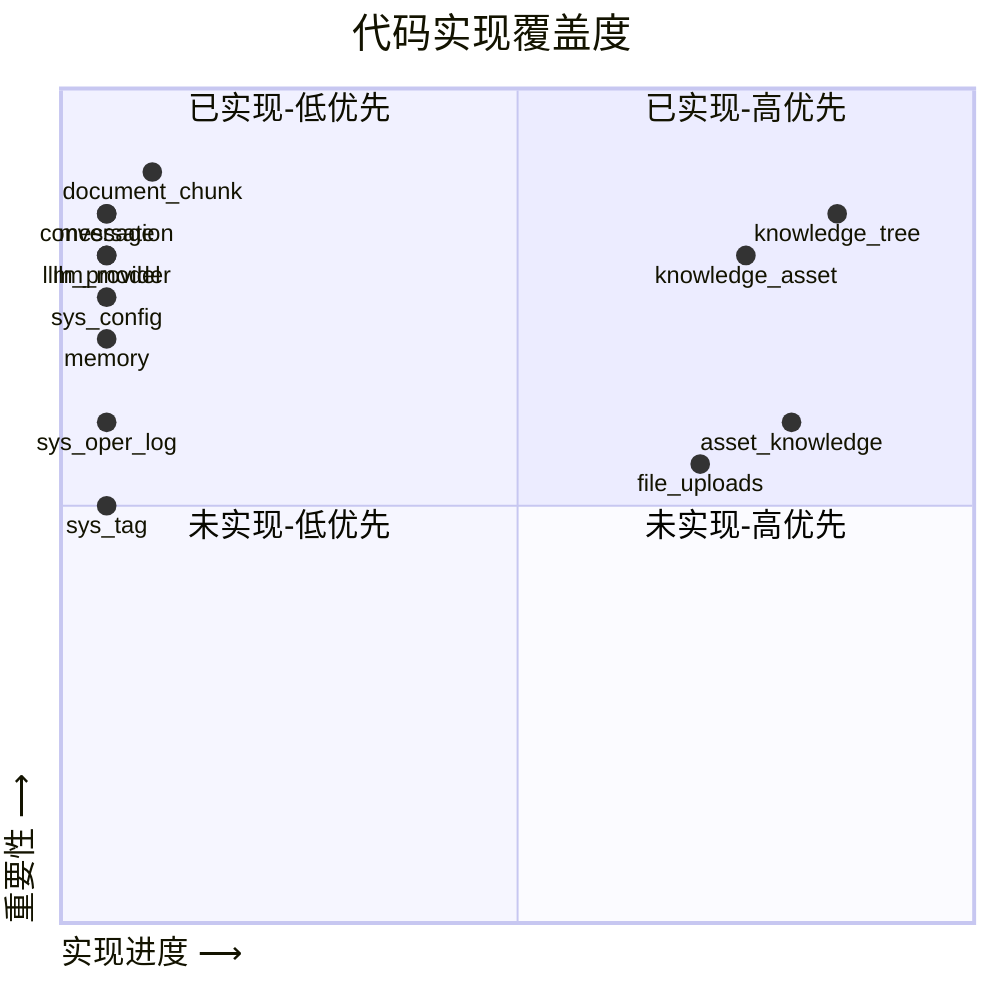

| # | 表名 | 设计文档 | tenant_tables.sql | Rust Model | Rust Service | Rust Command | 前端页面 |
|---|------|---------|-------------------|------------|-------------|-------------|---------|
| **📚 知识库核心** | | | | | | |
| 1 | `knowledge_tree` | ✅ 3.1节 | ✅ 第371行 | ✅ | ✅ | ✅ | ✅ /knowledge-asset |
| 2 | `knowledge_asset` | ✅ 3.2节 | ✅ 第588行 | ✅ | ✅ | ✅ | ✅ /knowledge-asset |
| 3 | `document_chunk` | ✅ 3.3节 | ❌ 缺失 | ❌ | ❌ | ❌ | ❌ |
| 4 | `skill_execution` | ✅ 3.4节 | ❌ 缺失 | ❌ | ❌ | ❌ | ❌ |
| **🤖 AI交互** | | | | | | |
| 5 | `conversation` | ✅ 3.5节 | ❌ 缺失 | ❌ | ❌ | ❌ | ❌ |
| 6 | `message` | ✅ 3.6节 | ❌ 缺失 | ❌ | ❌ | ❌ | ❌ |
| 7 | `memory` | ✅ 3.7节 | ❌ 缺失 | ❌ | ❌ | ❌ | ❌ |
| **👤 用户体系** | | | | | | |
| 8 | `sys_user` | ✅ 4.1.1节 | ❌ (public) | ✅ | ✅ | ✅ | ✅ |
| 9 | `sys_user_profile` | ✅ 4.1.2节 | ❌ 缺失 | ❌ | ❌ | ❌ | ❌ |
| **🧠 LLM模型管理** | | | | | | |
| 10 | `llm_provider` | ✅ 4.2.1节 | ❌ 缺失 | ❌ | ❌ | ❌ | ❌ |
| 11 | `llm_model` | ✅ 4.2.2节 | ❌ 缺失 | ❌ | ❌ | ❌ | ❌ |
| 12 | `user_llm_setting` | ✅ 4.2.3节 | ❌ 缺失 | ❌ | ❌ | ❌ | ❌ |
| 13 | `llm_call_record` | ✅ 4.2.4节 | ❌ 缺失 | ❌ | ❌ | ❌ | ❌ |
| **⚙️ 系统配置** | | | | | | |
| 14 | `sys_system_config` | ✅ 4.3.1节 | ❌ 缺失 | ❌ | ❌ | ❌ | ❌ |
| 15 | `sys_file_type_parse` | ✅ 4.3.2节 | ❌ 缺失 | ❌ | ❌ | ❌ | ❌ |
| 16 | `sys_scheduled_task` | ✅ 4.3.3节 | ❌ 缺失 | ❌ | ❌ | ❌ | ❌ |
| **📤 文件上传** | | | | | | |
| 17 | `sys_upload_task` | ✅ 4.4节 | ⚠️ file_uploads | ❌ | ❌ | ❌ | ❌ |
| **📋 日志** | | | | | | |
| 18 | `sys_oper_log` | ✅ 4.5.1节 | ❌ 缺失 | ❌ | ❌ | ❌ | ❌ |
| 19 | `sys_error_log` | ✅ 4.5.2节 | ❌ 缺失 | ❌ | ❌ | ❌ | ❌ |
| **🏷️ 标签** | | | | | | |
| 20 | `sys_tag` | ✅ 4.6节 | ❌ 缺失 | ❌ | ❌ | ❌ | ❌ |

> **结论：设计文档含 20 张表，代码仅实现 4 张（knowledge_tree, knowledge_asset, asset_knowledge old, file_uploads），剩余 16 张未落地。**

### 1.2 已实现代码评估

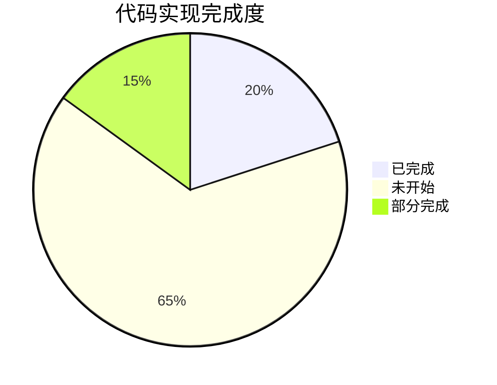

#### ✅ 知识树 (knowledge_tree)

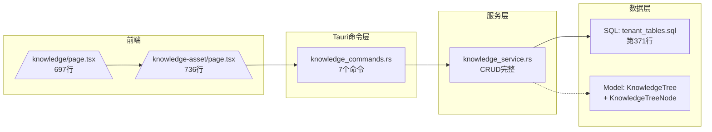

- SQL 表结构：第371行，字段完整
- Rust Model：`KnowledgeTree` + `KnowledgeTreeNode`（树形结构）
- Service：CRUD 完整（含级联删除、移动节点）
- Command：7个命令（get/insert/update/delete/move）
- 前端：`/knowledge` 和 `/knowledge-asset` 都有树形组件
- ⚠️ **问题**：`node_type` 注释未更新（写的是 `folder/document/link`，实际已支持 folder/document/link/raw_file/wiki_node/skill）

#### ✅ OKF 知识资产 (knowledge_asset)

```mermaid
flowchart LR
    subgraph 数据层
        A[SQL: tenant_tables.sql\n第588行\nGENERATED ALWAYS AS IDENTITY]
        B[Model: KnowledgeAsset\n808-842行]
    end
    subgraph 服务层
        C[knowledge_asset_service.rs\n6个方法]
    end
    subgraph 命令层
        D[knowledge_asset_commands.rs\n6个命令]
    end
    subgraph 前端
        E[knowledgeAssetService.ts\n8个API]
        F[MarkdownEditor组件\n5个文件]
        G[/knowledge-asset/page.tsx\n树+编辑器+上传]
    end
    A --> B --> C --> D
    D --> E --> G
    F --> G
```

- SQL：第588行，使用 `GENERATED ALWAYS AS IDENTITY`
- Rust Model：`KnowledgeAsset`（808-842行，字段完整）
- Service：`knowledge_asset_service.rs`，CRUD + attach_file
- Command：6个命令
- 前端：`/knowledge-asset` 完整页面（树+编辑器+文件上传）
- 前端 Service：`knowledgeAssetService.ts`（8个API方法）
- ⚠️ **问题**：字段 `content_html`、`confidence` 等未在前端利用

#### ⚠️ 前端重复问题

```mermaid
graph TD
    subgraph 重复区域 ~85%
        A[/knowledge/page.tsx\n697行\] 
        B[/knowledge-asset/page.tsx\n736行\]
    end
    A --> C[左侧：知识树组件]
    A --> D[右侧：Markdown编辑器]
    B --> C
    B --> D
    C --> E[getKnowledgeTree]
    D --> F[getKnowledgeAssetByTreeNode]
    D --> G[createKnowledgeAsset]
    style A fill:#ff6,stroke:#333
    style B fill:#ff6,stroke:#333
```

---

## 2. 架构问题诊断

### 2.1 问题一：定位模糊

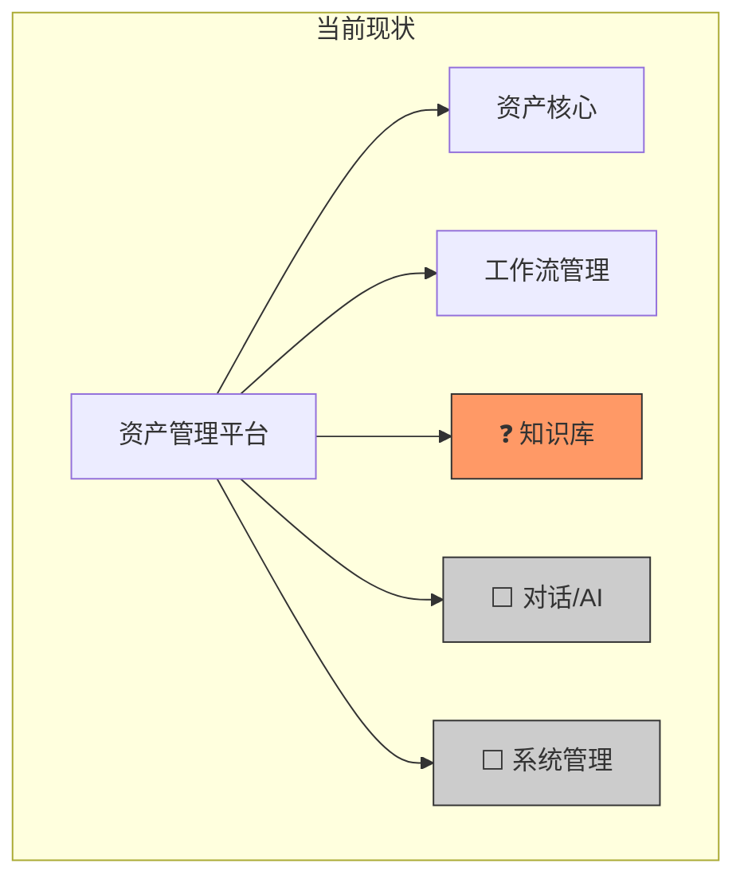

知识库究竟是**资产的附属知识**，还是**独立的知识管理体系**？

**建议**：知识库作为**独立的知识管理子系统**，但通过 `tree_node_id` 桥接可与资产关联。

### 2.2 问题二：层次混乱

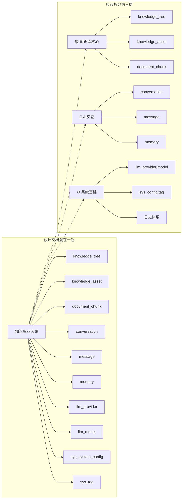

### 2.3 问题三：设计文档与代码不一致

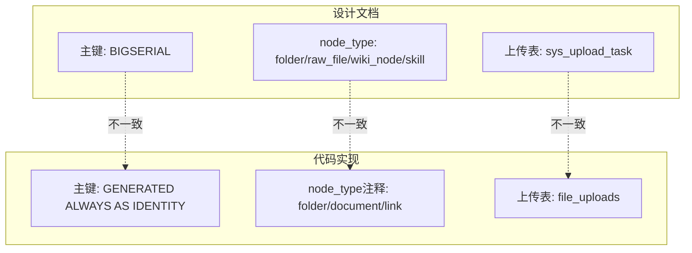

### 2.4 问题四：关键能力缺失

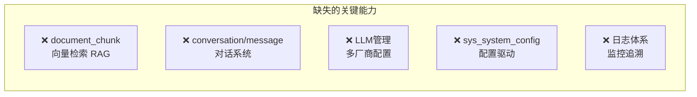

---

## 3. 重新设计方案

### 3.1 总体架构

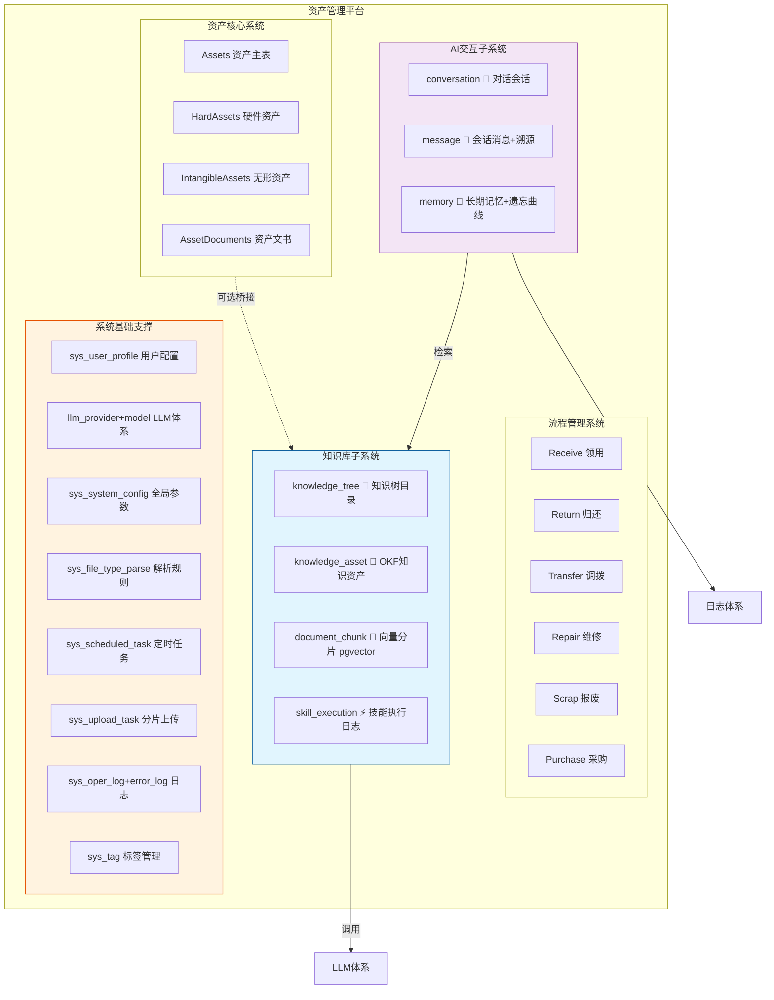

### 3.2 子系统职责定义

#### 📚 子系统一：知识库核心

**职责**：知识内容的创建、存储、组织、检索

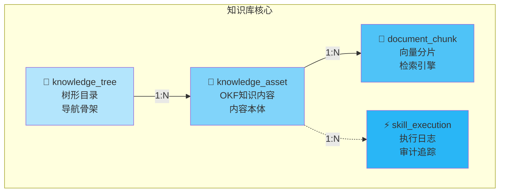

| 表 | 职责 | 定位 |
|----|------|------|
| `knowledge_tree` | 树形目录结构，组织知识分类 | 🗂️ 导航骨架 |
| `knowledge_asset` | OKF知识内容主体，含文件、Markdown、元数据 | 📄 内容本体 |
| `document_chunk` | 文档切片 + pgvector 向量，支撑 RAG 语义检索 | 🔬 检索引擎 |
| `skill_execution` | Skill规则/流程的执行日志，用于审计和重试 | ⚡ 执行审计 |

**关键特性**：
- OKF七层知识分类：`raw_source` → `concept` → `fact` → `rule` → `param` → `process` → `case`
- 文件存储通过 RustFS S3 对象存储
- 向量检索默认 1536 维，HNSW 余弦相似度索引加速

#### 🤖 子系统二：AI交互

**职责**：多轮对话、上下文管理、用户记忆

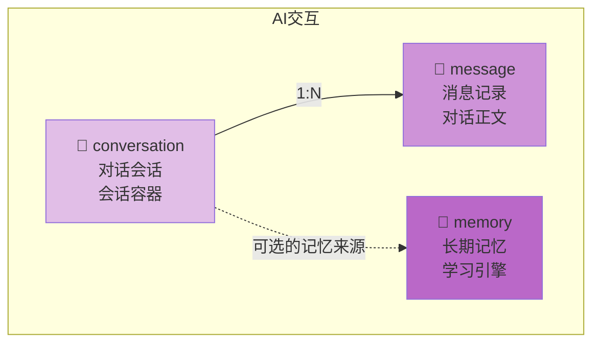

| 表 | 职责 | 定位 |
|----|------|------|
| `conversation` | 对话会话，绑定知识目录，隔离上下文 | 💬 会话容器 |
| `message` | 消息记录，含引用溯源 + 语音文件 + LLM元数据 | 📝 对话正文 |
| `memory` | 用户长期记忆，遗忘曲线间隔重复复习 | 🧠 学习引擎 |

**关键特性**：
- 会话可绑定指定知识树目录，限定 RAG 检索范围
- 消息记录引用知识资产 ID，支持溯源展示
- 遗忘曲线通过 `next_review_at` 控制复习调度

#### ⚙️ 子系统三：系统基础支撑

**职责**：全局配置、模型管理、日志监控

| 模块 | 表 | 图标 | 职责 |
|------|----|------|------|
| 用户个性化 | `sys_user_profile` | 👤 | 主题/语言/编辑器偏好 |
| LLM多厂商 | `llm_provider` | 🏭 | 厂商密钥 + 地址配置 |
| 模型管理 | `llm_model` | 🧠 | 模型明细(chat/embedding/asr/tts) |
| 用户偏好 | `user_llm_setting` | ⚙️ | 默认对话/向量模型 |
| 调用统计 | `llm_call_record` | 📊 | Token消耗 + 费用统计 |
| 全局配置 | `sys_system_config` | 🔧 | 向量维度/文件大小等 |
| 解析规则 | `sys_file_type_parse` | 📋 | 文件 OCR/ASR 解析规则 |
| 定时任务 | `sys_scheduled_task` | ⏰ | 记忆复习/过期清理 |
| 上传任务 | `sys_upload_task` | 📤 | 分片上传进度记录 |
| 操作日志 | `sys_oper_log` | 📜 | 用户关键操作追溯 |
| 异常日志 | `sys_error_log` | 🚨 | 系统异常统一记录 |
| 公共标签 | `sys_tag` | 🏷️ | 标签统一管理 |

### 3.3 与资产系统的桥接

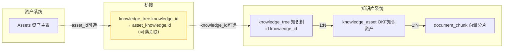

**关联方式**：`knowledge_tree.knowledge_id` 指向 `asset_knowledge.id`

---

## 4. 数据表完整定义

### 4.1 统一设计规范

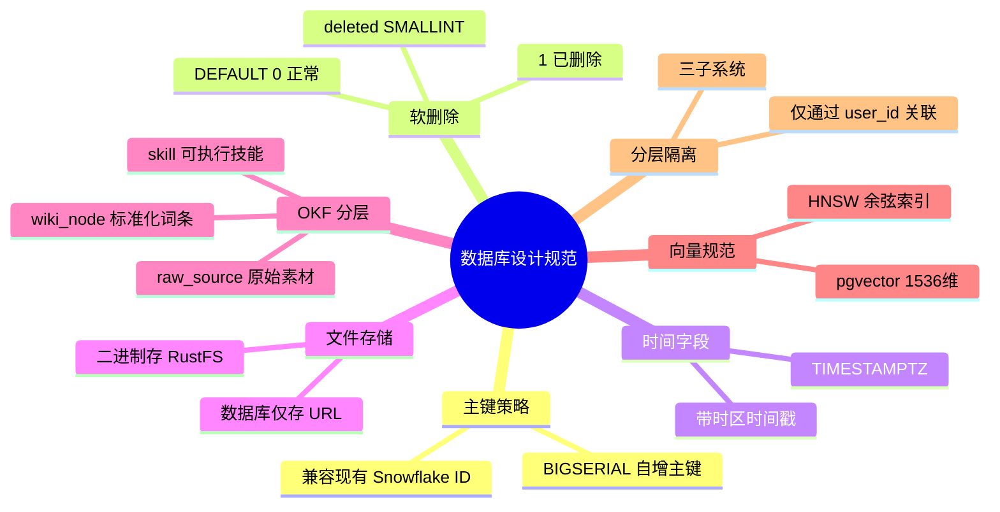

| 规则 | 说明 |
|------|------|
| 🔑 主键 | `BIGSERIAL` 自增主键（兼容现有 asset_knowledge 的 Snowflake ID） |
| 🗑️ 软删除 | `deleted SMALLINT NOT NULL DEFAULT 0`，0=正常 1=已删除 |
| ⏰ 时间字段 | 统一 `TIMESTAMPTZ` 带时区时间戳 |
| 💾 文件存储 | 二进制统一存 RustFS，数据库仅存 URL |
| 📊 OKF分层 | raw_source / wiki_node / skill 严格区分 |
| 🔬 向量规范 | pgvector 1536维，HNSW余弦相似度索引 |
| 🔒 分层隔离 | 三个子系统仅通过 user_id 关联 |

### 4.2 知识库核心表

#### 4.2.1 knowledge_tree 知识树目录表

**用途**：仅存储树形层级结构，不承载内容。

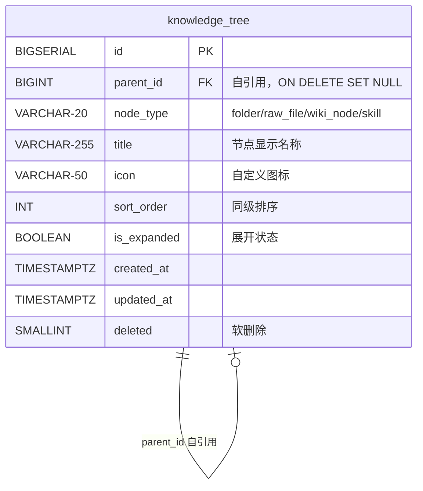

```sql
CREATE TABLE IF NOT EXISTS {schema}.knowledge_tree (
    id BIGSERIAL PRIMARY KEY,
    parent_id BIGINT REFERENCES {schema}.knowledge_tree(id) ON DELETE SET NULL,
    node_type VARCHAR(20) NOT NULL DEFAULT 'folder',
        -- folder=文件夹 raw_file=原始文件 wiki_node=OKF词条 skill=技能
    title VARCHAR(255) NOT NULL,
    icon VARCHAR(50),
    sort_order INT NOT NULL DEFAULT 0,
    is_expanded BOOLEAN NOT NULL DEFAULT true,
    created_at TIMESTAMPTZ NOT NULL DEFAULT NOW(),
    updated_at TIMESTAMPTZ NOT NULL DEFAULT NOW(),
    deleted SMALLINT NOT NULL DEFAULT 0
);

COMMENT ON COLUMN {schema}.knowledge_tree.node_type 
    IS 'folder=文件夹 raw_file=原始素材 wiki_node=标准化词条 skill=可执行技能节点';

CREATE INDEX idx_knowledge_tree_parent ON {schema}.knowledge_tree(parent_id, deleted);
```

**变更说明**：
- 去除 `knowledge_id` 字段（旧表用于关联 `asset_knowledge`，新方案通过 `knowledge_asset.tree_node_id` 反向关联）
- `node_type` 明确定义为：`folder` / `raw_file` / `wiki_node` / `skill`

#### 4.2.2 knowledge_asset OKF知识资产表

**用途**：知识库核心主表，承载 OKF 标准化知识内容。

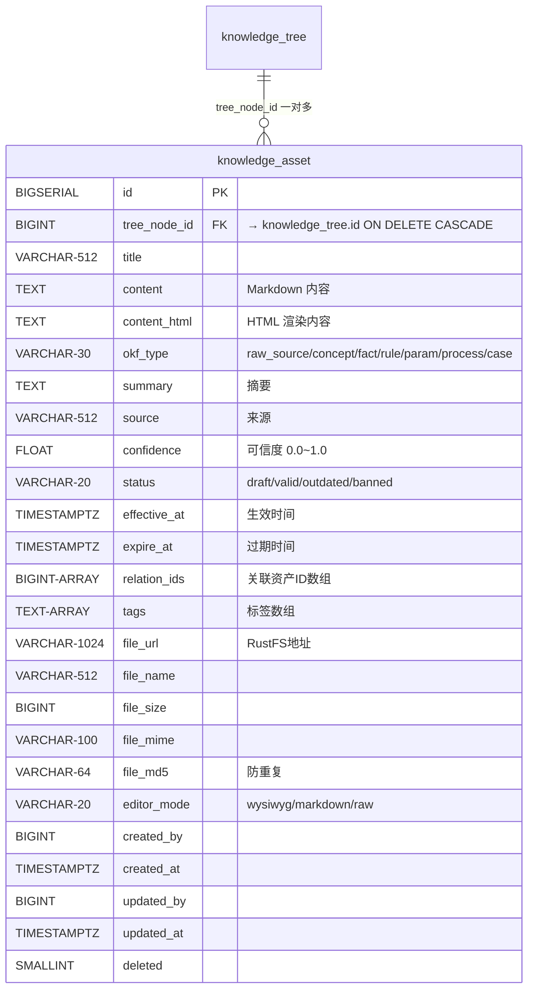

```sql
CREATE TABLE IF NOT EXISTS {schema}.knowledge_asset (
    id BIGSERIAL PRIMARY KEY,
    tree_node_id BIGINT NOT NULL REFERENCES {schema}.knowledge_tree(id) ON DELETE CASCADE,

    -- 基本内容
    title VARCHAR(512) NOT NULL,
    content TEXT,
    content_html TEXT,

    -- OKF 七层分类
    okf_type VARCHAR(30) NOT NULL DEFAULT 'raw_source',
        -- raw_source / concept / fact / rule / param / process / case
    summary TEXT,
    source VARCHAR(512),
    confidence FLOAT NOT NULL DEFAULT 1.0,   -- 可信度 0.0~1.0
    status VARCHAR(20) NOT NULL DEFAULT 'draft',
        -- draft / valid / outdated / banned

    -- 时效管理
    effective_at TIMESTAMPTZ,
    expire_at TIMESTAMPTZ,

    -- 关联与标签
    relation_ids BIGINT[],  -- 关联的其他 knowledge_asset.id 数组
    tags TEXT[],

    -- 文件字段
    file_url VARCHAR(1024),    -- RustFS 对象存储地址
    file_name VARCHAR(512),
    file_size BIGINT,
    file_mime VARCHAR(100),
    file_md5 VARCHAR(64),      -- 防重复上传

    -- 编辑器模式
    editor_mode VARCHAR(20) NOT NULL DEFAULT 'wysiwyg',
        -- wysiwyg / markdown / raw

    -- 基础字段
    created_by BIGINT,
    created_at TIMESTAMPTZ NOT NULL DEFAULT NOW(),
    updated_by BIGINT,
    updated_at TIMESTAMPTZ NOT NULL DEFAULT NOW(),
    deleted SMALLINT NOT NULL DEFAULT 0
);

COMMENT ON TABLE {schema}.knowledge_asset 
    IS 'OKF标准化知识资产：原始素材、标准化词条、可执行技能统一存储';

CREATE INDEX idx_asset_tree_node ON {schema}.knowledge_asset(tree_node_id, deleted);
CREATE INDEX idx_asset_okf_type ON {schema}.knowledge_asset(okf_type, status, deleted);
CREATE INDEX idx_asset_tags ON {schema}.knowledge_asset USING GIN(tags);
```

#### 4.2.3 document_chunk 向量分片检索表

**用途**：RAG 检索核心，存储文档切片与 pgvector 向量。

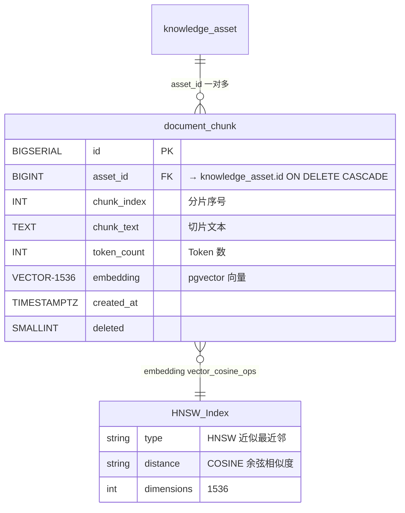

```sql
CREATE TABLE IF NOT EXISTS {schema}.document_chunk (
    id BIGSERIAL PRIMARY KEY,
    asset_id BIGINT NOT NULL REFERENCES {schema}.knowledge_asset(id) ON DELETE CASCADE,
    chunk_index INT NOT NULL,
    chunk_text TEXT NOT NULL,
    token_count INT,
    embedding vector(1536),        -- pgvector 1536维向量
    created_at TIMESTAMPTZ NOT NULL DEFAULT NOW(),
    deleted SMALLINT NOT NULL DEFAULT 0
);

COMMENT ON TABLE {schema}.document_chunk IS 'RAG向量分片检索表';
COMMENT ON COLUMN {schema}.document_chunk.embedding IS '1536维pgvector向量，HNSW索引加速';

CREATE INDEX idx_chunk_asset ON {schema}.document_chunk(asset_id, deleted);
CREATE INDEX idx_chunk_embedding ON {schema}.document_chunk USING hnsw (embedding vector_cosine_ops);
```

**说明**：
- 使用 `vector_cosine_ops` 余弦相似度操作符
- HNSW 索引适合高维向量的近似最近邻搜索
- `token_count` 记录分片 Token 数，用于 LLM 上下文窗口控制

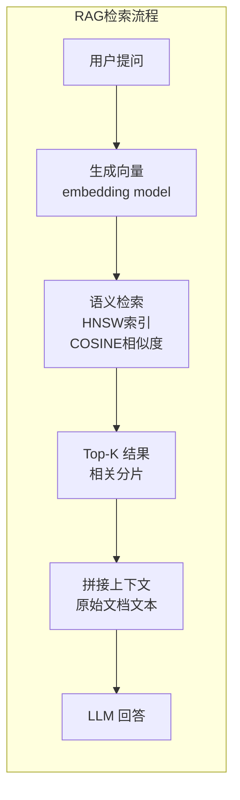

#### 4.2.4 skill_execution 技能执行日志表

**用途**：记录 rule/process/skill 类型知识的运行流水。

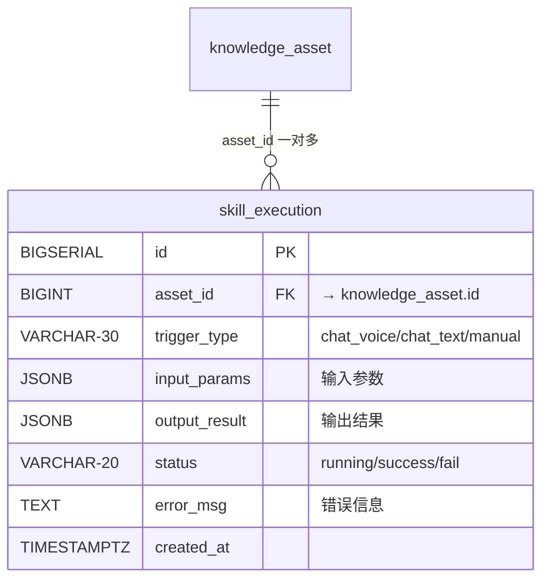

```sql
CREATE TABLE IF NOT EXISTS {schema}.skill_execution (
    id BIGSERIAL PRIMARY KEY,
    asset_id BIGINT REFERENCES {schema}.knowledge_asset(id),
    trigger_type VARCHAR(30),
        -- chat_voice / chat_text / manual
    input_params JSONB,
    output_result JSONB,
    status VARCHAR(20) NOT NULL,
        -- running / success / fail
    error_msg TEXT,
    created_at TIMESTAMPTZ NOT NULL DEFAULT NOW()
);

COMMENT ON TABLE {schema}.skill_execution IS 'Skill规则/流程执行日志';

CREATE INDEX idx_skill_asset ON {schema}.skill_execution(asset_id);
CREATE INDEX idx_skill_status ON {schema}.skill_execution(status);
```

### 4.3 AI交互子系统表

#### 4.3.1 conversation 对话会话表

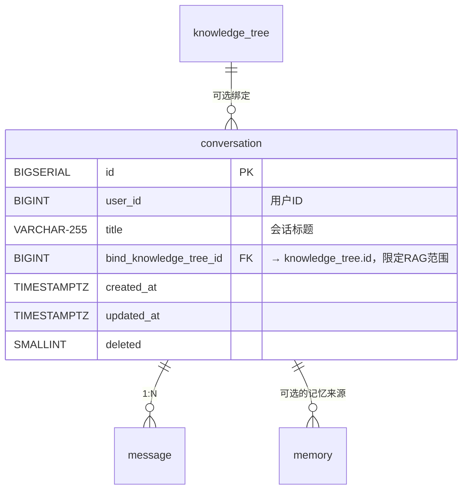

```sql
CREATE TABLE IF NOT EXISTS {schema}.conversation (
    id BIGSERIAL PRIMARY KEY,
    user_id BIGINT NOT NULL,
    title VARCHAR(255),
    bind_knowledge_tree_id BIGINT REFERENCES {schema}.knowledge_tree(id),
    created_at TIMESTAMPTZ NOT NULL DEFAULT NOW(),
    updated_at TIMESTAMPTZ NOT NULL DEFAULT NOW(),
    deleted SMALLINT NOT NULL DEFAULT 0
);

COMMENT ON COLUMN {schema}.conversation.bind_knowledge_tree_id 
    IS '绑定知识树目录，限定检索范围';

CREATE INDEX idx_conv_user ON {schema}.conversation(user_id, deleted);
CREATE INDEX idx_conv_tree ON {schema}.conversation(bind_knowledge_tree_id, deleted);
```

#### 4.3.2 message 会话消息表

```mermaid
erDiagram
    message {
        BIGSERIAL id PK
        BIGINT conv_id FK "→ conversation.id ON DELETE CASCADE"
        VARCHAR-20 role "user/assistant/system"
        TEXT content "消息内容"
        VARCHAR-1024 audio_url "语音消息RustFS地址"
        BIGINT-ARRAY reference_asset_ids "引用的知识资产ID数组"
        JSONB metadata "LLM运行元数据"
        TIMESTAMPTZ created_at
        SMALLINT deleted
    }
    conversation ||--o{ message : "conv_id 1:N"
```

```sql
CREATE TABLE IF NOT EXISTS {schema}.message (
    id BIGSERIAL PRIMARY KEY,
    conv_id BIGINT NOT NULL REFERENCES {schema}.conversation(id) ON DELETE CASCADE,
    role VARCHAR(20) NOT NULL,
        -- user / assistant / system
    content TEXT,
    audio_url VARCHAR(1024),       -- 语音消息 RustFS 地址
    reference_asset_ids BIGINT[],   -- 引用的知识资产ID数组
    metadata JSONB,                 -- LLM 运行元数据
    created_at TIMESTAMPTZ NOT NULL DEFAULT NOW(),
    deleted SMALLINT NOT NULL DEFAULT 0
);

COMMENT ON COLUMN {schema}.message.reference_asset_ids 
    IS '本次回答引用的 knowledge_asset.id 数组，支持溯源';

CREATE INDEX idx_msg_conv ON {schema}.message(conv_id, deleted);
```

#### 4.3.3 memory 用户长期记忆表

```mermaid
erDiagram
    memory {
        BIGSERIAL id PK
        BIGINT user_id "用户ID"
        TEXT content "记忆内容"
        VARCHAR-50 category "分类"
        FLOAT importance "重要性 0.0~1.0"
        BIGINT source_conv_id FK "→ conversation.id 来源"
        TIMESTAMPTZ next_review_at "下次复习时间"
        TIMESTAMPTZ created_at
        TIMESTAMPTZ updated_at
        SMALLINT deleted
    }
    conversation ||--o{ memory : "可选的记忆来源"
```

```sql
CREATE TABLE IF NOT EXISTS {schema}.memory (
    id BIGSERIAL PRIMARY KEY,
    user_id BIGINT NOT NULL,
    content TEXT NOT NULL,
    category VARCHAR(50),
    importance FLOAT DEFAULT 0.5,
    source_conv_id BIGINT REFERENCES {schema}.conversation(id),
    next_review_at TIMESTAMPTZ,     -- 遗忘曲线调度
    created_at TIMESTAMPTZ NOT NULL DEFAULT NOW(),
    updated_at TIMESTAMPTZ NOT NULL DEFAULT NOW(),
    deleted SMALLINT NOT NULL DEFAULT 0
);

COMMENT ON COLUMN {schema}.memory.next_review_at 
    IS '下次复习时间，遗忘曲线间隔重复调度';

CREATE INDEX idx_memory_user_review ON {schema}.memory(user_id, next_review_at, deleted);
```

### 4.4 系统基础支撑表

#### 4.4.1 sys_user_profile 用户个性化配置表

```sql
CREATE TABLE IF NOT EXISTS {schema}.sys_user_profile (
    id BIGSERIAL PRIMARY KEY,
    user_id BIGINT NOT NULL UNIQUE,
    theme VARCHAR(20) DEFAULT 'light',
    language VARCHAR(20) DEFAULT 'zh-CN',
    upload_max_size BIGINT DEFAULT 104857600,     -- 默认100MB
    editor_default_mode VARCHAR(20) DEFAULT 'wysiwyg',
    auto_summary BOOLEAN DEFAULT true,            -- 自动生成摘要
    auto_vectorize BOOLEAN DEFAULT true,          -- 自动向量化
    created_at TIMESTAMPTZ NOT NULL DEFAULT NOW(),
    updated_at TIMESTAMPTZ NOT NULL DEFAULT NOW()
);

COMMENT ON TABLE {schema}.sys_user_profile IS '用户个性化配置：界面、上传、编辑器偏好';
```

#### 4.4.2 llm_provider 大模型服务商配置

```sql
CREATE TABLE IF NOT EXISTS {schema}.llm_provider (
    id BIGSERIAL PRIMARY KEY,
    provider_code VARCHAR(50) NOT NULL UNIQUE,
        -- openai / claude / qwen / volcengine / tencent / ollama
    provider_name VARCHAR(100) NOT NULL,
    base_url VARCHAR(1024),
    api_key TEXT,
    secret_key TEXT,
    extra_config JSONB,
    weight INT NOT NULL DEFAULT 1,       -- 负载均衡权重
    is_local BOOLEAN NOT NULL DEFAULT false,
    enable BOOLEAN NOT NULL DEFAULT true,
    created_at TIMESTAMPTZ NOT NULL DEFAULT NOW(),
    updated_at TIMESTAMPTZ NOT NULL DEFAULT NOW(),
    deleted SMALLINT NOT NULL DEFAULT 0
);

CREATE INDEX idx_provider_code ON {schema}.llm_provider(provider_code, deleted);
```

#### 4.4.3 ~ 4.4.12 其余系统基础表

参见完整 [附录](#4-数据表完整定义)（完整 SQL 省略以保持文档简洁，可直接参考原设计文档对应章节）

### 4.5 全表关联总览

```mermaid
erDiagram
    %% 知识库核心
    knowledge_tree ||--o{ knowledge_asset : "tree_node_id"
    knowledge_asset ||--o{ document_chunk : "asset_id"
    knowledge_asset ||--o{ skill_execution : "asset_id"
    
    %% AI交互
    conversation ||--o{ message : "conv_id"
    conversation ||--o{ memory : "source_conv_id"
    
    %% 系统基础
    llm_provider ||--o{ llm_model : "provider_id"
    sys_user ||--|| sys_user_profile : "user_id"
    sys_user ||--|| user_llm_setting : "user_id"
    sys_user ||--o{ sys_upload_task : "user_id"
    sys_user ||--o{ sys_oper_log : "user_id"
    sys_user ||--o{ sys_error_log : "user_id"
    
    %% 跨系统关联
    knowledge_tree ||--o{ conversation : "bind_knowledge_tree_id(可选)"
    
    knowledge_tree {
        BIGSERIAL id PK
        BIGINT parent_id FK
        VARCHAR-20 node_type
        VARCHAR-255 title
        VARCHAR-50 icon
        INT sort_order
        BOOLEAN is_expanded
        TIMESTAMPTZ created_at
        TIMESTAMPTZ updated_at
        SMALLINT deleted
    }
    
    knowledge_asset {
        BIGSERIAL id PK
        BIGINT tree_node_id FK
        VARCHAR-512 title
        TEXT content
        TEXT content_html
        VARCHAR-30 okf_type
        TEXT summary
        TEXT source
        FLOAT confidence
        VARCHAR-20 status
        TIMESTAMPTZ effective_at
        TIMESTAMPTZ expire_at
        BIGINT-ARRAY relation_ids
        TEXT-ARRAY tags
        VARCHAR-1024 file_url
        VARCHAR-512 file_name
        BIGINT file_size
        VARCHAR-100 file_mime
        VARCHAR-64 file_md5
        VARCHAR-20 editor_mode
        BIGINT created_by
        TIMESTAMPTZ created_at
        BIGINT updated_by
        TIMESTAMPTZ updated_at
        SMALLINT deleted
    }
    
    document_chunk {
        BIGSERIAL id PK
        BIGINT asset_id FK
        INT chunk_index
        TEXT chunk_text
        INT token_count
        VECTOR-1536 embedding
        TIMESTAMPTZ created_at
        SMALLINT deleted
    }
    
    conversation {
        BIGSERIAL id PK
        BIGINT user_id
        VARCHAR-255 title
        BIGINT bind_knowledge_tree_id FK
        TIMESTAMPTZ created_at
        TIMESTAMPTZ updated_at
        SMALLINT deleted
    }
    
    message {
        BIGSERIAL id PK
        BIGINT conv_id FK
        VARCHAR-20 role
        TEXT content
        VARCHAR-1024 audio_url
        BIGINT-ARRAY reference_asset_ids
        JSONB metadata
        TIMESTAMPTZ created_at
        SMALLINT deleted
    }
```

---

## 5. 核心业务数据流

### 5.1 文件上传入库流程

```mermaid
flowchart TD
    U[用户选择文件] --> US[前端分片上传]
    US --> UTL[sys_upload_task\n记录上传进度]
    UTL --> S3[文件存入 RustFS\n获取 file_url]
    S3 --> KTN[knowledge_tree\n新建 raw_file 节点]
    KTN --> KAI[knowledge_asset\n插入 raw_source 原始素材]
    KAI --> OPT{AI解析?}
    OPT -->|是| AI[AI解析文件]
    AI --> WN[生成 wiki_node\n标准OKF词条]
    WN --> CHUNK[文本切片]
    CHUNK --> VEC[批量生成向量\nembedding model]
    VEC --> DC[document_chunk\n存储向量分片]
    OPT -->|否| END[完成]
    DC --> END
    
    style U fill:#e3f2fd
    style AI fill:#fff3e0
    style DC fill:#e8f5e9
```

### 5.2 AI多轮问答RAG流程

```mermaid
flowchart TD
    U[用户] --> C[创建 conversation\n绑定知识树目录]
    C --> LS[读取 user_llm_setting\n获取默认模型]
    LS --> Q[用户提问]
    Q --> EV[生成问题向量\nembedding model]
    EV --> RET[语义检索 document_chunk\n限定目录 + HNSW索引]
    RET --> RAG[拼接检索知识]
    RAG --> MEM[召回用户 memory\n相关长期记忆]
    MEM --> LLM[送入 LLM 回答]
    LLM --> MSG[message 保存\n对话+引用资产ID+语音地址]
    LLM --> REC[llm_call_record\n记录 Token 消耗]
    
    style U fill:#e3f2fd
    style EV fill:#fff3e0
    style RET fill:#e8f5e9
    style LLM fill:#fce4ec
```

### 5.3 遗忘曲线记忆复习流程

```mermaid
flowchart TD
    TASK[sys_scheduled_task\n定时扫描] --> SCAN[扫描 memory 表\nnext_review_at < NOW()]
    SCAN --> LIST[返回待复习记忆列表]
    LIST --> DIALOG{用户对话时}
    DIALOG -->|触发| RECALL[自动召回相关记忆]
    RECALL --> CONTEXT[拼入对话上下文]
    CONTEXT --> UPDATE[更新 next_review_at\n基于间隔重复算法]
    UPDATE --> SCHEDULE[重新排入复习计划]
    
    style TASK fill:#fff3e0
    style RECALL fill:#e8f5e9
    style UPDATE fill:#e3f2fd
```

### 5.4 Skill自动化执行流程

```mermaid
flowchart TD
    INTENT[对话意图匹配] --> MATCH{okf_type = ?}
    MATCH -->|skill| SKILL[加载 knowledge_asset\nokf_type=skill]
    MATCH -->|rule| RULE[加载 knowledge_asset\nokf_type=rule]
    MATCH -->|process| PROC[加载 knowledge_asset\nokf_type=process]
    SKILL --> EXEC[LangGraph 加载规则\n自动执行]
    RULE --> EXEC
    PROC --> EXEC
    EXEC --> LOG[skill_execution 写入\n入参/出参/状态]
    LOG --> RESULT[执行结果返回\n对话上下文]
    LOG -->|fail| RETRY[自动重试或报错]
    
    style MATCH fill:#fff3e0
    style EXEC fill:#fce4ec
    style LOG fill:#e8f5e9
```

---

## 6. 实施路线图

### 阶段划分

```mermaid
gantt
    title 知识库模块重构实施路线图
    dateFormat  YYYY-MM-DD
    axisFormat  %m-%d
    
    section Phase 0 架构清理
    合并/knowledge和/knowledge-asset     :p0, 2026-07-03, 2d
    清理node_type定义                   :p0, 2d
    
    section Phase 1 知识库核心增强
    document_chunk 表+Model+Service    :p1, after p0, 3d
    pgvector 支持                      :p1, 3d
    
    section Phase 2 AI交互子系统
    conversation+message 表            :p2, after p1, 3d
    对话系统前端                       :p2, 3d
    
    section Phase 3 系统基础(一)
    sys_user_profile+LLM体系           :p3, after p2, 3d
    
    section Phase 4 系统基础(二)
    系统配置+解析规则+定时任务          :p4, after p3, 2d
    
    section Phase 5 系统基础(三)
    上传任务+日志+标签                  :p5, after p4, 2d
    
    section Phase 6 高级功能
    memory遗忘曲线+skill_execution     :p6, after p5, 3d
```

| 阶段 | 层 | 内容 | 改动类型 | 工作量 |
|------|----|------|---------|--------|
| **Phase 0** 🏗️ | 架构清理 | 合并 `/knowledge` 和 `/knowledge-asset`、清理 node_type、删除重复代码 | 重构前端 | 2天 |
| **Phase 1** 📚 | 知识库核心 | 新增 `document_chunk` 表 + Model + Service + Command + pgvector 支持 | 增量 | 3天 |
| **Phase 2** 💬 | AI交互 | 新增 `conversation` + `message` 表，对话系统落地 | 增量 | 3天 |
| **Phase 3** 🧠 | 系统基础(一) | `sys_user_profile` + LLM体系（provider/model/setting/call_record） | 增量 | 3天 |
| **Phase 4** ⚙️ | 系统基础(二) | `sys_system_config` + `sys_file_type_parse` + `sys_scheduled_task` | 增量 | 2天 |
| **Phase 5** 📋 | 系统基础(三) | `sys_upload_task` + `sys_oper_log` + `sys_error_log` + `sys_tag` | 增量 | 2天 |
| **Phase 6** 🚀 | 高级功能 | `memory` 遗忘曲线 + `skill_execution` 执行日志 | 增量 | 3天 |

### 每个阶段的标准产出

```mermaid
flowchart LR
    subgraph 每个阶段交付物
        S1[📄 SQL DDL\n追加到 tenant_tables.sql]
        S2[🦀 Rust Model\n追加到 models.rs]
        S3[🛠️ Rust Service\n新建 xxx_service.rs]
        S4[📮 Rust Command\n新建 xxx_commands.rs]
        S5[🔗 注册到 lib.rs\ninvoke_handler]
        S6[🌐 前端 Service\nservices/xxxService.ts]
        S7[🖥️ 前端页面\napp/xxx/page.tsx]
    end
    S1 --> S2 --> S3 --> S4 --> S5
    S5 --> S6 --> S7
```

---

## 7. 附录：代码差异清单

### 7.1 现有 asset_knowledge 与新 knowledge_asset 对比

```mermaid
graph LR
    subgraph 旧 asset_knowledge
        A1[主键: Snowflake ID]
        A2[关联: asset_id → assets]
        A3[类型: doc_source + knowledge_type]
        A4[向量: vector_data BYTEA]
        A5[权限: permission_level]
    end
    subgraph 新 knowledge_asset
        B1[主键: GENERATED ALWAYS AS IDENTITY]
        B2[关联: tree_node_id → knowledge_tree]
        B3[类型: okf_type OKF七层分类]
        B4[向量: 移至 document_chunk.embedding]
        B5[标签: tags TEXT[] + GIN索引]
        B6[文件: file_url/name/size/mime/md5]
        B7[编辑器: editor_mode + content_html]
        B8[时效: effective_at + expire_at]
    end
```

| 特性 | `asset_knowledge` (旧) | `knowledge_asset` (新) |
|------|----------------------|----------------------|
| 🔑 主键 | Snowflake ID | GENERATED ALWAYS AS IDENTITY |
| 🔗 关联 | asset_id → assets | tree_node_id → knowledge_tree |
| 🏷️ 类型 | doc_source + knowledge_type | okf_type（OKF 七层分类） |
| 🔬 向量 | vector_data BYTEA | 移至 document_chunk.embedding |
| 🔒 权限 | permission_level + owner | 无（暂不实现） |
| 🏷️ 标签 | 无 | tags TEXT[] + GIN索引 |
| 📎 文件 | 无 | file_url/name/size/mime/md5 |
| ✏️ 编辑器 | 无 | editor_mode + content_html |
| ⏰ 时效 | 无 | effective_at + expire_at |

### 7.2 需要保持不变的旧代码清单

```mermaid
graph TD
    subgraph 保持不变的文件
        F1[📄 tenant_tables.sql\nasset_knowledge 定义]
        F2[🦀 knowledge_service.rs\n所有旧函数]
        F3[📮 knowledge_commands.rs\n所有旧命令]
        F4[🦀 models.rs\nAssetKnowledge 结构体]
        F5[🌐 services/knowledgeService.ts\nAPI 兼容]
        F6[🖥️ /knowledge 路由\n逐步引导到新页面]
    end
    style F1 fill:#c8e6c9
    style F2 fill:#c8e6c9
    style F3 fill:#c8e6c9
    style F4 fill:#c8e6c9
    style F5 fill:#c8e6c9
    style F6 fill:#fff9c4
```

### 7.3 现有 codebase 关键文件索引

| 文件 | 说明 | 行数 | 状态 |
|------|------|------|------|
| `tenant_tables.sql` | 租户业务表 DDL | 632 | ✅ 含新旧表 |
| `public_tables.sql` | 公共表 DDL | - | ✅ |
| `models.rs` (808-842) | KnowledgeAsset struct | 842 | ✅ |
| `knowledge_asset_service.rs` | OKF知识资产 Service | 250 | ✅ |
| `knowledge_asset_commands.rs` | OKF知识资产 Command | 147 | ✅ |
| `knowledge_service.rs` | 旧知识树+条目 Service | 407 | ⚠️ 保留 |
| `knowledge_commands.rs` | 旧知识树+条目 Command | 235 | ⚠️ 保留 |
| `lib.rs` (213-231) | 已注册的 OKF 命令 | 249 | ✅ |
| `knowledgeAssetService.ts` | 前端知识资产 Service | 110 | ✅ |
| `knowledgeService.ts` | 前端旧知识 Service | 158 | ⚠️ 保留 |
| `/knowledge/page.tsx` | 旧知识库页面 | 697 | 🔄 待合并 |
| `/knowledge-asset/page.tsx` | OKF知识资产页面 | 736 | ✅ 主页面 |
| `MarkdownEditor/` | 编辑器组件(5文件) | - | ✅ |

---

## 版本历史

| 版本 | 日期 | 变更 |
|------|------|------|
| V1.0 | 2026-07-02 | 初始版本，基于 Git commit abdfd18 |
| V1.1 | 2026-07-02 | 增加 Mermaid 可视化图表，优化文档可读性 |

---

> 📌 **注意**：本文档中的 Mermaid 图表需在支持 Mermaid 的 Markdown 渲染器中查看
> （VS Code + Mermaid 插件 / GitHub / GitLab 等）

*文档结束*