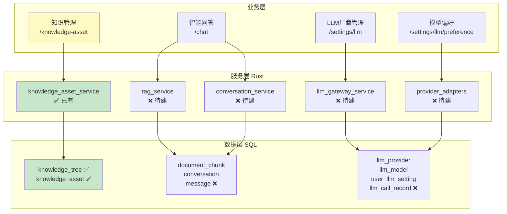
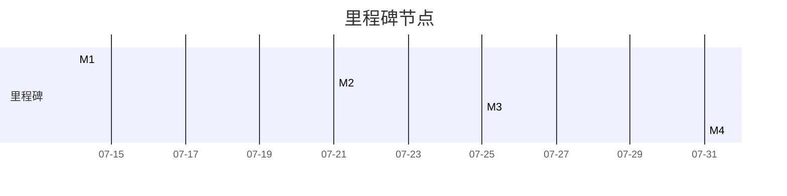

# 知识库模块开发计划

> 基于现有代码状态（2026-07-02）的完整开发进度规划
> 总估算工作量：约 **45 人天**

---

## 一、当前状态概览

### ✅ 已完成（文档设计阶段）

| 交付物 | 文件 | 说明 |
|--------|------|------|
| 架构重设计文档 | `docs/知识库模块/知识库模块架构梳理与重新设计方案.md` | 含 ER 图、架构图、数据流图 |
| LLM厂商设计文档 | `docs/知识库模块/多LLM厂商兼容设计方案.md` | 适配器模式、Rust 代码、前端原型 |
| RAG问答设计文档 | `docs/知识库模块/智能问答系统（RAG多轮对话）设计方案.md` | 检索器、对话管理、引用系统 |
| 菜单种子数据 | `src-tauri/.../public_initial_data.sql` | 知识库菜单已更新，原 AI 工作流已合并 |
| 表迁移脚本 | `src-tauri/.../knowledge_module_migration.sql` | 17 张新表 DDL + 触发器 + 种子数据 |
| 启动集成 | `src-tauri/.../postgres.rs` | 服务启动时自动执行迁移脚本 |

### ❌ 待开发（代码实现阶段）

所有后端的 Rust Model/Service/Command，以及前端的页面/组件都尚未编码。

---

## 二、整体分层架构



---

## 三、开发阶段规划

### Phase 1: 后端基础设施（7天）

#### 1.1 Rust Model 结构体（1天）

| 文件 | 内容 | 工作量 |
|------|------|--------|
| `models.rs` 追加 | 新增 `DocumentChunk`, `Conversation`, `Message`, `Memory`, `SkillExecution`, `LLMProvider`, `LLMModel`, `UserLLMSetting`, `LLMCallRecord` 共 9 个 struct | 0.5天 |
| `models.rs` 追加 | 新增 `TokenUsage`, `LLMChatRequest`, `LLMChatResponse`, `LLMEmbeddingRequest`, `LLMEmbeddingResponse` 等请求响应结构体 | 0.5天 |

**关键点**：所有 i64 字段需要 `#[serde(serialize_with = "i64_to_string")]` 防止 JS 精度丢失

#### 1.2 document_chunk 向量分片服务（2天）

| 任务 | 文件 | 说明 |
|------|------|------|
| Service | `service/rag_service.rs` | `chunk_text()` 文本切片 + `vectorize()` 调用 LLM 生成向量 + `search()` 语义检索 + 递归CTE目录限定 |
| Command | `commands/rag_commands.rs` | `chunk_and_vectorize`, `re_vectorize_asset`, `test_rag_retrieval` |
| 注册 | `lib.rs` | 追加 invoke_handler |

#### 1.3 conversation + message 对话服务（2天）

| 任务 | 文件 | 说明 |
|------|------|------|
| Service | `service/conversation_service.rs` | 创建会话、发送消息、获取历史、删除会话、引用解析 |
| Command | `commands/conversation_commands.rs` | `create_conversation`, `send_message`, `get_conversations`, `get_conversation_messages`, `update_conversation_title`, `delete_conversation` |
| 注册 | `lib.rs` | 追加 invoke_handler |

#### 1.4 LLM 网关服务（2天）

| 任务 | 文件 | 说明 |
|------|------|------|
| Trait + Router | `service/llm_gateway_service.rs` | `LLMProviderAdapter` trait, `LLMRouter` 路由, `LoadBalancer`, `CircuitBreaker` |
| Adapter | `service/provider_adapters.rs` | OpenAI / Claude / Qwen / Ollama 适配器实现 |
| 密钥加密 | `utils/crypto.rs` | AES-256-GCM 加密/解密 API Key |
| Service | `service/llm_provider_service.rs` | CRUD 厂商 + 模型 + 用户偏好 |
| Command | `commands/llm_provider_commands.rs` | 厂商/模型/偏好的增删改查命令 |
| 注册 | `lib.rs` | 追加 invoke_handler |

---

### Phase 2: 前端基础页面（7天）

#### 2.1 重构知识管理页面（2天）

| 任务 | 文件 | 说明 |
|------|------|------|
| 合并重复 | 删除 `/knowledge/page.tsx`，保留 `/knowledge-asset/page.tsx` | |
| 前端 Service | `services/conversationService.ts` | 新增对话相关 API |
| 前端 Service | `services/llmProviderService.ts` | 新增厂商/模型 API |

#### 2.2 智能问答页面（3天）

| 任务 | 文件 | 说明 |
|------|------|------|
| 对话界面 | `app/chat/page.tsx` | 左侧会话列表 + 右侧对话区域 |
| 消息气泡 | `components/Chat/MessageBubble.tsx` | 引用标注 + 模型元数据 |
| 引用面板 | `components/Chat/CitationPanel.tsx` | 展示被引用资产列表 |
| 流式输出 | `hooks/useStreamAnswer.ts` | SSE 流式输出体验 |

**页面原型**：
```
┌─────────────────────────────────────┐
│ 📋 会话列表    │  💬 智能问答         │
│ 今日           │  👤 采购资产的       │
│ ├ 📎 采购流程   │     审批流程是？    │
│ ├ 📎 合同模板   │  🤖 根据知识库...   │
│ 昨天           │  [📎 采购流程]       │
│ ├ 🔍 报废流程   │  [📎 审批权限]       │
│ [+新对话]      │  ┌──────────────┐   │
│               │  │ 📎 引用来源(2) │   │
│               │  │ ├ 流程 采购流程 │   │
│               │  │ └ 规则 审批权限 │   │
│               │  └──────────────┘   │
│               │ │ 输入问题... [➤]   │
└─────────────────────────────────────┘
```

#### 2.3 LLM厂商管理页面（2天）

| 任务 | 文件 | 说明 |
|------|------|------|
| 厂商列表 | `app/settings/llm/page.tsx` | 厂商卡片列表 + 编辑对话框 |
| 模型管理 | `components/LLM/ModelList.tsx` | 厂商下模型列表 + 同步按钮 |
| 用户偏好 | `app/settings/llm/preference/page.tsx` | 默认模型选择 + 温度滑块 |

---

### Phase 3: 核心 RAG 引擎（5天）

#### 3.1 文本切片引擎（1天）

```rust
pub struct TextChunker {
    chunk_size: usize,      // 默认 512 tokens
    chunk_overlap: usize,   // 默认 128 tokens
    separator: String,      // 默认 "\n\n"
}

impl TextChunker {
    pub fn chunk(&self, text: &str) -> Vec<ChunkInput> {
        // 1. 按段落分割
        // 2. 合并到 chunk_size
        // 3. 重叠 overlap
        // 4. 返回 Vec<ChunkInput>
    }
}
```

#### 3.2 语义检索优化（2天）

| 优化项 | 说明 |
|--------|------|
| 混合检索 | 向量检索 + 关键词（tsvector）+ RRF 融合排序 |
| MMR 重排序 | 多样性保证，避免返回语义过于相似的分片 |
| 缓存层 | 已向量化的问题缓存，避免重复调用 embedding 模型 |

#### 3.3 上下文构建器（1天）

```rust
pub struct ContextBuilder {
    max_system_tokens: i32,     // 2000
    max_context_tokens: i32,    // 2000
    max_history_tokens: i32,    // 2000
    max_memory_tokens: i32,     // 500
}
```

#### 3.4 引用解析器（1天）

```rust
pub struct CitationParser;

impl CitationParser {
    /// 解析 "[来源 N]" 标记 → 提取被引用的 asset_id 列表
    pub fn parse(answer: &str, chunks: &[ChunkResult]) -> (String, Vec<i64>) {
        // ...
    }
    
    /// 替换为 Markdown 链接 [📎 title](asset:id)
    pub fn to_markdown_links(answer: &str, chunks: &[ChunkResult]) -> String {
        // ...
    }
}
```

---

### Phase 4: 调用链集成（4天）

#### 4.1 完整调用链路打通


| 任务 | 说明 | 工作量 |
|------|------|--------|
| 链路联调 | 从用户输入到最终回答的全流程集成 | 2天 |
| 错误处理 | 模型不可用降级、重试、熔断 | 1天 |
| 日志埋点 | 操作日志 + 异常日志统一写入 | 1天 |

#### 4.2 记忆召回集成（1天）

```sql
-- 在对话时自动召回相关记忆
SELECT content, category, importance 
FROM {schema}.memory 
WHERE user_id = $1 
  AND next_review_at < NOW()
  AND deleted = 0
ORDER BY importance DESC, next_review_at ASC
LIMIT 5;
```

---

### Phase 5: 测试 & 联调（5天）

| 阶段 | 内容 | 工作量 |
|------|------|--------|
| 单元测试 | 各 adapter、chunker、parser 的单元测试 | 2天 |
| 集成测试 | RAG 检索 → 对话 → LLM 调用 → 引用解析 端到端 | 2天 |
| 性能测试 | 向量检索延迟、LLM 调用耗时、首响应时间 | 1天 |

---

## 四、甘特图

```mermaid
gantt
    title 知识库模块开发进度
    dateFormat  YYYY-MM-DD
    axisFormat  %m-%d
    
    section Phase1 后端基础设施
    Rust Model 结构体           :p1, 2026-07-07, 1d
    document_chunk 向量服务      :p1, 2d
    conversation 对话服务        :p1, 2d
    LLM 网关服务                :p1, 2d
    
    section Phase2 前端页面
    重构知识管理页面              :p2, after p1, 2d
    智能问答页面                  :p2, 3d
    LLM管理页面                  :p2, 2d
    
    section Phase3 核心RAG引擎
    文本切片引擎                  :p3, after p2, 1d
    语义检索优化                  :p3, 2d
    上下文构建器                  :p3, 1d
    引用解析器                    :p3, 1d
    
    section Phase4 调用链集成
    全流程联调                   :p4, after p3, 2d
    错误处理+日志                :p4, 1d
    记忆召回集成                 :p4, 1d
    
    section Phase5 测试
    单元测试                     :p5, after p4, 2d
    集成测试                     :p5, 2d
    性能测试                     :p5, 1d
```

---

## 五、详细任务拆解

### 文件创建清单

| # | 文件路径 | 类型 | 阶段 | 估算(天) |
|---|---------|------|------|---------|
| 1 | `src-tauri/src/database/models.rs` (追加) | Rust Model | P1 | 0.5 |
| 2 | `src-tauri/src/service/rag_service.rs` | Rust Service | P1 | 1 |
| 3 | `src-tauri/src/commands/rag_commands.rs` | Rust Command | P1 | 0.5 |
| 4 | `src-tauri/src/service/conversation_service.rs` | Rust Service | P1 | 1 |
| 5 | `src-tauri/src/commands/conversation_commands.rs` | Rust Command | P1 | 0.5 |
| 6 | `src-tauri/src/service/llm_gateway_service.rs` | Rust Service | P1 | 1 |
| 7 | `src-tauri/src/service/provider_adapters.rs` | Rust Service | P1 | 1 |
| 8 | `src-tauri/src/service/llm_provider_service.rs` | Rust Service | P1 | 0.5 |
| 9 | `src-tauri/src/commands/llm_provider_commands.rs` | Rust Command | P1 | 0.5 |
| 10 | `src-tauri/src/utils/crypto.rs` | Rust Utils | P1 | 0.5 |
| 11 | `src/app/chat/page.tsx` | 前端页面 | P2 | 1.5 |
| 12 | `src/components/Chat/MessageBubble.tsx` | 前端组件 | P2 | 0.5 |
| 13 | `src/components/Chat/CitationPanel.tsx` | 前端组件 | P2 | 0.5 |
| 14 | `src/hooks/useStreamAnswer.ts` | 前端 Hooks | P2 | 0.5 |
| 15 | `src/app/settings/llm/page.tsx` | 前端页面 | P2 | 1 |
| 16 | `src/app/settings/llm/preference/page.tsx` | 前端页面 | P2 | 0.5 |
| 17 | `src/components/LLM/ModelList.tsx` | 前端组件 | P2 | 0.5 |
| 18 | `src/services/conversationService.ts` | 前端 Service | P2 | 0.5 |
| 19 | `src/services/llmProviderService.ts` | 前端 Service | P2 | 0.5 |

### 文件修改清单

| # | 文件 | 修改内容 | 阶段 |
|---|------|---------|------|
| 1 | `src-tauri/src/commands/mod.rs` | 追加新模块声明 | P1 |
| 2 | `src-tauri/src/service/mod.rs` | 追加新模块声明 | P1 |
| 3 | `src-tauri/src/lib.rs` | 追加 invoke_handler 注册 | P1 |
| 4 | `src/components/Layout.tsx` | 如有需要调整布局 | P2 |
| 5 | `src/app/knowledge/page.tsx` | 删除（合并到 knowledge-asset） | P2 |

---

## 六、里程碑



| 里程碑 | 日期 | 验收标准 |
|--------|------|---------|
| **M1** 🏗️ 后端基础链路 | 07-14 | 所有 Rust Model/Service/Command 编译通过，DB 迁移自动执行 |
| **M2** 🖥️ 前端可交互 | 07-21 | 三页面可渲染：知识管理(已有)/智能问答/LLM管理 |
| **M3** 🔍 RAG 检索 | 07-25 | 知识资产可切片向量化，语义检索返回 Top-K 结果 |
| **M4** ✅ 完整验收 | 07-31 | 端到端问答：提问 → RAG检索 → LLM回答 → 引用展示 |

---

## 七、风险与应对

| 风险 | 影响 | 概率 | 应对 |
|------|------|------|------|
| pgvector 大版本兼容 | 向量检索不可用 | 中 | 迁移脚本中 HNSW 索引加注释，先降级到暴力搜索 |
| OpenAI API 调用失败 | 问答功能不可用 | 低 | 熔断器自动切换备选厂商 |
| 前端流式输出复杂度 | 用户体验差 | 中 | 先实现非流式版本，后续迭代流式优化 |
| 多租户 schema 隔离 | 数据错乱 | 低 | conv/message/文档表都按 {schema} 隔离，公共表放 public |

---

## 八、开发顺序建议

### 🥇 第一优先级（P0）- 先让链路跑通

```
1. Model struct     → 基础数据承载
2. LLM Gateway      → 统一模型调用（没有 AI 调用，其他功能都不可用）
3. RAG Service      → 向量检索基础版
4. Conversation     → 对话基础版
5. 简单前端         → 能看到结果
```

### 🥈 第二优先级（P1）- 完善体验

```
6. 引用解析系统     → 溯源展示
7. 流式输出         → 打字机效果
8. MMR 重排序       → 检索质量
9. 密钥安全         → 加密存储
```

### 🥉 第三优先级（P2）- 运维能力

```
10. 用量统计页面
11. 厂商管理页面
12. 操作日志/异常日志
13. 记忆召回系统
```

---

## 版本历史

| 版本 | 日期 | 变更 |
|------|------|------|
| V1.0 | 2026-07-02 | 初始版本，基于当前代码状态规划 |

---

*文档结束*